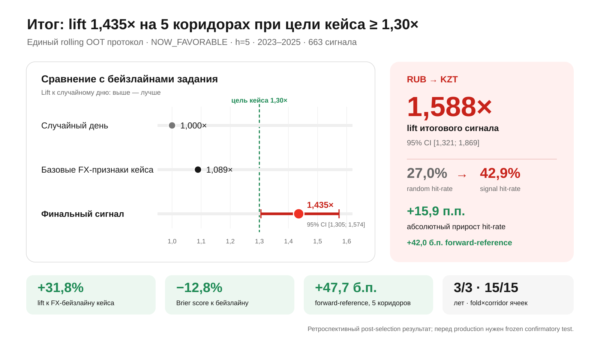
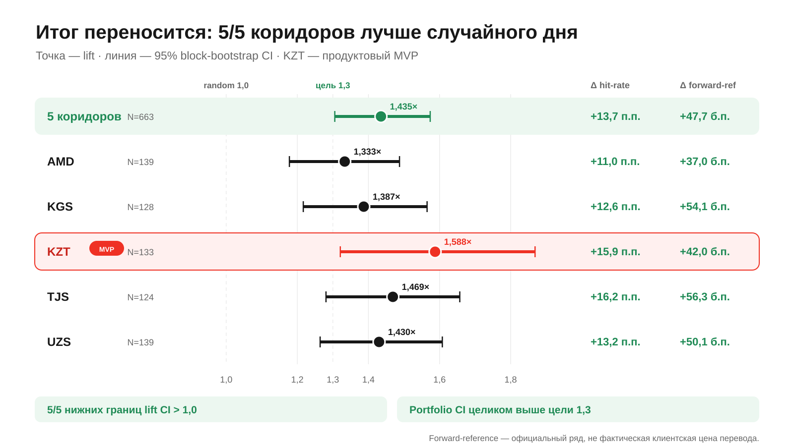
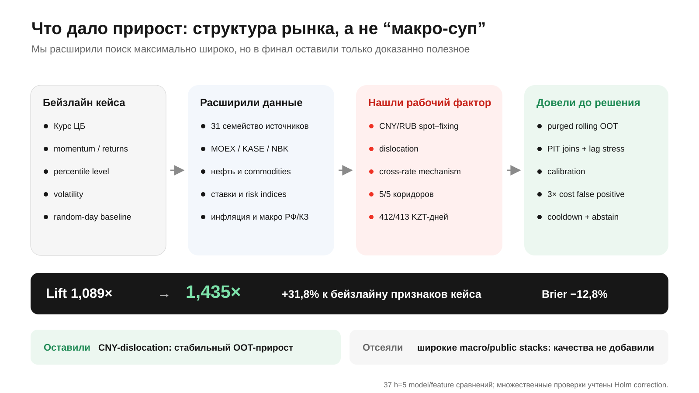
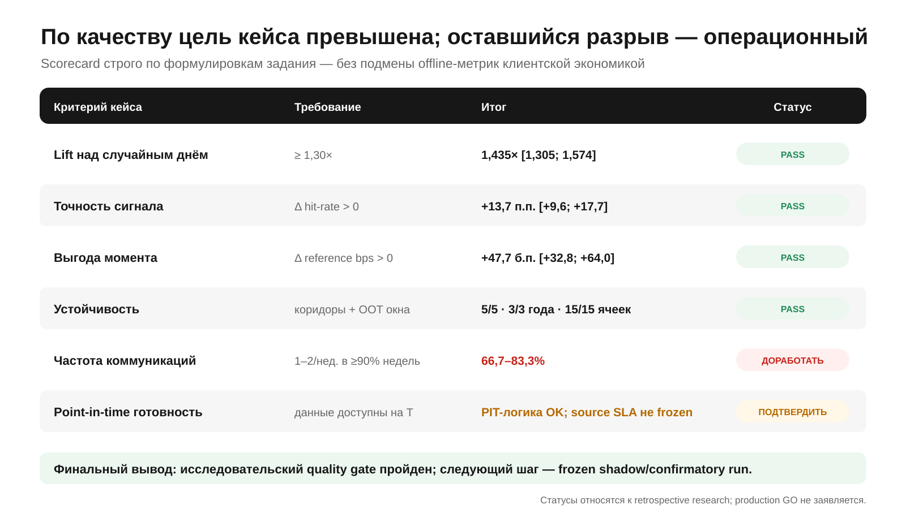

# AlphaTransfer — итоговый результат против бейзлайнов кейса

Основная история — слайды 1–3: итоговый результат, переносимость по коридорам и то, что мы добавили поверх бейзлайна задания. Слайд 4 — опциональный честный scorecard перед финальным выводом. Блок заменяет `[TBD]` на текущем слайде 9. Рядом с каждым SVG лежит PNG 1600×900.

---

## Слайд 1. Итог: цель кейса по качеству превышена

**Главный тезис:** итоговый сигнал дал `lift 1,435×` на пяти коридорах при цели кейса `≥1,30×`; для продуктового RUB→KZT результат составил `1,588×`.

**Что сказать голосом:**

- Главный baseline задания — случайный день, его lift равен `1,0`. Цель кейса — устойчивый `lift ≥1,3`.
- ML на базовых FX-признаках из задания — returns/momentum, percentile level и volatility — дал `1,089×`. После добавления найденного рыночного фактора итог вырос до `1,435×`: `+31,8%` к feature-baseline кейса.
- На RUB→KZT hit-rate вырос с `27,0%` для сопоставимого случайного дня до `42,9%`: `+15,9 п.п.`. Lift `1,588×`, 95% CI `[1,321; 1,869]` — интервал целиком выше целевого `1,3`.
- На пяти коридорах одновременно: hit-rate delta `+13,7 п.п.`, forward-reference delta `+47,7 б.п.`, Brier score лучше базовой модели на `12,8%`.
- Устойчивость: результат по Brier лучше в `3/3` годах и `15/15` fold×corridor ячейках.

**Подпись мелким шрифтом:** rolling OOT 2023–2025, NOW_FAVORABLE, `h=5`, 663 сигнала. Результат ретроспективный post-selection; перед production нужен frozen confirmatory test.

---

## Слайд 2. Итог переносится на все пять коридоров

**Главный тезис:** один и тот же финальный сигнал статистически лучше случайного дня во всех пяти коридорах; объединённый portfolio CI целиком выше целевого `lift 1,3`.

**Что сказать голосом:**

- Итоговая portfolio-оценка: `1,435× [1,305; 1,574]`, `+13,7 п.п.` hit-rate и `+47,7 б.п.` forward-reference.
- По коридорам lift находится от `1,333×` до `1,588×`; во всех `5/5` нижняя граница 95% CI выше `1,0`.
- KZT — самый сильный продуктовый коридор: `1,588×`, `+15,9 п.п.` hit-rate и `+42,0 б.п.` forward-reference.
- TJS даёт максимальный абсолютный прирост hit-rate (`+16,2 п.п.`), KGS/TJS — максимальный forward-reference effect (`+54–56 б.п.`).
- AMD/KGS/TJS/UZS здесь не расширяют MVP: они доказывают переносимость механизма, чего прямо требует кейс.

**Как читать:**

- Точка — lift, линия — 95% block-bootstrap CI.
- Вертикальные ориентиры — случайный день `1,0` и цель задания `1,3`.
- `Δ forward-ref` относится к официальному reference-rate, а не к фактической цене перевода в приложении.

---

## Слайд 3. Что мы добавили поверх бейзлайна задания

**Главный тезис:** прирост дал не объём данных сам по себе, а найденный структурный фактор CNY/RUB spot–fixing dislocation плюс строгая методика отбора.

**Что сказать голосом:**

- Отправная точка кейса: официальный курс ЦБ, momentum/returns, percentile levels, volatility и сравнение со случайным днём.
- Мы собрали 31 семейство источников: MOEX, KASE, NBK, нефть и commodities, ставки, risk indices, инфляцию и макро РФ/КЗ.
- Провели 37 сопоставимых `h=5` model/feature экспериментов. Широкие macro/public stacks не улучшили быстрый target — мы не стали тащить их в финальную модель.
- Рабочей находкой стала дислокация между CNY/RUB spot и fixing, согласованная со структурным cross-rate механизмом: арифметическая совместимость на 5/5 коридорах и 412/413 KZT-днях.
- Добавили purged rolling OOT, point-in-time joins и lag stress, калибровку, трёхкратную цену false positive, cooldown, abstain, block bootstrap и Holm correction.

**Итог:** lift вырос `1,089× → 1,435×`, Brier снизился на `12,8%`. В финал вошёл один доказанный фактор; неполезные признаки были явно исключены.

---

## Слайд 4. Scorecard относительно критериев кейса

**Главный тезис:** исследовательские критерии качества выполнены; до production остаются cadence и подтверждение реального SLA источника.

**Что сказать голосом:**

- Пройдены четыре главных offline-критерия: lift, hit-rate delta, положительная выгода момента и переносимость по коридорам/OOT-периодам.
- Частота пока не выполняет жёсткий communication SLA: худшая fold×corridor доля недель с 1–2 сигналами — `66,7–83,3%` при цели `≥90%`.
- Логика point-in-time реализована, но исторический `published_at/available_at` некоторых источников реконструирован. Это нужно подтвердить frozen shadow-run.
- Поэтому корректный статус: **research quality gate пройден; production GO пока не заявляем**.

**Если нужно сократить до трёх слайдов:** убрать этот слайд, а строку про cadence и confirmatory run перенести мелкой подписью на слайд 2.

---

## Методологическая подпись для последнего слайда или appendix

`Rolling out-of-time · 2023–2025 · horizon h=5 CBR rows/publication proxy · grouped by decision date · block bootstrap confidence intervals · multiple-testing correction · point-in-time lag sensitivity · retrospective post-selection diagnostics are explicitly separated from prospective confirmation.`

Источники расчётов: [постановка кейса](../global_task.md), [канонический quant-отчёт](../review_artifacts/quant_macro/QUANT_RESEARCH_REPORT_2026-09-04.md), [model metrics](../review_artifacts/quant_macro/results-final-20260904-v2/development_metrics.csv), [policy uncertainty](../review_artifacts/quant_macro/results-final-20260904-v2/development_policy_uncertainty_audit_h5.csv), [corridor uncertainty](../review_artifacts/quant_macro/results-final-20260904-v2/diagnostic_corridor_candidate_uncertainty_h5.csv).
