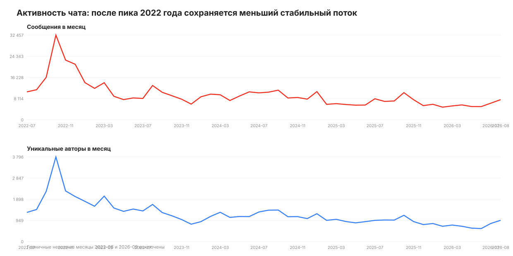
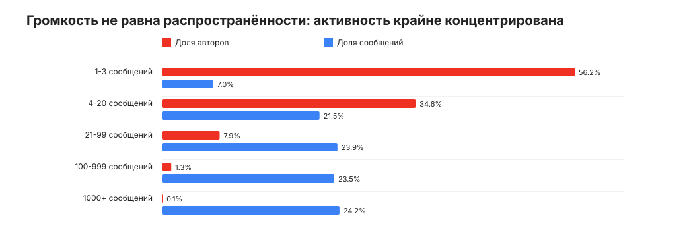
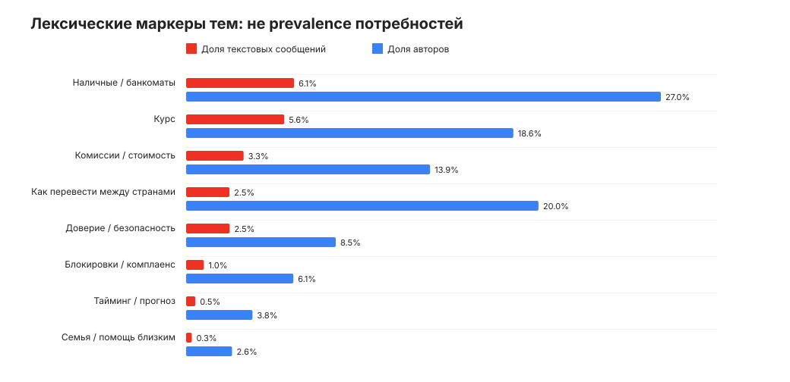
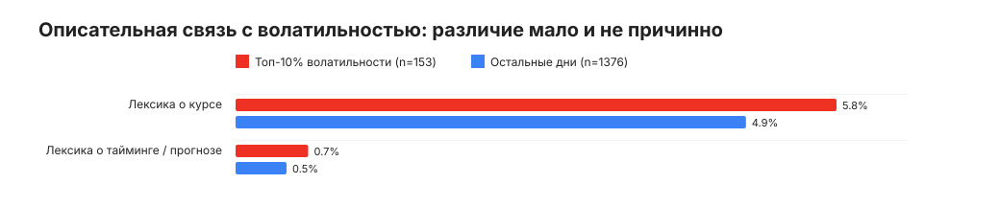
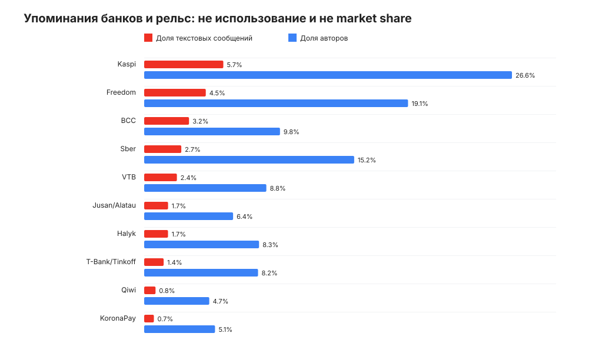

# Казахстанский чат обменов: что люди на самом деле пытаются решить и какой продукт нужен AlphaTransfer

**Дата исследования:** 3 сентября 2026 года  
**Источник:** полный Telegram-export `result.json`  
**Продуктовый контекст:** AlphaTransfer, переводы RUB→KZT  
**Методы:** потоковый текстовый анализ, user-level нормализация, временные срезы, связь с RUB/KZT, ручная разметка 154 веток, независимый аудит

## Главный вывод

**В этом самоотобранном чате устойчиво встречаются затруднения вокруг маршрута, полной цены, доступности и безопасности рядом с темой курса. Диагностическая ручная разметка показывает, что слова о курсе часто означают выбор текущего способа исполнения, а не намерение ждать движения рынка.** Данные недостаточны, чтобы ранжировать распространённость jobs, но делают execution-first правдоподобной продуктовой гипотезой; готовность переносить дату и эффект timing-push нужно измерять на транзакциях AlphaTransfer.

Для AlphaTransfer отсюда следует не отказ от сигнала, а смена роли сигнала:

> **Сигнал — не самостоятельный продукт и не совет “переводите сейчас”. Это редкий вход в уже исполнимый, безопасный и прозрачный перевод.**

Рекомендованный порядок:

1. **Gate 0 для кейса:** сначала закрыть обязательный воспроизводимый signal layer. На out-of-time walk-forward для `h=1/3/5/10/20` нужны hit rate и lift к случайному дню, выгода в б.п. отдельно, частота/кучность, устойчивость и цена ожидания быстрых/медленных сигналов — без look-ahead.
2. **Для будущего пилота:** перед отправкой проверить доступность маршрута; при открытии и подтверждении повторно рассчитать live-котировку, `recipient gets`, комиссию и время актуальности. Это не замена сигналу, а защита клиента от устаревшего контакта.
3. Массовый универсальный push не запускать. Тестировать его на кандидатах с повторными RUB→KZT-переводами; гибкость даты пока не наблюдаема и остаётся проверяемой гипотезой.
4. Проверять не CTR, а ITT-разницу кумулятивного завершённого объёма и маржи против холдаута на 28/60/90 дней. Каннибализацию диагностировать по траектории эффекта, не “вычитать будущий перевод” у конкретного клиента.

Иными словами: **для защиты — `signal first`; для будущего пилота — `execution experience first, timing as a targeted retention/reactivation layer`.** Чат даёт основание для пилота, но не доказывает готовность массового клиента ждать нужный день.

**Важно для хакатона:** это не предложение заменить обязательный сигнальный слой красивым экраном. По постановке AlphaTransfer сначала всё равно нужен честный walk-forward бэктест сигнала. Исследование чата отвечает на другой вопрос — кому и в каком клиентском опыте такой сигнал может принести ценность. На защите сильная связка: доказанный signal layer как core deliverable + execution-first экран как продуктовая интерпретация и задача со звёздочкой.

## Решение в одном экране

| Вопрос | Ответ исследования | Уверенность |
|---|---|---|
| Есть ли реальная боль вокруг RUB↔KZT? | Да. Люди системно обсуждают маршрут, курс, комиссию, наличные, ограничения и безопасность. | Высокая |
| Является ли курс важным критерием? | Да, но вместе с итогом получателю и исполнимостью, а не отдельно. | Высокая |
| Доказано ли, что пользователи готовы переносить дату? | Нет. Чат хорошо показывает поиск решения “сейчас”, но почти не наблюдает свободу выбора даты. | Высокая уверенность в **недостаточности** доказательств |
| Стоит ли делать timing-push? | Да, как ограниченный эксперимент для клиентов с повторными переводами и доступным маршрутом; гибкость даты — проверяемая гипотеза. | Средняя |
| Что обязательно закрыть в хакатоне? | Walk-forward signal layer со всеми метриками постановки; чат его не заменяет. | Высокая |
| Какой продуктовый опыт нужен перед внешним пилотом? | При наличии точного quote API: live `recipient gets` + total cost + повторная проверка доступности + статус/TTL + понятное восстановление. | Средняя для конкретного дизайна; высокая для принципа “курс нельзя отделять от исполнения” |
| Можно ли оценить TAM, долю P2P или средний чек рынка? | Нет: чат самоотобран, активность концентрирована, транзакции не верифицированы. | Высокая |

## 1. Что именно исследовано

### Паспорт корпуса

| Показатель | Значение |
|---|---:|
| Период | 09.06.2022 10:07 — 03.09.2026 15:52 |
| Всего событий | 480 746 |
| Пользовательских сообщений | 480 713 |
| Непустых текстовых сообщений | 473 949 |
| Уникальных авторов | 36 236 |
| Сообщений-ответов | 320 736 (66,7%) |
| Отредактированных сообщений | 95 202 (19,8%) |
| Сообщений с реакциями | 55 521 (11,6%) |
| Сообщений с медиа | 12 867 (2,7%) |

Экспорт — не чистая доска объявлений. Это большой разговорный чат о деньгах, картах, обмене, наличных, крипто и жизни между Россией и Казахстаном. Поэтому единица качественного анализа — **ветка/эпизод**, а не отдельное сообщение.

### Почему старый пример нельзя использовать как базу цифр

Предыдущий документ описывает 12 036 событий — 11 342 обычных и 11 225 текстовых сообщений, — 486 авторов и период с мая 2024 года; текущий `result.json` содержит 480 746 событий, 36 236 авторов и начинается в июне 2022-го. Отличаются и названия чатов. Значит, пример относится к другому или сильно отфильтрованному корпусу.

Из примера полезны гипотезы — P2P как конкурент, цена, доверие, срочность, — но не числа. Например, в полном корпусе KoronaPay упомянут 3 323 раза, а не два; Alfa — 885 раз, а не 34. Это не “ошибка” старого расчёта, а доказательство несопоставимого scope.

### Активность: релокационный пик прошёл, ядро осталось



Пик пришёлся на вторую половину 2022 года: медиана июля–декабря — 18,8 тыс. сообщений и 2,1 тыс. авторов в месяц. Затем трафик снизился, но не исчез:

| Период | Медиана сообщений в месяц | Медиана авторов в месяц |
|---|---:|---:|
| 2022, июль–декабрь | 18 773 | 2 134 |
| 2023 | 9 106 | 1 415 |
| 2024 | 9 344 | 1 122 |
| 2025 | 6 604 | 951 |
| 2026, январь–август | 5 499 | 713 |

Корректная интерпретация: потребность устойчива, но рынок чата **сжался после шока 2022 года**. Утверждать рост сообщества или экстраполировать ранний пик на 2026 год нельзя.

### Кто создаёт видимую активность



- 56,2% авторов написали всего 1–3 сообщения и создали 7,0% потока.
- 35 авторов — менее 0,1% всех участников — создали 24,2% сообщений.
- Верхний 1% авторов создал 44,5% сообщений; верхние 5% — 63,0%.
- Только 28,4% авторов появлялись минимум в двух календарных месяцах; 3,4% — в шести и более.
- 5,95% из 439 101 достаточно длинного текста относятся к точным повторам после приведения регистра и пробелов. Это не смысловая дедупликация, но предупреждение о шаблонах.

Следствие: `share of messages` систематически усиливает голос сверхактивных участников, чья реальная роль не установлена. Везде, где возможно, исследование показывает также число авторов и ручную проверку эпизодов.

## 2. Jobs to be Done: курс — часть работы, не вся работа

### Лексические маркеры: навигация, а не prevalence



Категории ниже пересекаются, имеют разную precision/recall и построены по лексическим правилам. Это **верхние оценки совпадений**, а не доли потребностей, клиентов или операций; сравнивать размеры строк как ранжирование jobs нельзя.

| Лексический маркер | Сообщений | Авторов | Для чего использовать |
|---|---:|---:|---|
| Наличные / банкоматы | 29 054 (6,13%) | 9 773 (26,97%) | Найти ветки о форме получения и физической доступности. |
| Курс | 26 427 (5,58%) | 6 737 (18,59%) | Отобрать разговоры о цене; слово “курс” также даёт ложные срабатывания. |
| Комиссии / полная стоимость | 15 483 (3,27%) | 5 023 (13,86%) | Найти эпизоды effective price для ручной проверки. |
| Как перевести между странами | 11 683 (2,47%) | 7 254 (20,02%) | Отобрать routing/how-to ветки; не все относятся к RUB↔KZT. |
| Доверие / безопасность | 11 736 (2,48%) | 3 081 (8,50%) | Навигация по safety-контексту, включая нерелевантные совпадения. |
| Блокировки / комплаенс | 4 779 (1,01%) | 2 208 (6,09%) | Поиск failure/recovery эпизодов. |
| Тайминг / прогноз | 2 499 (0,53%) | 1 366 (3,77%) | Широкий screen для проверки date elasticity; не её оценка. |
| Семья / помощь близким | 1 535 (0,32%) | 946 (2,61%) | Поиск контекста целевой персоны; не размер сегмента. |

### Какие паттерны обнаружены в ручной разметке 154 веток

Выборка была намеренно стратифицирована: по 22 эпизода из семи тематических страт, равномерно по 2022–2026 годам. Поэтому количество эпизодов показывает наличие и насыщенность паттерна, **но не распространённость в корпусе**.

| Primary job эпизода | Эпизодов | Наблюдаемая работа |
|---|---:|---|
| Выбрать и исполнить маршрут RUB↔KZT | 34 | Понять конкретную последовательность банка/карты/счёта и провести деньги. |
| Найти выгодный курс или способ | 25 | Сравнить банк, банкомат, обменник, наличные, промежуточную валюту или время. |
| Посчитать полную стоимость | 20 | Отделить комиссию от конвертации и узнать фактический итог. |
| Восстановить исполнимость | 21 | Найти замену после блока, лимита, отказа, задержки или изменения правил. |
| Снизить риск мошенничества/ошибки | 18 | Проверить контрагента/маршрут и не потерять деньги. |
| Получить нужную форму денег | 17 | Выбрать между картой, наличными, P2P и крипто с учётом ограничений. |
| Нерелевантный финансовый/бытовой шум | 19 | Финансовое слово есть, решения RUB↔KZT нет. |

Наблюдаемый сценарий поиска решения:

`возникла нужда → обсуждаются направление и форма денег → сравниваются итог, комиссия, скорость и доступность → выбирается рельса → проверяются доверие и ограничения → пользователь обсуждает выполнение или fallback`

Курс находится в середине процесса. Хороший курс не создаёт ценности, если маршрут недоступен, комиссия съедает эффект или пользователь не доверяет исполнению.

## 3. Рабочие гипотезы сегментации: кого предстоит различить

| Сегмент | Контекст / job | Что ему нужно | Роль timing-push | Приоритет |
|---|---|---|---|---|
| **S1. Кандидат: регулярный отправитель с гибким окном** | Повторно отправляет RUB→KZT; возможность двигать дату пока не доказана | Наблюдение за рынком без ручной рутины, понятный monetary gain | Потенциально высокая, но повторность не равна гибкости даты | Исследуемая аудитория пилота сигнала |
| **S2. Срочный отправитель** | Получателю нужны деньги сейчас или текущий путь сломался | Скорость, вероятность успеха, актуальная сумма | Низкая: не предлагать ждать; показать исполнимый путь сейчас | Основной сегмент in-flow |
| **S3. Route problem-solver** | Переводит через несколько банков, карту, наличные, P2P или крипто | Проверка доступности, total cost, инструкции, fallback | Вторична; сначала восстановить доступность | Высокий продуктовый приоритет |
| **S4. P2P/cash switcher** | Ищет лучший net result вне официального перевода | Цена плюс доверие и контроль риска | Может рассмотреть банк, если разница объяснима и исполнение надёжно | Исследовательская гипотеза: предпочтение P2P не наблюдаемо в данных банка без добровольного сигнала |
| **S5. Сверхактивный участник чата, роль не установлена** | Часто отвечает или публикует сообщения; профессия и экономическая роль неизвестны | Требует отдельной ручной типологии | Нельзя автоматически считать его менялой или поставщиком ликвидности | Не использовать как основную персону без валидации |

Критическая граница — между S1 и S2. Один и тот же push нельзя отправлять человеку, который может ждать неделю, и человеку с дедлайном сегодня. Пока законного и валидированного признака гибкости нет, “неэкстренность” нельзя использовать как скрытый таргетинг: её сначала нужно исследовать и связать с наблюдаемыми банковскими proxy.

## 4. Проверка главной гипотезы: связан ли момент рынка с обсуждением тайминга

### Что поддерживает timing-гипотезу

- Курсовой lexical screen охватывает 6 737 авторов; ручные ветки подтверждают, что часть этих эпизодов действительно сравнивает цену, время и способы.
- В последние 24 полных месяца 73 дня из верхнего дециля абсолютного изменения RUB/KZT имели в среднем 0,643% timing-лексики против 0,517% на остальных 657 днях: описательная разница +0,126 п.п., отношение 1,24×.
- После исключения 2022 года отношение также выше единицы — 1,39×, абсолютная разница +0,185 п.п. Это robustness-наблюдение, но не статистический или причинный эффект.

### Что ослабляет timing-гипотезу

- Под широкими, неодинаково валидированными screens найдено 26,4 тыс. совпадений по курсу и 2,5 тыс. по timing/forecast. Это навигационный контраст, не оценка относительной доли jobs: `price awareness ≠ date elasticity`.
- В последние 24 месяца Spearman-корреляция абсолютного дневного движения с долей timing-лексики — всего 0,074. Монотонная связь практически отсутствует.
- Валидированное P2P-ядро содержит лишь 123 сообщения: мощности для отдельного market-response исследования недостаточно. Широкий automated listing-like proxy из основной сводки для такого вывода не используется.
- Чат содержит намерения и разговоры, а не подтверждённые переводы. Реальную дату операции и альтернативный день мы не видим.
- Срочность и ожидание извлекаются из текста с большим количеством бытовых ложных срабатываний; их сырое соотношение нельзя использовать как решение.
- Сравнение выполнено на уровне календарного дня с external end-of-day UTC benchmark. Timezone чата неизвестна, не учтены новости/изменения банковских правил, автокорреляция и multiple testing; доверительные интервалы для разницы не рассчитывались.

### Независимая диагностическая проверка 150 сообщений

Вторая ручная выборка проверяла не prevalence, а смысл ключевых слов. На каждую тему отбиралось по 25 кандидатов, равномерно по пяти временным стратам; для “будущего курса” добавлен отдельный стресс-тест из 25 сообщений.

| Проверка | Результат ручного чтения | Продуктовый смысл |
|---|---:|---|
| Явное ожидание именно движения курса | 3 из 25 строгих кандидатов; ещё 2 неоднозначны | Поведение существует, но keyword “жду” в основном относится к ответу, карте, зачислению или решению банка. |
| Прямая срочная потребность перевести/обменять | 16 из 25 строгих кандидатов | Для этого режима in-flow и надёжность важнее ожидания. |
| Вопросы о курсе, реально относящиеся к маршруту/цене исполнения | 19 из 25 | “Какой будет курс” часто означает курс, который применит сервис, а не прогноз рынка. |
| Комиссия / полная стоимость | 20 из 25 | Пользователь сравнивает effective price; лишь 4 эпизода прямо формулировали сумму получателю. |
| Недоступность маршрута | 14 из 25 | Ошибка/лимит/блок — частый контекст, где хороший рынок не решает job. |
| Явный прогноз роста/падения в отдельном stress-test | 0 из 25 | Будущеподобная грамматика без ручной проверки сильно переоценивает predictive demand. |

Эти доли нельзя переносить на весь чат: выборка целевая и без второго coder. Они показывают возможные типы и направление ложных срабатываний словарей, которые нужно валидировать на gold set.



### Вердикт

**Наблюдение совместимо с реактивным вниманием к резким движениям, но не доказывает ни реакцию людей на известную им котировку, ни массовую готовность переносить перевод.** Отсутствие доказательства не равно отсутствию сегмента. Правильное решение — не rollout и не отказ, а узкий пилот на кандидатах с повторными переводами и холдаутом.

Для сигнального слоя полезна challenger-гипотеза: экстремальное, легко объяснимое движение может быть лучшим кандидатом на момент коммуникации, чем просто высокий исторический percentile. Это не готовый trigger: он должен пройти тот же walk-forward signal-gate и policy layer, что любой другой индикатор.

### Что означает пройти signal-gate

Интерес к слову “курс” не является метрикой модели. Для сценариев “сейчас выгодно” и “окно закрывается” заранее задаются разные правила попадания. На каждом `h=1/3/5/10/20` и out-of-time окне нужно показать:

- hit rate и lift по hit rate относительно случайного дня того же коридора и периода;
- статистически положительную выгоду момента в базисных пунктах как отдельную метрику;
- частоту и кучность, совместимые примерно с 1–2 **сигналами на коридор** в неделю;
- цену ожидания: что теряется между быстрым сигналом и подтверждением медленного;
- переносимость параметров по периодам/коридорам и отсутствие look-ahead.

Правила комбинации, пороги и reject option фиксируются до теста. Отрицательный результат по индикатору — допустимый и полезный исход.

## 5. Реальный конкурентный набор шире банковских переводов

### Прямой P2P виден, но полный чат не является P2P-маркетплейсом

Из-за отсутствия хэштегов и большого количества справочных вопросов автоматический поиск “обменять RUB на KZT” даёт много ложных срабатываний. Поэтому для P2P построено отдельное консервативное Tier A: оба валютных маркера, явное владение/потребность или peer-request и транзакционный контекст; банковские/how-to формулировки отфильтрованы.

| Показатель | Результат |
|---|---:|
| High-precision кандидаты | 123 сообщения, 100 авторов |
| Ручная проверка | 89 из 100 — реальные P2P-заявки |
| Precision | 89,0%; Wilson 95% CI 81,4–93,7% |
| Оценка реальных заявок в Tier A | около 110; ориентировочный интервал 101–115 |
| Направление | 75 RUB→KZT (61%), 48 KZT→RUB (39%) |
| Активность авторов | 85 из 100 дали один оффер; 14 — 2–3; один — 4–10 |
| Явная сумма / надёжно распознанный курс | 18 / 5 сообщений |

Ядро P2P существует и показывает двусторонний matching, но оно консервативно, мало и сосредоточено преимущественно в ранней релокационной волне. Это **не** позволяет оценить GMV, средний чек или рыночный курс. Reply/edit/reaction есть у 10,6%/15,4%/4,1% кандидатов, но ни один из признаков не доказывает completion сделки.

Практический вывод двойной:

- P2P — явно сформулированная альтернатива в намерениях и источник языка/рисков для custdev; фактическое исполнение и объём не наблюдаются;
- называть весь чат P2P-рынком или выводить из него долю профессиональных менял нельзя.



| Банк / рельса | Сообщений | Авторов | Осторожная интерпретация |
|---|---:|---:|---|
| Kaspi | 27 091 | 9 624 | Главная клиентская поверхность Казахстана в обсуждении. |
| Freedom | 21 097 | 6 904 | Высокая видимость карточных и трансграничных сценариев. |
| BCC | 15 345 | 3 554 | Часто обсуждаемая локальная банковская рельса. |
| Sber | 12 713 | 5 495 | Заметная российская сторона маршрута. |
| VTB | 11 204 | 3 197 | Сильная историческая роль, в том числе наличные/карты. |
| Jusan / Alatau | 8 184 | 2 326 | Локальный банк; название менялось во времени. |
| Halyk | 8 163 | 3 006 | Альтернативная локальная рельса. |
| T-Bank / Tinkoff | 6 662 | 2 979 | Российская рельса и сравнение способов. |
| KoronaPay | 3 323 | 1 854 | Реальный участник поля выбора, но не единственная альтернатива. |
| Alfa | 885 | 586 | Низкая разговорная видимость относительно лидеров; не market share. |

Это частоты упоминаний, а не использования, NPS или доли рынка. На них влияют новости, переименования и вопросы новичков. Но качественная картина надёжна: человек сравнивает **не набор приложений одного класса**, а целый портфель обходных путей:

`банк → переводная система → карта/банкомат → обменник/наличные → знакомый/P2P → крипто`

Отсюда value proposition AlphaTransfer не может быть только “наш курс лучше”. Банк **может** конкурировать комбинацией, которую ещё предстоит проверить на реальной цене, доступности и доверии:

- понятного исполнимого результата;
- меньшего операционного риска;
- отсутствия поиска контрагента;
- статуса и поддержки;
- экономии времени на сравнении и мониторинге.

## 6. Продуктовая гипотеза для прототипа и будущего пилота

Раздел ниже не закрывает задачу со звёздочкой целиком: для этого отдельно нужны карта актуального пути Alfa Mobile, сравнение нескольких механик и прототип. Здесь зафиксирована логика, которую исследование чата поддерживает и которую можно положить в такой прототип.

### Архитектура пользовательского обещания

```text
история переводов + market signal + pre-send eligibility check
                         │
      signal frequency и клиентский contact budget — разные слои
                         │
        factual push кандидату с повторными переводами
                         │
            deep link в готовый RUB→KZT маршрут
                         │
 open-time re-check → курс + комиссия + recipient gets + timestamp
             ├── сигнал сохранился → подтвердить
             ├── цена изменилась, но условие живо → честно показать разницу
             └── условие исчезло → не торопить, предложить следующий алерт
                         │
          confirm-time final quote / фиксация по правилам процессинга
```

Частота модели и частота контакта различаются. 1–2 сигнала на коридор в неделю — самопроверка потока на бэктесте. Реальная отправка подчиняется более жёсткому общему клиентскому бюджету 1–2 сообщения в неделю и конкурирует с другими CRM-коммуникациями; приоритетизация и suppression серий живут в отдельном policy layer.

### Приоритеты

| Слой | Возможность | Статус в кейсе | Приоритет будущего пилота |
|---|---|---|---|
| Signal | Walk-forward модель, комбинация и policy | **Обязательный core deliverable / Gate 0** | Только прошедшие signal-gate сценарии |
| Execution | Live `recipient gets`, total fee, payout method | Задача со звёздочкой; при наличии точного quote API | Prerequisite до внешнего push-пилота |
| Eligibility | Проверка до отправки, при открытии и подтверждении | Продуктовая логика прототипа | Не отправлять при известной недоступности; объяснять изменения |
| Repricing | Timestamp/TTL и три состояния после открытия | Продуктовая логика прототипа | Обязательный guardrail доверия; не гарантия цены |
| Recovery | Статус, понятное восстановление и допустимый fallback | Гипотеза из ручных веток | Высокий: ошибки и ограничения — самостоятельный job |
| Timing | Targeted factual push | Выход обязательного сигнального слоя | Ограниченный E2-эксперимент, не rollout на всю базу |
| Explanation | Рыночный факт отдельно от исполнимой котировки | Библиотека текстов — часть core | Не смешивать mid-market и execution rate |
| Rate lock | Краткая фиксация курса | Опционально | Только после unit economics и правил высокой волатильности |

### Примеры безопасной коммуникации

Все числа ниже — переменные шаблона, а не фактическая котировка.

**Push:**

> Рыночный ориентир RUB/KZT сегодня выше, чем в `{Y}%` дней за последние 30 дней. В переводе покажем актуальную сумму получателю — она зависит от условий на момент открытия. Посмотреть перевод.

**На экране после открытия:**

> Расчёт перевода на `{timestamp}`: 1 ₽ = `{X}` ₸; получатель получит `{N}` ₸; комиссия `{F}`. Котировка будет повторно проверена перед подтверждением.

**Если цена изменилась, но условие всё ещё выполняется:**

> После уведомления курс обновился. Сейчас получатель получит `{N2}` ₸ вместо `{N1}` ₸; значение всё ещё выше `{Y}%` наблюдений за 30 дней.

**Если возможность ушла:**

> Курс изменился и больше не соответствует условию уведомления. Можно перевести по текущим условиям или дождаться следующего сигнала.

Обязательно показывать время расчёта и пояснять, что итог фиксируется только на шаге, где это действительно делает процессинг.

Не использовать: “успейте”, “курс скоро вырастет”, “гарантированно лучший курс”, “заработайте на переводе”, “вы получите больше Google/ЦБ” без сопоставимой исполнимой базы.

## 7. План post-hack пилота: как проверить продукт, а не красивую идею

Ни один из шагов ниже не выполнен в хакатоне и не предполагает контакт с авторами чата. План требует отдельного доступа к банковским данным, legal/privacy review и согласований. Чат используется только для формулировки гипотез.

### До эксперимента

1. На транзакциях AlphaTransfer выделить повторных RUB→KZT-отправителей и оценить реальное распределение интервалов, сумм и дней относительно зарплаты/праздников.
2. Построить pre-send проверку доступности: страна, валюта, лимит, recipient, pay-in/payout method; повторять её при открытии и подтверждении.
3. Связать публичный `signal_rate` с реальной котировкой AlphaTransfer и измерить расхождение/лаг.
4. Проверить сигнал walk-forward с асимметричной ценой ошибки из постановки кейса; чат не заменяет этот бэктест.
5. Провести 12–18 интервью по **последнему фактическому переводу**, не по реакции на концепт.

### E1 — in-flow, intent-level

Среди пользователей, уже открывших доступный RUB→KZT-сценарий, случайно показать:

- текущий экран;
- `recipient gets + total cost + timestamp/TTL + понятное восстановление/fallback`.

Primary — completion этой попытки. Guardrails — cancel, ошибка, время, поддержка и расхождение quote→confirm. Этот тест не измеряет эффект push и анализируется среди корректно рандомизированных intent-сессий.

### E2 — timing, signal-level ITT

Только после signal-gate и желательно после E1. В момент валидного сигнала и успешной pre-send проверки рандомизировать клиентов с доступным маршрутом на factual push и no-push. Во всех группах использовать один и тот же execution screen.

Primary — ITT-разница кумулятивного завершённого объёма и маржи за 28/60/90 дней **по всем назначенным клиентам**, а не только открывшим push. Повторность прошлых переводов — наблюдаемый stratifier; гибкость даты — непроверенное предположение, а не скрытый eligibility-фильтр.

Общий контактный лимит — 1–2 сообщения на клиента в неделю с учётом остальных CRM-кампаний.

### Метрики

**Primary:**

- E1: инкрементальная completion конверсия intent-сессии;
- E2: инкрементальный кумулятивный RUB→KZT-объём и маржа за 28/60/90 дней;
- инкрементальная доля клиентов с завершённым переводом;
- динамика эффекта по окнам: если ранний spike исчезает к 60/90 дням, это признак сдвига времени, а не роста net-объёма.

**Диагностика воронки:** доставлен push → открыт → открыт маршрут → получена quote → подтверждено → завершено; время до действия; recipient gets относительно момента сигнала.

**Guardrails:**

- отписка/отключение push и жалобы;
- доля `signal→open` с ухудшением live rate более заранее заданных `{X}` б.п.; доля таких случаев с корректно показанным re-price;
- fail/cancel/reversal, задержки и обращения в поддержку;
- исчезновение эффекта на горизонте 60/90 дней как признак каннибализации;
- отрицательная маржа, злоупотребление lock, концентрация эффекта в одном узком сегменте.

Любое численное ухудшение guardrail надо мониторить после rollout, даже если оно статистически незначимо в пилоте.

### Решение о rollout

Расширять пилот только если:

1. E1 улучшает completion среди рандомизированных intent-сессий без роста ошибок/жалоб;
2. E2 даёт положительный ITT net-объём и маржу к 60/90 дням против no-push;
3. при ухудшении live rate клиент до подтверждения видит актуальный `recipient gets`, разницу с push и время расчёта, может отказаться без давления; stale-rate, cancel и complaint guardrails остаются в допустимых пределах;
4. коммуникационный канал не выжигается;
5. эффект сохраняется вне одного месяца и одного микро-сегмента;
6. пройдены два раздельных порога: клиентская выгода против сопоставимой исполнимой альтернативы и положительная экономика банка.

## 8. Post-hack CustDev: что проверить после согласования

Рекрутинг возможен только через согласованный канал с добровольным согласием; PII и авторы Telegram-export для контакта не используются.

### Кого интервьюировать

12–18 человек через согласованный канал банка или панель с добровольным согласием:

- 4–6 повторных RUB→KZT-отправителей;
- 3–4 KZT→RUB или двусторонних пользователя для контраста;
- 3–4 недавно выбравших P2P/наличные/крипто;
- 2–3 столкнувшихся с отказом, задержкой или блокировкой.

Сверхактивных поставщиков ликвидности интервьюировать отдельно как экспертов, не смешивая с семейным отправителем.

### Вопросы о последнем случае

1. Что произошло перед тем, как понадобилось отправить деньги? Какой был дедлайн?
2. Какие способы реально рассматривались и какие были исключены?
3. Как человек понимал итоговую сумму и где возникала неопределённость?
4. Мог ли он перенести перевод на 1/3/5 дней? Что сделал бы ожидание невозможным?
5. Когда он последний раз следил за курсом и какое изменение счёл бы значимым в рублях?
6. Что должно быть в push, чтобы он выглядел как факт, а не реклама?
7. Что он ожидает увидеть, если условия уже изменились после уведомления?
8. Почему банковский сценарий с контролируемым исполнением может проиграть P2P и какая разница в цене это компенсирует?

Ответ “да, наверное воспользовался бы” не считать подтверждением. Подтверждение S1 — недавний конкретный эпизод, где дата действительно была гибкой, человек назвал заметный денежный порог и понятное действие после push.

Дополнительно полезен двухнедельный diary study: участник фиксирует момент возникновения потребности, первое сравнение курса, фактическую операцию и причину выбора дня. Это измерит эластичность даты лучше ретроспективного вопроса.

## 9. Что данные доказывают, а что нет

### Доказано в пределах этого корпуса

- Вопросы курса, комиссии, доступности и безопасности устойчиво присутствуют во всех годах.
- Чат — help/community surface, а не репрезентативная транзакционная выборка.
- Внимание к таймингу возрастает на экстремально волатильных днях, но связь слабая и нелинейная.
- Один headline rate недостаточен: users сравнивают полный маршрут и форму получения.
- Message-level метрики нельзя читать без поправки на сверхактивное ядро.

### Не доказано

- Доля клиентов AlphaTransfer, готовых ждать лучшего курса.
- Причинный эффект push на перевод, retention, маржу или лояльность.
- Доля P2P/наличных/крипто на рынке, TAM или банковская market share.
- Реальная успешность, скорость, размер и цена сделок: export хранит сообщения, а не ledger.
- Что упомянутый в старом сообщении способ всё ещё доступен: банковские правила менялись.
- Переносимость вывода на TJS/UZS/KGS/AMD.

## 10. Методика и ограничения

1. Полный JSON разобран потоково без записи исходных текстов и пользовательских идентификаторов в производные таблицы.
2. Текстовые массивы Telegram корректно склеены из строк и entity-объектов; service-сообщения исключены из пользовательской активности.
3. Категории — регулярные выражения на русском/английском; они пересекаются и не являются NLP-классификатором. Используются как навигация и upper bound.
4. Ручная выборка включает 154 дедуплицированных ветки, равномерно по времени и семи стратам. Она намеренно усиливает редкие темы и не оценивает prevalence.
5. Отдельная диагностическая выборка 150 сообщений проверяет смысл timing/in-flow словарей. Она не сравнима с 154-эпизодной по единице анализа и также не оценивает prevalence.
6. Разметку делал один аналитик; второй слепой coder и Cohen’s kappa пока отсутствуют. Перед публикацией prevalence-оценок нужно независимо переразметить 20% основной выборки и 100% trust/block кейсов.
7. 66,7% сообщений — replies; 4,0% reply-ссылок ведут на отсутствующие сообщения. Часть контекста потеряна.
8. 19,8% сообщений отредактированы, но export содержит только финальный текст, а не историю изменений.
9. Пропущено 110 853 значения внутри диапазона message ID; их нельзя автоматически считать удалёнными сообщениями.
10. Время в поле `date` не содержит timezone. Почасовые выводы не использовались.
11. Первый и последний месяцы неполные; тренды считают только полные месяцы.
12. Day-level market association использует end-of-day UTC RUB/KZT Open Exchange Rates как внешний reference, а не исполнимую котировку AlphaTransfer. Sensitivity по лагам/выходным и causal control не выполнялась.
13. Источник самоотобран: сюда приходят люди с проблемой/альтернативой, поэтому оценки нельзя переносить на всех клиентов банка.
14. Автор чата не равен уникальному клиенту банка; боты, каналы, модераторы и роли сверхактивных участников надёжно не классифицированы.
15. Снижение активности может отражать не только изменение потребности, но и миграцию участников, модерацию, смену правил/тем или появление других каналов.
16. Тематические частоты посчитаны на всех сообщениях без category-level sensitivity после дедупликации; перед prevalence-оценкой нужен размеченный gold set и сравнение `all messages / author-day / deduplicated`.

## 11. Воспроизводимость

Основные агрегаты сверены независимым аудитом и автоматическими инвариантами: число событий/сообщений, суммы месячных и дневных рядов, авторские бины, категории, даты и SHA-256 исходника согласованы.

- [Код и описание артефактов](README.md)
- [Агрегированная сводка](data/summary.json)
- [Проверка временной устойчивости](data/robustness_slices.json)
- [Валидация high-precision P2P-ядра](data/p2p_validation.json)
- [Месячные агрегаты](data/monthly.csv)
- [Кодбук и схема качественного анализа](../analysis_work/qual_method.md)
- [Ручная разметка 154 эпизодов](../analysis_work/qual_labeled_findings.md)
- [Диагностическая проверка timing vs in-flow](../analysis_work/timing_vs_inflow.md)
- [Подробный P2P precision-аудит](../analysis_work/data_audit/p2p_validation.md)
- [Продуктовая рамка и критика старого отчёта](../analysis_work/product_context.md)

Прямые идентификаторы, контакты и исходные тексты не выгружаются в производные файлы. Детальный `data/daily.csv` сохранён только для внутренней воспроизводимости: в нём есть редкие ячейки, поэтому его не следует публиковать вне команды без недельной агрегации и suppression значений `<5` (предпочтительно `<10`).

---

## Финальная рекомендация

**Продолжать AlphaTransfer: сначала доказать обязательный signal layer, а execution experience сделать prerequisite будущего внешнего пилота; timing оставить проверяемым слоем коммуникации.** Для защиты кейса честная формулировка сильнее обещания “мы нашли идеальный день”:

> Мы не обещаем и не сообщаем клиенту прогноз курса: модель оценивается offline, а push содержит только факт настоящего/прошлого. Когда статистический сигнал редок и значим, мы пишем кандидату с повторными переводами только после pre-send проверки, а при открытии показываем актуальную исполнимую сумму и честный re-price. Если возможность ушла, не давим на перевод.

Чат делает гипотезу правдоподобной: в нём видны ручной поиск, сложность маршрута и тревога о доверии. Но право на массовый push должен дать только пилот с холдаутом и net-объёмом, а не частота слова “курс”.
