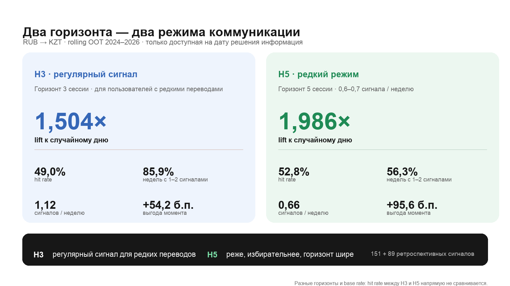
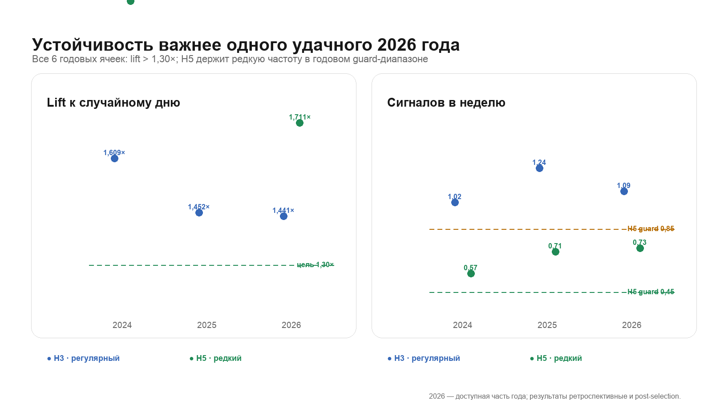
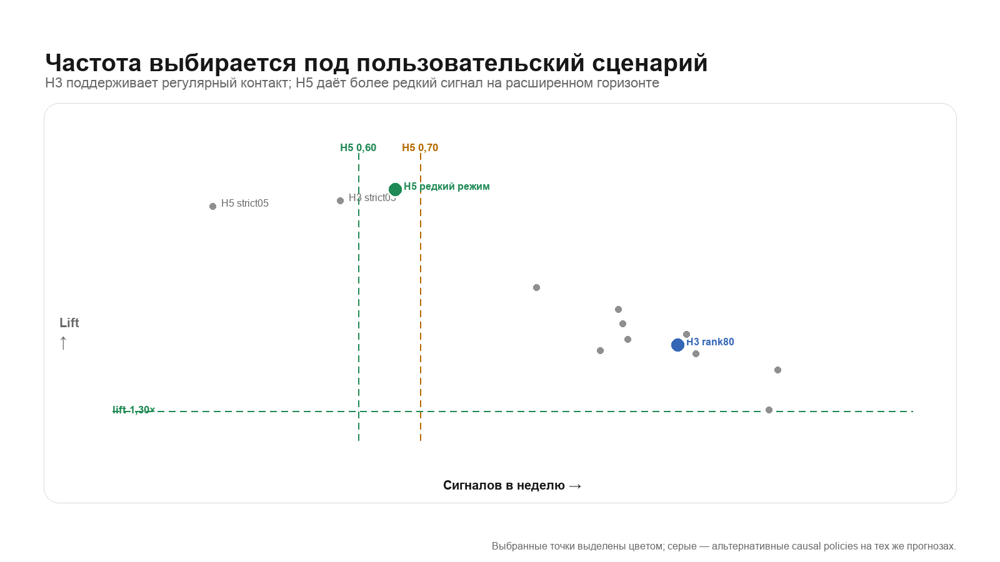
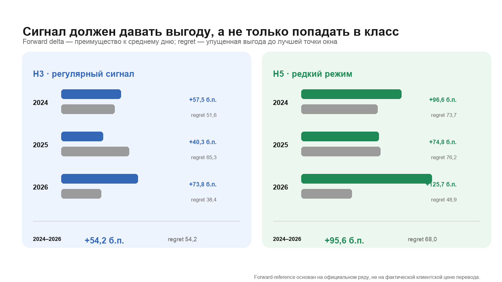
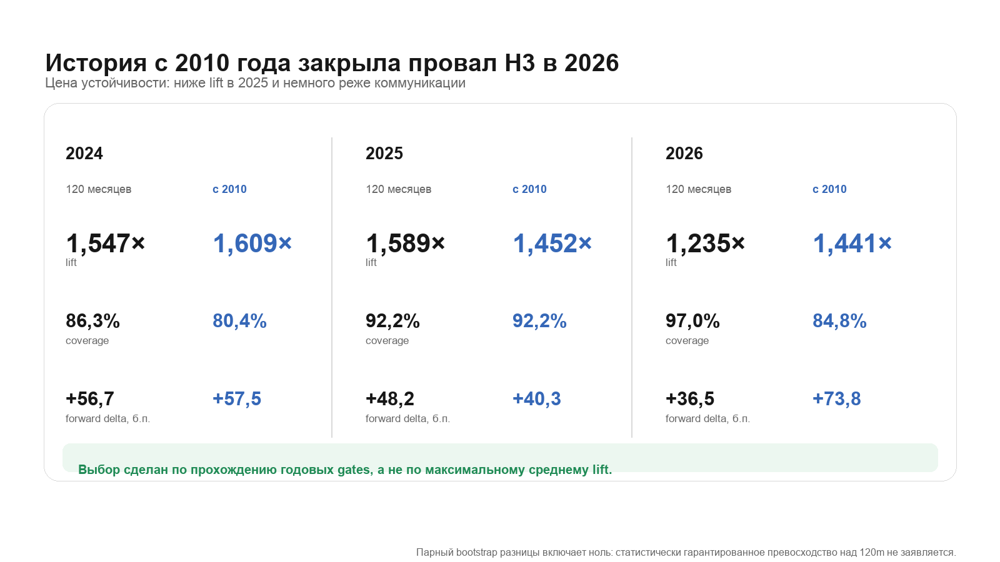
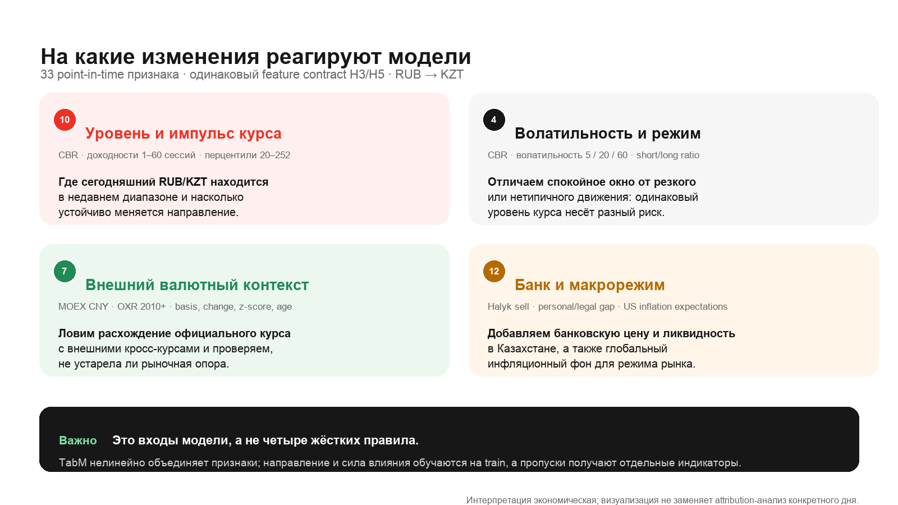
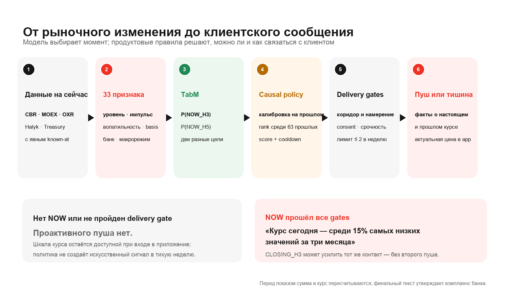
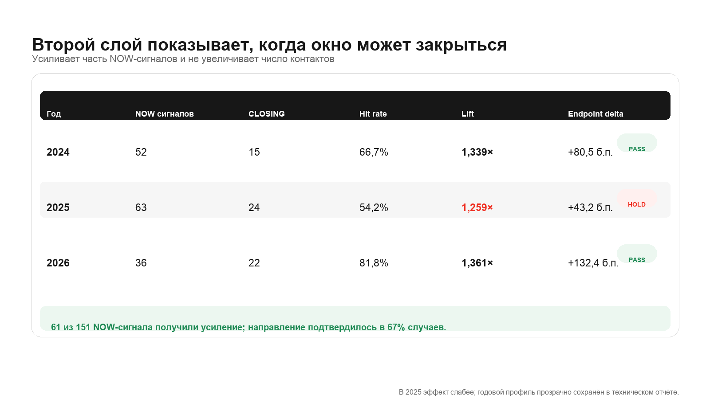
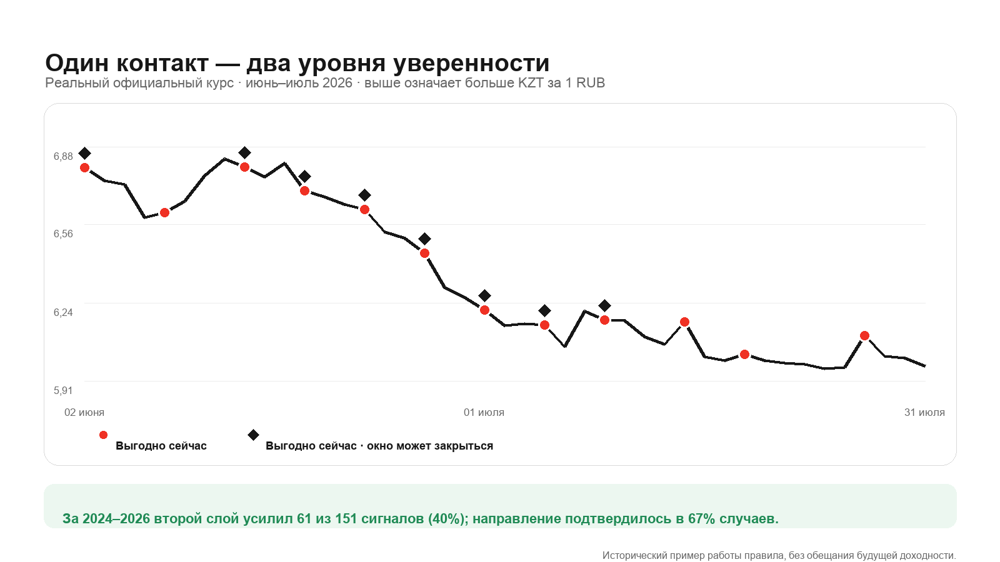

# AlphaTransfer: технический отчёт по итоговым моделям

AlphaTransfer определяет, насколько текущий момент благоприятен для перевода из рублей в тенге, и формирует уведомление «выгодно сейчас». Решение рассчитано на клиента, который не следит за валютным рынком постоянно и ожидает от банка короткого, своевременного и проверяемого сообщения.

В отчёте последовательно обоснованы целевые события, состав данных, правила формирования уведомлений, выбор модели и разделение продукта на два режима. Все публичные показатели получены при последовательной проверке на 2024, 2025 и доступной части 2026 года: каждый год оценивался только после обучения и настройки на более ранних данных. Исходные значения собраны в [едином наборе отчётных показателей](assets/model-metrics/metrics_snapshot.csv), а графики воспроизводятся скриптом `scripts/build_readme_assets.py`.

## 1. Постановка задачи и итоговое решение

Кейс требует ответить на три связанных вопроса. Во-первых, сигнал должен быть точнее случайного выбора дня. Во-вторых, выбранный день должен давать измеримую выгоду по курсу. В-третьих, полезные сигналы необходимо превратить в управляемый поток уведомлений, который не превышает допустимую частоту и допускает молчание при отсутствии достаточно сильного основания.

Этим требованиям соответствуют три основные метрики: отношение точности модели к точности случайного дня, преимущество выбранного момента в базисных пунктах и частота сигналов. Точность, ошибка Брайера, площадь под ROC-кривой, упущенная выгода и недельное покрытие дополняют оценку и помогают выявлять неустойчивые решения.

В итоговую систему вошли две модели одного семейства, обученные на разных целевых событиях.

| Режим | Целевое событие | Правило отбора | Продуктовая роль |
| --- | --- | --- | --- |
| H3 | текущий курс не выше курса ни в одну из трёх следующих дат действия официального курса ЦБ | правило `rank80`: сравнение с 63 предыдущими оценками, перерыв не менее двух расчётных дат, не более двух сигналов в неделю | регулярное наблюдение за короткими окнами для клиентов, которые переводят сравнительно редко |
| H5 | текущий курс не выше курса ни в одну из пяти следующих дат действия официального курса ЦБ | правило `rare65`: тот же принцип, настроенный примерно на 0,65 сигнала в неделю | более избирательный режим для клиента, который может выбирать момент в пределах пяти дат действия курса и предпочитает меньше уведомлений |

Обе модели используют TabM и один состав из 33 рыночных признаков. Они обучены отдельно, поскольку события H3 и H5 имеют разную базовую вероятность: 32,9% и 26,5% соответственно. Поэтому абсолютную точность и ошибку Брайера двух горизонтов нельзя считать прямым сравнением архитектур.

Итоговые модели обучены на истории с 2010 года. При ежегодной проверке параметры оценивались только на данных, предшествовавших отдельному году настройки вероятностей и частоты, после чего модель применялась к следующему году. Финальные версии переобучены по состоянию на 5 сентября 2026 года. Будущих наблюдений после этого переобучения пока нет, поэтому публичные показатели относятся к ежегодно воспроизводимой процедуре, а не к новому итоговому набору параметров.

### Как требования кейса отражены в решении

| Требование | Реализация | Результат | Ограничение |
| --- | --- | --- | --- |
| Сигнал лучше случайного дня | отдельные события H3 и H5; базовая вероятность считается внутри каждого года и валютного направления | итоговый lift равен 1,504 для H3 и 1,986 для H5; во всех шести годовых срезах он выше 1,30 | все периоды уже использовались в исследовании |
| Выбранный момент имеет денежный смысл | преимущество дня измеряется относительно среднего допустимого дня того же периода | +54,2 базисного пункта для H3 и +95,6 для H5; преимущество положительно во всех годах | расчёт основан на официальном курсе ЦБ и не включает тарифы и спред Альфа-Банка |
| Частота уведомлений контролируется | относительный порог, перерыв между сигналами и недельный предел | H3 даёт 1,12 сигнала в неделю, H5 — 0,66; максимум равен двум | режим H5 намеренно использует меньшую часть общего бюджета коммуникаций |
| Используются импульс, уровень, разворот, сезонность и рыночный режим | проверены признаки динамики, положения курса, волатильности, дополнительная модель закрытия окна и календарные признаки | итоговый набор содержит 33 признака; календарная гипотеза проверена отдельно | календарные признаки не дали устойчивого улучшения и не вошли в рабочую модель |
| На дату решения неизвестно будущее | каждый источник присоединяется с учётом времени доступности; исходы, которые ещё не успели проявиться, исключаются; преобразования оцениваются только на обучающих данных | повторный расчёт воспроизводит оценки и даты сигналов; изменение исходов проверочного периода не меняет ранее принятые решения | для части источников точное историческое время публикации заменено консервативной задержкой |
| Измерена цена ожидания подтверждения | отдельно сопоставлены быстрый рыночный и более медленный официальный сигналы | средняя цена ожидания составила 42,2; 33,2 и 13,8 базисного пункта в 2023–2025 годах | результат носит исследовательский характер и не относится напрямую к итоговым весам TabM |

## 2. Целевые события и метрики

Пусть $R_t$ обозначает официальный курс ЦБ в рублях за один тенге. Чем меньше $R_t$, тем выгоднее покупка тенге за рубли. Для горизонта $h$ событие «выгодно сейчас» считается истинным, если текущий курс не выше каждого из $h$ следующих курсов:

$$
NOW_h = \mathbf{1}\left[R_t \leq \min(R_{t+1},\ldots,R_{t+h})\right].
$$

Будущими точками служат следующие даты действия официального курса ЦБ, а не календарные дни. Последние $h$ наблюдений каждого обучающего и настроечного отрезка исключаются, если их исход ещё не был известен к границе периода.

| Метрика | Определение | Смысл |
| --- | --- | --- |
| Точность сигналов | доля успешных событий среди поданных сигналов | как часто сообщение «выгодно сейчас» подтверждалось |
| Базовая вероятность | доля успешных событий среди всех допустимых дней того же года и валютного направления | качество случайно выбранного дня в сопоставимом рыночном режиме |
| Lift | число успехов, делённое на ожидаемое число успехов при случайном выборе дней | во сколько раз сигнал информативнее случайного дня |
| Преимущество момента | среднее будущее изменение курса в дни сигнала минус среднее изменение во все допустимые дни той же группы | относительная ценность выбранного момента в базисных пунктах |
| Упущенная выгода | разница между текущим курсом и лучшим курсом внутри будущего окна | сколько потенциальной выгоды оставалось внутри окна; меньшее значение лучше |
| Недельное покрытие | доля недель с одним или двумя сигналами | регулярность коммуникации с учётом недель без сигналов |
| Сигналов в неделю | число сигналов, делённое на число наблюдаемых недель | средняя нагрузка до ограничений общего банковского канала |
| Ошибка Брайера | средний квадрат ошибки вероятности на всех вневыборочных днях | качество вероятностной оценки; меньшее значение лучше |
| Площадь под ROC-кривой | способность ранжировать успешные и неуспешные дни без выбора порога | дополнительная оценка разделяющей способности модели |

При объединении нескольких лет lift не усредняется. Для каждого года и валютного направления базовая вероятность умножается на число сигналов, после чего фактическое число успехов делится на сумму таких ожиданий. Это сохраняет корректное сравнение со случайным выбором дня при изменении рыночного режима.

## 3. Итоговые результаты



| Метрика за 2024–2026 годы | H3: регулярный режим | H5: редкий режим |
| --- | ---: | ---: |
| Вневыборочных наблюдений | 647 | 641 |
| Сигналов / успешных сигналов | 151 / 74 | 89 / 47 |
| Базовая вероятность события | 32,9% | 26,5% |
| Точность сигналов | 49,0% | **52,8%** |
| Lift | **1,504×** | **1,986×** |
| Преимущество момента | **+54,2 б.п.** | **+95,6 б.п.** |
| Упущенная выгода | 54,2 б.п. | 68,0 б.п. |
| Ошибка Брайера | 0,1782 | 0,1705 |
| Площадь под ROC-кривой | 0,765 | 0,737 |
| Недель с одним или двумя сигналами | 85,9% | 56,3% |
| Сигналов в неделю | 1,12 | **0,66** |
| Недель без сигналов | 19 из 135 | 59 из 135 |
| Наибольшее число сигналов за неделю | 2 | 2 |

H3 обеспечивает регулярную коммуникацию на коротком горизонте. H5 снижает среднюю частоту на 41% и отбирает более редкие даты, которые для её собственного целевого события дают lift 1,986 и преимущество 95,6 базисного пункта. Различие целей и базовых вероятностей не позволяет объяснять этот разрыв одним только горизонтом.

### Устойчивость по годам



| Год | Модель | Базовая вероятность | Точность | Lift | Недельное покрытие | Сигналов в неделю | Преимущество, б.п. | Упущенная выгода, б.п. | Ошибка Брайера | ROC AUC |
| --- | --- | ---: | ---: | ---: | ---: | ---: | ---: | ---: | ---: | ---: |
| 2024 | H3 | 33,5% | 53,8% | 1,609× | 80,4% | 1,02 | +57,5 | 51,6 | 0,1894 | 0,744 |
| 2025 | H3 | 26,2% | 38,1% | 1,452× | 92,2% | 1,24 | +40,3 | 65,3 | 0,1645 | 0,742 |
| 2026* | H3 | 42,4% | 61,1% | 1,441× | 84,8% | 1,09 | +73,8 | 38,4 | 0,1821 | 0,801 |
| 2024 | H5 | 26,7% | 55,2% | 2,063× | 49,0% | 0,57 | +96,6 | 73,7 | 0,1819 | 0,704 |
| 2025 | H5 | 19,8% | 44,4% | 2,241× | 60,8% | 0,71 | +74,8 | 76,2 | 0,1438 | 0,731 |
| 2026* | H5 | 36,5% | 62,5% | 1,711× | 60,6% | 0,73 | +125,7 | 48,9 | 0,1941 | 0,755 |

`*` Для 2026 года используется доступная часть года.

Во всех шести годовых срезах lift выше 1,30, а преимущество момента положительно. H3 во всех годах обеспечивает недельное покрытие не ниже 80%. Частота H5 находится в заранее установленном годовом диапазоне от 0,45 до 0,85 сигнала в неделю, а её итоговое значение входит в целевой диапазон от 0,60 до 0,70.

## 4. Соотношение качества и частоты



Постоянный порог вероятности 0,5 хорошо выделяет самые сильные оценки, однако частота таких оценок заметно меняется вместе с рынком. Итоговое правило сравнивает текущую оценку модели с 63 предшествующими оценками того же ряда. Для расчёта требуется не менее 20 прошлых значений. Текущий день добавляется в историю только после принятия решения, поэтому будущие оценки и исходы не влияют на сигнал.

Правило H3, обозначенное в коде как `rank80`, настраивается на регулярное недельное покрытие и обычно пропускает оценки ниже восьмидесятого процентиля недавней истории. Правило H5, обозначенное как `rare65`, выбирает по предшествующему настроечному периоду порог, который даёт около 0,65 сигнала в неделю. Числа в этих названиях относятся к способу настройки, а не к вероятности успеха.

Для H3 строгий порог 0,5 повышает итоговый lift до 1,698, но в худшем году оставляет сигналы лишь в 37,3% недель. Выбранное правило даёт lift 1,504 и покрытие 85,9%. Для H5 выбранная частота составляет 0,659 сигнала в неделю при минимальном годовом lift 1,711. Таким образом, правила задают две осмысленные точки на границе между качеством и частотой.

## 5. Выгода и упущенная возможность



Преимущество момента показывает, насколько будущая динамика после сигнала лучше средней динамики после произвольного допустимого дня того же периода. Упущенная выгода показывает расстояние до лучшего курса внутри будущего окна. Эти показатели основаны на официальном ряде ЦБ. Они характеризуют качество выбора момента, но не равны фактической экономии клиента после банковского спреда и комиссии.

Самым слабым годом H5 по преимуществу момента стал 2025 год, однако значение осталось положительным и составило 74,8 базисного пункта. В 2024 и доступной части 2026 года оно составило 96,6 и 125,7 базисного пункта соответственно.

## 6. Выбор длины обучающей истории

### H5

| Период | Обучение на последних 120 месяцах: lift / сигналов в неделю / преимущество | Обучение на истории с 2010 года: lift / сигналов в неделю / преимущество |
| --- | ---: | ---: |
| 2024 | 1,869× / 0,67 / +81,6 | **2,063×** / 0,57 / **+96,6** |
| 2025 | **2,255×** / 0,75 / **+79,8** | 2,241× / 0,71 / +74,8 |
| 2026 | 1,622× / 0,82 / +112,9 | **1,711×** / 0,73 / **+125,7** |
| 2024–2026 | 1,887× / 0,73 / +89,4 | **1,986×** / **0,66** / **+95,6** |

Обе версии прошли годовые требования к качеству. Обучение на последних 120 месяцах дало 0,733 сигнала в неделю, что выше верхней границы редкого режима 0,70. Использование всей истории снизило частоту до 0,659 сигнала в неделю, повысило итоговый lift на 0,099, увеличило преимущество на 6,2 базисного пункта и уменьшило ошибку Брайера на 0,00087. Поэтому по заранее установленному правилу была выбрана полная история.

| Разность «полная история минус 120 месяцев» | Оценка | 95%-й доверительный интервал по месячным блокам |
| --- | ---: | ---: |
| Lift | +0,099× | [−0,139; +0,322] |
| Преимущество момента | +6,2 б.п. | [−6,9; +19,7] |
| Ошибка Брайера | −0,00087 | [−0,00484; +0,00276] |

Все три интервала включают ноль. Полная история лучше соответствует устойчивости и частоте выбранного режима, однако статистически подтверждённого общего превосходства над 120 месяцами нет.

### H3



| Период | Обучение на последних 120 месяцах: lift / покрытие / преимущество | Обучение на истории с 2010 года: lift / покрытие / преимущество |
| --- | ---: | ---: |
| 2024 | 1,547× / 86,3% / +56,7 | **1,609×** / 80,4% / +57,5 |
| 2025 | **1,589×** / 92,2% / +48,2 | 1,452× / 92,2% / +40,3 |
| 2026 | 1,235× / **97,0%** / +36,5 | **1,441×** / 84,8% / **+73,8** |
| 2024–2026 | 1,453× / **91,1%** / +48,1 | **1,504×** / 85,9% / **+54,2** |

Обучение на последних 120 месяцах обеспечивает более высокое общее покрытие, но в 2026 году lift равен 1,235 и не достигает порога 1,30. Полная история проходит требования по качеству, выгоде и покрытию во всех трёх годах. В 2025 году её результат слабее, поэтому выбор основан на устойчивости худшего года, а не на превосходстве в каждом отдельном периоде.

| Разность «полная история минус 120 месяцев» | Оценка | 95%-й доверительный интервал по месячным блокам |
| --- | ---: | ---: |
| Lift | +0,051× | [−0,088; +0,172] |
| Преимущество момента | +6,1 б.п. | [−1,4; +13,2] |
| Ошибка Брайера | −0,0002 | [−0,0049; +0,0036] |

Эти интервалы также включают ноль. Кроме того, сравнение меняет длину обучения всего набора признаков, поэтому его нельзя считать оценкой старой истории OXR. В отдельном сопоставимом опыте добавление данных OXR за 2010–2018 годы изменило ошибку Брайера на +0,000467; доверительный интервал от −0,000536 до +0,001503 включал ноль. Следовательно, старые наблюдения OXR сами по себе улучшение полной модели не объясняют.

## 7. Данные и обоснование рыночных триггеров

### От наблюдения рынка до уведомления

В системе последовательно разделены три уровня. Рыночный показатель описывает одно наблюдаемое состояние: движение курса, его положение в историческом диапазоне, волатильность или расхождение источников. Модель объединяет все доступные показатели и оценивает вероятность целевого события. Затем отдельное правило учитывает относительную силу оценки, перерыв между сообщениями и недельный предел. Только после проверки клиентской готовности появляется уведомление.

Такое разделение позволяет согласовать противоречивые показатели. Например, низкий курс в годовом диапазоне может совпасть с сильным краткосрочным падением или с уже начавшимся разворотом. Отдельный показатель не вызывает сообщение сам по себе; решение определяется их совместным состоянием.



### Почему выбраны именно эти триггеры

Под триггером здесь понимается наблюдаемое состояние рынка, которое может изменить вероятность события «выгодно сейчас». Это не самостоятельная команда на отправку сообщения. Модель рассматривает несколько состояний одновременно, а уведомление появляется только после проверки силы общего прогноза и продуктовых ограничений.

Набор триггеров выбирался по четырём требованиям. Показатель должен иметь понятную связь с ценой RUB/KZT, быть доступным к моменту решения, дополнять уже имеющиеся сведения и сохранять смысл при изменении рыночного режима. Последнее требование существенно: календарные признаки выглядели разумно экономически, но не дали устойчивого улучшения и поэтому были исключены.

| Триггер | Рыночная гипотеза | Почему он нужен модели | Что показала проверка |
| --- | --- | --- | --- |
| Текущий уровень курса | благоприятный момент определяется не абсолютным числом, а положением курса относительно недавней истории | различает обычный день и локально дешёвый тенге на месячном, квартальном, полугодовом и годовом масштабе | показатели положения сохранились во вспомогательном отборе другой архитектуры; без них невозможно непосредственно описать относительную выгодность текущего курса |
| Краткосрочный и среднесрочный импульс | одинаково низкий курс может продолжать снижаться либо уже разворачиваться вверх | изменения за 1–60 дат помогают отличить продолжающееся движение от начала закрытия выгодного окна | изменения за 1, 5 и 60 дат сохранились во вспомогательной проверке устойчивости; горизонты 3 и 5 согласованы с целевыми событиями H3 и H5 |
| Волатильность | одно и то же изменение имеет разный смысл на спокойном и резко меняющемся рынке | оценивает риск продолжения движения и помогает не переносить правила спокойного периода на нестабильный | все четыре показателя волатильности сохранились во вспомогательном отборе признаков |
| Расхождение CNY/RUB на Московской бирже | давление на рубль может проявиться в ликвидном биржевом ориентире раньше, чем в официальном RUB/KZT | добавляет более быстрый источник информации о рублёвой части курса | показатель сохранился во вспомогательном отборе; отдельное исследование показало измеримую цену ожидания более позднего официального подтверждения |
| Независимая оценка OXR | расхождение внешнего кросс-курса и курса ЦБ может отражать ещё не учтённое движение | проверяет, подтверждает ли внешний рынок официальный уровень, и явно учитывает свежесть наблюдения | расширение OXR до 2010 года само по себе не улучшило ошибку Брайера; поэтому источник используется только как часть общего набора и не считается самостоятельным доказанным сигналом |
| Банковские котировки Halyk | локальный банк быстрее отражает спрос, предложение и изменение условий на рынке тенге | приближает модель к реальному банковскому ценообразованию, которого нет в официальном курсе ЦБ | добавление Halyk улучшило ошибку Брайера на январском отрезке 2026 года на 0,02416; дополнительная задержка на день снижала lift ранней TabM с 1,449 до 1,064 |
| Инфляционные ожидания США | глобальный режим доллара и склонность к риску меняют поведение валют развивающихся стран | позволяет различать одинаковые локальные движения в разных макроэкономических условиях | совместно с Halyk и локальными признаками эта группа уменьшила ошибку Брайера относительно V3 на основном периоде и в январе 2026 года; самостоятельный вклад каждого ряда не установлен |

Расширение исходных 15 признаков до полного набора из 33 повысило lift градиентного бустинга с 1,183 до 1,617, а TabM — с 1,271 до 1,584 на сопоставимом периоде 2023–2025 годов. Преимущество момента выросло соответственно с 23,5 до 61,7 и с 41,9 до 61,2 базисного пункта. Эти результаты обосновывают совместное использование групп, но не позволяют приписать весь прирост одному показателю.

### Как из триггеров получается понятное объяснение

Нелинейная модель не позволяет добросовестно назвать один признак причиной каждого прогноза без отдельного анализа конкретной даты. Поэтому клиентское объяснение строится из проверяемых наблюдений, а не из предположений о внутренней логике сети.

Первой сообщается относительная привлекательность курса: например, какое место текущая цена занимает среди значений последних 60 дат. Затем можно указать фактическую краткосрочную динамику и, при наличии свежих данных, подтверждение со стороны внешнего или банковского курса. Уточнение «окно может закрыться» добавляется только по отдельной модели H3 и только к уже разрешённому уведомлению. Макроэкономические показатели и внутренние параметры модели в текст сообщения не выносятся: они улучшают оценку, но не дают клиенту самостоятельного и проверяемого основания для действия.

Таким образом, сообщение отвечает на три вопроса в естественном порядке: насколько выгоден текущий уровень относительно недавней истории, что происходило с курсом в последние даты и есть ли основание ожидать закрытия окна. Численные значения должны рассчитываться непосредственно на дату отправки. Это исключает общие фразы вроде «рынок благоприятен» без наблюдаемого подтверждения.

### Динамика и положение официального курса

| Признак | Построение | Экономическая интерпретация |
| --- | --- | --- |
| `ret1` | логарифмическое изменение за одну сессию | самый быстрый импульс; положительное значение указывает на удорожание тенге и может сопровождать разворот |
| `ret3` | изменение за три сессии | движение на масштабе целевого события H3 |
| `ret5` | изменение за пять сессий | недельный импульс и естественный масштаб H5 |
| `ret10` | изменение за десять сессий | двухнедельный тренд, помогающий отличать краткий отскок от продолжения движения |
| `ret20` | изменение за двадцать сессий | месячный режим импульса или возврата к среднему |
| `ret60` | изменение за шестьдесят сессий | квартальный режим курса |
| `pr20` | положение текущего курса среди последних 20 значений | относительная дешевизна тенге на месячном масштабе |
| `pr60` | положение среди последних 60 значений | относительная дешевизна на квартальном масштабе |
| `pr120` | положение среди последних 120 значений | более устойчивый полугодовой ориентир |
| `pr252` | положение среди последних 252 значений | положение курса приблизительно в годовом диапазоне |

Для показателей положения используется средний ранг совпадающих значений. Низкий ранг означает, что тенге стоит дёшево относительно недавней истории. Несколько горизонтов сохраняются намеренно: они позволяют модели отличить локальное движение от более продолжительного режима. В дополнительной проверке устойчивости другой архитектуры были поддержаны `ret1`, `ret5`, `ret60` и все четыре показателя положения. Эта проверка служит вспомогательным свидетельством и не измеряет отдельный вклад каждого признака в итоговую TabM.

### Волатильность

| Признак | Построение | Экономическая интерпретация |
| --- | --- | --- |
| `vol5` | стандартное отклонение односессионных изменений за пять сессий | краткосрочный риск быстрого изменения курса |
| `vol20` | стандартное отклонение за двадцать сессий | месячный режим волатильности |
| `vol60` | стандартное отклонение за шестьдесят сессий | более устойчивый квартальный режим |
| `volratio` | отношение пятисессионной волатильности к шестидесятисессионной | всплеск или сжатие краткосрочного риска относительно обычного уровня |

Волатильность не определяет выгодность курса непосредственно. Она меняет смысл одинакового движения: падение на спокойном рынке и то же падение во время резкого всплеска имеют разную вероятность продолжения. Все четыре показателя прошли вспомогательную проверку устойчивости признаков.

### Индикатор MOEX

Признак `moex_cny_close_minus_fixing_same_session` равен логарифмической разности между ценой закрытия CNY/RUB и фиксингом той же торговой сессии. Положительное значение означает, что к закрытию юань подорожал относительно рубля. Поскольку движение рубля к юаню способно раньше официального RUB/KZT отразить общее давление на российскую валюту, этот показатель служит опережающим, хотя и косвенным, ориентиром.

Цена закрытия и фиксинг используются только при совпадении торговых дат. Наблюдение считается доступным на следующий календарный день и не используется, если ему больше семи дней. Показатель прошёл вспомогательную проверку устойчивости, однако остаётся косвенным: он описывает рынок CNY/RUB, а не поток заявок по тенге.

### Данные Open Exchange Rates

Open Exchange Rates (OXR) даёт независимую оценку RUB/KZT, рассчитанную через долларовые курсы. Чтобы модель не получила сведения раньше их реального появления, каждая запись становилась доступной лишь через сутки после публикации, но в любом случае не раньше чем через сутки после окончания дня, к которому она относится. Обычно это означало задержку примерно в два дня. Если с момента последнего доступного наблюдения прошло больше семи дней, оно не использовалось.

Внешний курс OXR сравнивается с официальным курсом ЦБ в логарифмах. Разность между ними показывает, насколько независимая рыночная оценка отклоняется от официальной.

| Признак | Построение | Интерпретация |
| --- | --- | --- |
| `oxr_log_basis` | разность логарифмов курса OXR и курса ЦБ | расхождение внешней и официальной оценки RUB/KZT |
| `oxr_basis_chg1` | изменение базиса за одну сессию | быстрое изменение расхождения источников |
| `oxr_basis_chg5` | изменение базиса за пять сессий | недельная устойчивость расхождения |
| `oxr_basis_z20` | отклонение базиса от среднего за 20 сессий, выраженное в стандартных отклонениях | аномальность текущего расхождения относительно недавнего режима |
| `oxr_available` | указатель наличия допустимого наблюдения | позволяет отличить наблюдаемое значение от заполненного пропуска |
| `oxr_age_days` | число дней после последней публикации | показывает, насколько свежа внешняя оценка |

Отдельное расширение OXR до 2010 года устойчивого улучшения не дало. Возраст публикации также оказался чувствительным к изменению задержки источника. Поэтому OXR используется как дополнительное подтверждение состояния рынка, а его доступность и возраст подлежат отдельному контролю. Набор OXR входит в зафиксированную итоговую конфигурацию, однако независимый вклад каждого из шести признаков не установлен.

### Котировки Halyk Bank

История Halyk позволяет приблизить состояние банковского ценообразования в тенге. Изменения сначала рассчитываются внутри исходной банковской серии и только затем присоединяются к календарю ЦБ. Это предотвращает появление искусственных нулевых изменений в дни без новой котировки.

| Признак | Построение | Интерпретация |
| --- | --- | --- |
| `halyk_rub_sell_official_basis` | сумма логарифма розничной котировки RUB/KZT Halyk и логарифма официального курса ЦБ | отклонение банковского курса от официального паритета |
| `halyk_rub_personal_legal_gap` | разность розничной и корпоративной рублёвой котировки одной даты | различие условий для физических и юридических лиц как косвенный показатель премии и ликвидности |
| `halyk_personal_rub_ret1` | изменение розничной рублёвой котировки за одну банковскую сессию | быстрая переоценка рубля банком |
| `halyk_personal_rub_ret5` | изменение за пять банковских сессий | недельная переоценка рубля |
| `halyk_personal_usd_ret1` | изменение розничной долларовой котировки за одну сессию | быстрая динамика долларовой составляющей тенге |
| `halyk_personal_usd_ret5` | изменение за пять сессий | более устойчивое движение долларовой составляющей |

Котировка считается доступной на следующий календарный день и используется не дольше семи дней. В групповом опыте добавление Halyk к сочетанию Treasury и признаков KZT уменьшило ошибку Брайера на январском отрезке 2026 года на 0,02416; доверительный интервал целиком находился ниже нуля. На основном исследовательском периоде интервал включал ноль. Если котировки искусственно задерживались ещё на один день, lift ранней версии TabM снижался с 1,449 до 1,064. Следовательно, банковские котировки несут полезную информацию, но ценность этой информации быстро уменьшается при задержке.

Halyk публикует курс продажи валюты банком. Для отправителя рублей в Казахстан нужна противоположная сторона сделки. Поэтому эти признаки отражают банковскую переоценку рынка, но не заменяют исполнимый курс Альфа-Банка и не позволяют оценить его маржу.

### Макроэкономический фон US Treasury

Используются два показателя инфляционных ожиданий США: десятилетняя безубыточная инфляция T10YIE и пятилетнее ожидание, рассчитанное для периода через пять лет, T5YIFR. Они характеризуют глобальные ожидания инфляции и склонность рынка к риску, которые влияют на доллар и валюты развивающихся стран.

| Признак | Построение | Интерпретация |
| --- | --- | --- |
| `treasury_t10yie_stale_level` | уровень T10YIE | текущий долгосрочный инфляционный фон |
| `treasury_t10yie_stale_chg5` | изменение T10YIE за пять наблюдений | краткосрочная смена ожиданий |
| `treasury_t10yie_stale_chg20` | изменение за двадцать наблюдений | более устойчивый месячный сдвиг |
| `treasury_t5yifr_stale_level` | уровень T5YIFR | долгосрочные ожидания, слабее зависящие от ближайшего цикла |
| `treasury_t5yifr_stale_chg5` | изменение T5YIFR за пять наблюдений | быстрый сдвиг долгосрочного фона |
| `treasury_t5yifr_stale_chg20` | изменение за двадцать наблюдений | устойчивый месячный сдвиг |

Чтобы исключить преждевременное использование публикаций, показатели Казначейства США сдвинуты на семь календарных дней; значения старше четырнадцати дней не используются. До 2020 года все шесть показателей отсутствуют. В групповом опыте сочетание данных Казначейства США, Halyk и локальных признаков KZT уменьшило ошибку Брайера относительно V3 на 0,00959 на основном периоде и на 0,01496 в январе 2026 года; оба доверительных интервала находились ниже нуля. Добавление макроэкономических данных к Halyk дало подтверждённое улучшение на основном периоде, но не на январском отрезке. Следовательно, эта группа полезна в некоторых конфигурациях, хотя самостоятельный вклад каждого показателя не установлен.

### Время доступности и обработка пропусков

Официальный курс ЦБ считается известным в 10:05 по московскому времени в день действия. Данные Московской биржи и Halyk становятся доступными модели на следующий календарный день. Для OXR применяется описанная выше задержка, обычно равная двум дням, а для показателей Казначейства США — семидневный запас. При объединении источников модель получает только последнее наблюдение, которое уже было опубликовано к моменту расчёта; записи с более поздним временем публикации исключаются.

Каждый из 33 числовых признаков сопровождается указателем пропуска. Значение, которым заполняются пропуски, и параметры числового преобразования определяются только по обучающим данным. Благодаря этому ранние годы можно использовать без искусственного переноса данных Halyk или Казначейства США в прошлое. Сам факт отсутствия источника способен косвенно указывать на историческую эпоху, поэтому после запуска необходимо следить за долей пропусков и фактическими задержками публикаций.

### Что дали группы признаков

| Сравнение на 2023–2025 годах | Lift | Преимущество момента | Ошибка Брайера | Недельное покрытие |
| --- | ---: | ---: | ---: | ---: |
| Градиентный бустинг, исходные 15 признаков | 1,183 | +23,5 б.п. | 0,1844 | 93,4% |
| Градиентный бустинг, 33 признака | 1,617 | +61,7 б.п. | 0,1798 | 79,6% |
| TabM, исходные 15 признаков | 1,271 | +41,9 б.п. | 0,1904 | 85,5% |
| TabM, 33 признака | 1,584 | +61,2 б.п. | 0,1843 | 77,0% |

Расширенный набор улучшил измеренное качество обеих архитектур на KZT, но снизил долю недель с сигналом. Этот опыт подтверждает пользу набора в целом. Серия из 33 сопоставимых переобучений с последовательным исключением каждого признака не проводилась, поэтому отчёт не приписывает отдельный прирост каждому столбцу. Для такого вывода потребовались бы одинаковые годовые разбиения, повторное обучение, парная оценка по месячным блокам и поправка на множественные проверки.

### Календарная сезонность

Календарная гипотеза из задания была проверена с помощью дня недели, дня месяца и месяца года. Эти признаки добавлялись к одной и той же логистической модели с динамикой и волатильностью на горизонтах H1, H3, H5, H10 и H20.

На H3 календарь повысил lift с 1,021 до 1,066 и преимущество момента с 4,4 до 10,2 базисного пункта, но слегка ухудшил ошибку Брайера с 0,2523 до 0,2531. На H5 lift снизился с 1,071 до 1,055, а ошибка выросла с 0,2397 до 0,2422, хотя преимущество момента увеличилось с 9,9 до 12,2 базисного пункта. На H20 lift снизился с 1,042 до 0,953. Устойчивого улучшения на нескольких горизонтах не обнаружено, поэтому календарные поля не вошли в итоговый набор.

## 8. Причинная цепочка формирования уведомления



Сначала система отбирает только те записи источников, которые уже могли быть известны в момент расчёта. На их основе строятся 33 рыночных признака и указатели отсутствующих значений. TabM оценивает вероятность события H3 или H5. Затем отдельная логистическая модель, настроенная на предшествующем году, приводит численные оценки к наблюдаемой вероятности, сохраняя их порядок. Текущая оценка сравнивается с 63 предыдущими, после чего применяются перерыв в две расчётные даты и недельный предел.

Полученный рыночный сигнал ещё не означает автоматическую отправку. Банк проверяет согласие клиента, актуальность направления RUB→KZT, наличие намерения и средств, срочность перевода и общий предел числа сообщений. Если хотя бы одно условие не выполнено, уведомление не отправляется. При самостоятельном входе в приложение клиент всё равно видит актуальный курс и рассчитанную стоимость перевода.

| Этап | H3 | H5 | Назначение |
| --- | --- | --- | --- |
| Целевое окно | три даты действия курса | пять дат действия курса | соответствует возможному сроку принятия решения |
| Настройка вероятностей | монотонная логистическая модель на предшествующем году | то же правило | корректирует масштаб оценки без использования проверочного года |
| Оценка относительной силы | положение среди 63 предыдущих оценок; требуется не менее 20 | то же правило | уменьшает зависимость частоты от общего сдвига вероятностей |
| Настройка частоты | регулярное недельное покрытие | около 0,65 сигнала в неделю | создаёт два режима коммуникации |
| Перерыв | две даты расчёта | две даты расчёта | объединяет повторяющиеся дни одного рыночного окна |
| Недельный предел | два сигнала | два сигнала | ограничивает нагрузку на канал |
| Неделя без сигнала | допускается | допускается | исключает искусственное заполнение квоты |

## 9. Дополнительная оценка «окно может закрыться»



Дополнительная модель, обозначенная в коде как `CLOSING_H3`, оценивает вероятность того, что через три даты действия официального курса тенге будет стоить дороже, чем сейчас. Её результат используется только вместе с уже сформированным сигналом H3. Уточнение «окно может закрыться» добавляется, когда вероятность повышения не ниже 0,5 и рост уже начался по сравнению с предыдущей расчётной датой. Число сообщений при этом не увеличивается.



За 2024–2026 годы дополнительная модель усилила формулировку 61 из 151 основного сигнала, то есть 40,4%. В 41 случае из 61 направление подтвердилось. Среднее повышение курса к концу трёхсессионного окна составило 87,1 базисного пункта.

| Показатель за 2024–2026 годы | Значение | Основание расчёта |
| --- | ---: | --- |
| Сигналов с уточнением | 61 из 151, или 40,4% | только уже отобранные H3-сигналы |
| Точность | 67,2% | 61 уточнение |
| Базовая вероятность / lift | 49,8% / **1,351×** | базовая вероятность рассчитана по 647 вневыборочным дням |
| Среднее повышение к концу окна | **+87,1 б.п.** | 61 уточнение |
| Ошибка Брайера | 0,2271 | все 647 дней |
| Площадь под ROC-кривой | 0,676 | все 647 дней |
| Дополнительных сообщений | **0** | уточняется существующий текст |

| Год | Основных сигналов | Уточнений | Точность | Lift | Повышение к концу окна |
| --- | ---: | ---: | ---: | ---: | ---: |
| 2024 | 52 | 15 | 66,7% | 1,339× | +80,5 б.п. |
| 2025 | 63 | 24 | 54,2% | 1,259× | +43,2 б.п. |
| 2026* | 36 | 22 | 81,8% | 1,361× | +132,4 б.п. |

Результат неоднороден: в 2025 году lift равен 1,259 и не достигает исследовательской границы 1,30. Поэтому сила формулировки и порог дополнительной модели требуют проверки на новом периоде. Её целевое событие тесно связано с основным H3 и не служит независимым подтверждением качества основной модели.

## 10. Выбор архитектуры и конфигурации

### Принцип выбора

Сравнение охватывало не только алгоритм, но и всё правило принятия решения: целевое событие, длину истории, состав признаков, числовую обработку, настройку вероятностей и ограничение частоты. Это необходимо, поскольку высокая площадь под ROC-кривой без приемлемой частоты не решает задачу коммуникации, а высокий lift на нескольких десятках дат может оставлять клиента без сигналов большую часть года.

Вариант допускался к итоговому сравнению, если в каждом году его lift был не ниже 1,30, преимущество момента оставалось положительным, а частота соответствовала назначению режима. Затем последовательно сравнивались результат в худшем году, общий lift, преимущество момента и ошибка Брайера. Выбирать задним числом отдельную модель для каждого проверочного года не разрешалось.

Первичный поиск охватывал все горизонты из задания: один, три, пять, десять и двадцать дат действия курса. В раннем сопоставимом опыте с классическими моделями лучший lift составлял для них 1,110; 1,055; 1,066; 1,089 и 1,107. Минимальный годовой результат ни у одного варианта не превышал 1,084. После расширения данных устойчивые и различимые с продуктовой точки зрения решения были получены для горизонтов в три и пять дат. Одного дня недостаточно для доставки сообщения и действия клиента, а десять и двадцать дней слабее соответствуют формулировке «выгодно сейчас» и повышают цену ожидания.

### Устройство итоговой TabM

| Компонент | Конфигурация | Обоснование |
| --- | --- | --- |
| Область обучения | отдельная модель KZT | позволяет использовать банковские признаки Казахстана и лучше соответствует выбранному пилотному коридору |
| Числовой вход | 33 значения и 33 указателя пропуска | сохраняет информацию о доступности источников и не требует переносить будущие данные в ранние годы |
| Кодирование чисел | периодические представления размерности 16 с 16 частотами | позволяет компактно описывать нелинейные зависимости уровней, рангов и базисов |
| Основная сеть | два слоя по 128 нейронов; во время обучения случайно отключается 10% связей | небольшая глубина соответствует объёму в несколько тысяч временных наблюдений и ограничивает переобучение |
| Внутреннее усреднение | 16 параллельных экземпляров модели с общими входными признаками | уменьшает зависимость результата от одного набора внутренних параметров |
| Критерий обучения | бинарное событие «выгодно сейчас» | оптимизирует требуемое событие, а не общую ошибку прогноза курса |
| Число проходов по обучающим данным | выбирается по отдельному предшествующему отрезку; в итоговом обучении 40 для H3 и 25 для H5 | проверочный год не управляет остановкой обучения |
| Настройка вероятностей | монотонная логистическая модель на отдельном предшествующем году | приводит оценки к наблюдаемому масштабу вероятности и сохраняет их порядок |

Архитектура и начальное состояние генератора случайных чисел были зафиксированы до итогового сравнения длины истории. В ранней проверке разных запусков lift менялся от 1,432 до 1,692, а недельное покрытие — от 65,1% до 80,9%. Лучший запуск задним числом не выбирался. Такой порядок уменьшает смещение отбора, но показывает, что в следующем цикле необходимо оценивать разброс результатов между повторными обучениями.

### Отдельная модель KZT

На одинаковом отрезке 2023–2025 годов локальная TabM с 33 признаками дала на KZT lift 1,584, ошибку Брайера 0,1843 и преимущество 61,2 базисного пункта. Модель, обученная сразу на пяти валютных направлениях, при оценке на KZT дала 1,410, 0,1985 и 49,1 базисного пункта соответственно.

Исследование общей модели для нескольких валютных направлений также показало, что лучший вариант прошёл 14 из 15 годовых проверок, но для KZT в 2026 году его коэффициент составил 1,270 и не достиг порога 1,30. Ни один вариант общей модели не прошёл все 15 проверок. Поэтому итоговая версия подтверждена только для RUB→KZT. Перенос на другое валютное направление потребует собственной ежегодной проверки и отдельной настройки порога.

### Сопоставление TabM и градиентного бустинга

| Модель на 33 признаках, 2023–2025 годы | Lift | Точность | Недельное покрытие | Ошибка Брайера | Преимущество момента |
| --- | ---: | ---: | ---: | ---: | ---: |
| Локальный градиентный бустинг KZT | **1,617** | **45,4%** | **79,6%** | **0,1798** | **+61,7 б.п.** |
| Локальная TabM KZT | 1,584 | 42,7% | 77,0% | 0,1843 | +61,2 б.п. |
| Общий градиентный бустинг, пять коридоров | **1,471** | **45,9%** | 82,2% | **0,1901** | **+52,9 б.п.** |
| Общая TabM, пять коридоров | 1,370 | 42,4% | **82,4%** | 0,2017 | +45,1 б.п. |

В локальном сравнении разность lift TabM и бустинга равна −0,033; 95%-й доверительный интервал от −0,226 до +0,161 включает ноль. Разность ошибок Брайера также не позволяет установить преимущество одной модели. В общем варианте ошибка TabM выше на 0,01162, а доверительный интервал от +0,00423 до +0,01863 целиком положителен.

Следовательно, имеющиеся данные подтверждают пригодность выбранной TabM, но не доказывают общего превосходства нейросетевой архитектуры над градиентным бустингом. Выбор TabM опирается на четыре обстоятельства. Для неё проведён единообразный отбор H3 и H5 на 2024–2026 годах, обе итоговые конфигурации прошли годовые требования, а совместная модель на предшествующем настроечном периоде не присвоила градиентному бустингу положительного веса. Кроме того, для обеих моделей TabM подготовлен единый воспроизводимый процесс обучения и применения. В следующем испытании градиентный бустинг следует оценить параллельно на тех же полных историях, годах и правилах частоты.

### Другие проверенные подходы

| Подход | Результат | Причина отказа от замены итоговой модели |
| --- | --- | --- |
| Предыдущая версия V3 с постоянным порогом 0,5, KZT H5 | коэффициент 2,045 и точность 56,7%, но недельное покрытие 38,8% при 60 сигналах | слишком много недель без сигнала для регулярного режима |
| Предыдущая версия V3 с прежним правилом частоты, KZT | lift 1,478 и покрытие 88,2% | сильный ориентир, однако итоговые конфигурации дают более высокие оценки качества; системы различаются не только архитектурой |
| CatBoost после отбора 14 из 27 признаков | пересечение выбранных признаков между окнами составило 10, 10 и 11 из 14; ошибка Брайера ухудшилась на 0,0126; 0,0159 и 0,00325 | отбор признаков оказался неустойчивым и не улучшил проверочные периоды |
| Сочетание TabM и градиентного бустинга | на предшествующем настроечном периоде весь вес был присвоен TabM | добавление бустинга не улучшило выбранную конфигурацию |
| Предобученные модели Chronos-2 Small и Synth, до 119 млн параметров | лучший вариант, использовавший их прогнозы как дополнительные признаки, дал ошибку 0,19052, lift 1,436 и преимущество 50,3 базисного пункта | доверительные интервалы улучшения включали ноль; самостоятельные модели события были заметно слабее |
| Случайное блуждание | показало лучшую среднюю квантильную ошибку прогноза, чем проверенные предобученные модели | сложная модель временных рядов сама по себе не создала качественный сигнал события |

Полное дообучение Chronos уменьшало ошибку Брайера относительно предыдущей V3, обученной на коротком отрезке, лишь на 1,38% в одной конфигурации, но одновременно снижало преимущество момента с 47,7 до 35,0 базисного пункта. V3 на десятилетней истории сохраняла меньшую ошибку 0,18485. Поэтому итоговая система непосредственно обучается распознавать событие «выгодно сейчас» и отдельно управляет частотой сообщений. К предобученным прогнозам курса можно вернуться после появления нового подтверждающего периода.

## 11. Два режима для разных потребностей клиента

H3 и H5 отвечают разным условиям принятия решения. H3 регулярно ищет благоприятные моменты в пределах трёх дат действия курса. H5 рассчитана на более длинный срок и подаёт более редкие, избирательные сигналы.

| Свойство | H3: регулярное наблюдение | H5: редкое наблюдение | Продуктовый смысл |
| --- | ---: | ---: | --- |
| Сигналов в неделю | 1,12 | 0,66 | H5 снижает частоту на 41,1% |
| Недель хотя бы с одним сигналом | 85,9% | 56,3% | H3 поддерживает более непрерывное наблюдение |
| Горизонт | 3 даты действия курса | 5 дат действия курса | H5 требует большей гибкости срока |
| Lift для собственного целевого события | 1,504× | 1,986× | обе модели информативнее случайного дня |
| Преимущество момента | +54,2 б.п. | +95,6 б.п. | H5 выбирает более редкие и сильные даты |
| Базовая вероятность события | 32,9% | 26,5% | показатели двух горизонтов нельзя считать прямым сравнением моделей |

H3 предназначена для клиента, который переводит сравнительно редко, но хочет поручить банку регулярное наблюдение за короткими окнами. Уведомление отправляется только при наличии текущего намерения или готовности к переводу. H5 подходит клиенту, который может выбрать день в пределах пяти дат действия курса и явно предпочитает меньше сообщений. Для назначения режима важнее допустимый срок и выбранная частота сообщений, чем одна историческая характеристика «частый» или «редкий» отправитель.

### Основания для разделения потребностей

Открытые исследования подтверждают, что ритм переводов заметно различается между людьми. По данным Всемирного банка о получателях в Кыргызстане, 40% получают перевод не реже одного раза в месяц, 32% — от четырёх до шести раз в год, 21% — два-три раза, а 6% — раз в год. Набор L2KGZ за 2021–2025 годы содержит 62 235 ежемесячных наблюдений домохозяйств и 324 050 наблюдений отдельных лиц. Вероятность перевода в следующем наблюдаемом месяце составляет 70,76% после месяца с переводом и 31,91% после месяца без него. Среди 447 мигрантов, наблюдавшихся не менее шести месяцев, 20,58% отправляли деньги более чем в 75% месяцев, 59,96% — в 25–75%, а 19,46% — не более чем в четверти месяцев.

Эти данные показывают устойчивые различия в ритме потребности, но относятся к получателям и мигрантам, а не к клиентам Альфа-Банка. Они также не содержат сведений о ежедневной реакции на уведомление. Поэтому внешние наблюдения обосновывают необходимость учитывать готовность и срок перевода, но не позволяют автоматически назначать H3 или H5.

### Проверка синтетических пользовательских сценариев

В отдельной симуляции правило, которое выбирало горизонт и частоту по группе переводов, давало в 2024–2025 годах в среднем 4,580 контакта на один наблюдаемый период клиента. Точность по общему событию H5 составила 38,9%, доля контактов внутри скрытого окна потребности — 61,4%, а условная чистая ценность выбранного момента — 260,8 рубля. Единое правило давало 7,626 контакта, точность 45,0%, долю релевантных контактов 54,0% и условную ценность 621,9 рубля. Даже после выравнивания ожидаемого числа контактов единое правило сохраняло точность 44,6% и условную ценность 334,0 рубля при 3,685 контакта.

Таким образом, редкий перевод не означает, что рынок нужно проверять редко. Длинный перерыв способен исключить единственное окно, когда клиент готов действовать. Кроме того, тысячи синтетических контактов основаны всего на 157–167 различных рыночных датах и не увеличивают объём независимой информации о курсе.

Поэтому H3 и H5 рассматриваются как два варианта уведомлений, а не как уже доказанная автоматическая персонализация. Выбор должен учитывать согласие клиента, текущую готовность, срок перевода и желаемую частоту сообщений. Историческая частота переводов пригодна для предварительного разделения участников банковского испытания, но не должна быть единственным основанием для переключения модели.

### Предлагаемое правило назначения

| Условие | Решение | Обоснование |
| --- | --- | --- |
| Нет согласия, активного направления RUB→KZT, средств или намерения; перевод требуется немедленно | уведомление о выборе момента не отправляется; при входе показывается текущая цена | модель не должна задерживать обязательный перевод |
| Клиент переводит редко, выбрал регулярное наблюдение и может принять решение в течение трёх сессий | H3 | банк постоянно наблюдает рынок, но связывается только при подтверждённой готовности |
| Клиент предпочитает меньше уведомлений и может действовать в течение пяти сессий | H5 | частота 0,6–0,7 сигнала в неделю соответствует более избирательному режиму |
| Обе модели дают сильную оценку | используется заранее выбранный режим клиента и одно сообщение | две модели не должны удваивать контакт |
| H3 прошла отбор, а дополнительная модель подтверждает закрытие окна | текст существующего сообщения усиливается | срочность добавляется без нового уведомления |
| Общий банковский предел уже занят более приоритетным сообщением | валютное уведомление подавляется с сохранением причины | ограничение относится ко всем сообщениям клиенту |

### Проверка в банковском испытании

Реальных клиентских данных и истории реакции на такие уведомления в материалах кейса нет, а построение модели выбора адресатов не входит в обязательный объём задачи. Поэтому назначение режимов следует проверять в случайном контролируемом испытании на уровне клиента. В него включаются клиенты направления RUB→KZT, согласившиеся на сообщения и проявившие готовность к переводу; срочные переводы исключаются.

До случайного распределения клиенты разделяются по недавней частоте переводов, сроку принятия решения, наличию средств, выбранной частоте сообщений и текущей нагрузке других банковских коммуникаций. Сравниваются четыре варианта: отсутствие валютного уведомления, H3, H5 и выбор между H3 и H5 по предпочтению клиента. Основными продуктовыми показателями служат дополнительный объём завершённых переводов и дополнительная маржа на одного подходящего клиента. Одновременно контролируются отписки, жалобы, число контактов, доля отменённых сообщений, конверсия внутри заявленного срока и фактическое количество полученных тенге.

Правило назначения принимается только в том случае, если оно увеличивает объём или маржу относительно единого режима и не повышает число отписок, жалоб и избыточных сообщений. До такого испытания H3 и H5 следует предлагать как понятный выбор частоты, а не назначать незаметно для клиента на основании неподтверждённой поведенческой модели.

## 12. Цена ожидания медленного подтверждения

Отдельный опыт сопоставлял быстрый показатель расхождения CNY/RUB с более поздним подтверждением по официальной истории. В 2023, 2024 и 2025 годах подтверждение появлялось соответственно в 46,0%, 21,4% и 51,1% случаев. Медианное ожидание составляло две, две и полторы даты действия курса, а средняя цена ожидания по официальному курсу — 42,2; 33,2 и 13,8 базисного пункта. Точность подтверждённых событий H5 не улучшалась устойчиво.

Поэтому медленное подтверждение не используется как обязательный второй этап. H3 и H5 работают параллельно для разных сроков решения. Дополнительная модель закрытия окна меняет только формулировку уже разрешённого сообщения.

## 13. Статистическая неопределённость и границы вывода

Доверительные интервалы для сравнения полной и десятилетней истории получены парным повторным отбором календарных месяцев с раздельным учётом каждого года. В каждой повторной выборке заново рассчитывалась базовая вероятность события. Такой подход сохраняет общие рыночные режимы двух сравниваемых моделей и лучше учитывает временную зависимость, чем независимое перемешивание отдельных дней.

Интервалы относятся к уже обученным моделям и выбранным правилам. Они не учитывают весь предшествующий поиск признаков и архитектур, разброс при повторном обучении и множественность исследовательских сравнений. Все доступные периоды, включая 2026 год, уже просматривались при разработке. Поэтому результаты описывают устойчивость выбранной процедуры на прошлых данных, но не заменяют будущую подтверждающую проверку.

Преимущество момента рассчитано по официальному курсу ЦБ. Для оценки фактической пользы клиенту необходимы исполнимая котировка Альфа-Банка, комиссия, объём перевода и факт исполнения. Для оценки пользы банку дополнительно потребуются изменение конверсии, объёма и маржи. Эти величины входят в предложенное банковское испытание и не выводятся из исторического курса.

## 14. Протокол и воспроизводимость

Проверка построена по календарным годам. Для каждого года обучение заканчивается до отдельного двенадцатимесячного периода настройки вероятностей и частоты, за которым следует проверочный год. Исходы обучающих примеров должны полностью проявиться до каждой границы. Заполнение пропусков и числовые преобразования определяются только по обучающим данным. Порог частоты использует лишь предшествующую историю оценок. Внешние источники присоединяются с учётом времени, когда каждая запись могла быть известна.

Повторный расчёт проверяет неизменность проверочных групп, достаточность времени для проявления исходов, контрольные суммы исходных данных, значения вероятностей, состояние правила частоты и итоговые даты сигналов. Результаты финального переобучения не выдаются за новую проверку на будущих данных.

Основные источники и файлы, позволяющие проверить расчёты:

- [постановка кейса](../global_task.md), [сводка вопросов и ответов](../Q&A для команд — сводка 20260903.md) и [полные вопросы и ответы](../Вопросы и ответы.md);
- [построение 33 признаков и учёт времени доступности](../final_solution/tabm_h3/features.py);
- [результаты и выбор H3](../final_solution/tabm_h3/evaluation/REPORT.md), [машиночитаемое решение H3](../final_solution/tabm_h3/evaluation/selection.json);
- [результаты и выбор H5](../research_v4/h5_fullhistory/REPORT.md), [парные интервалы H5](../research_v4/h5_fullhistory/paired_intervals.csv);
- [сопоставление TabM и градиентного бустинга](../research_v4/architecture_2023_2025/REPORT.md);
- [исследование OXR, Halyk и Treasury](../research_v4/oxr2010_bank/REPORT.md);
- [исследование предобученных моделей временных рядов](../research_v4/foundation/REPORT.md);
- [опыт отбора признаков CatBoost](../research_v4/final_sprint/catboost/REPORT.md);
- [измерение цены ожидания](../final_solution/model_bundle/fast_slow_confirmation_summary.csv);
- [синтетическое исследование пользовательских групп](../research_v4/segments/REPORT.md) и [внешние данные о поведении](../product_artifacts/V4_SEGMENTATION_EVIDENCE.md);
- [полная таблица H3](../final_solution/tabm_h3/evaluation/REPORTING_ALL_METRICS.csv), [полная таблица H5](../research_v4/h5_fullhistory/REPORTING_ALL_METRICS.csv) и [архив сопоставлений](../research_v4/robust_selection/REPORTING_ALL_METRICS.csv);
- [набор показателей для README](assets/model-metrics/metrics_snapshot.csv) и [контрольные суммы](assets/model-metrics/metrics_snapshot_receipt.json).

Проверить и заново построить графики можно командами:

```bash
python3.11 scripts/build_readme_assets.py --build
python3.11 scripts/build_readme_assets.py --check
```

Получить показатели итоговых моделей можно единообразно:

```bash
python3.11 final_solution/main.py --model h3 --action metrics --corridor-filter KZT
python3.11 final_solution/main.py --model h5 --action metrics --corridor-filter KZT
```
