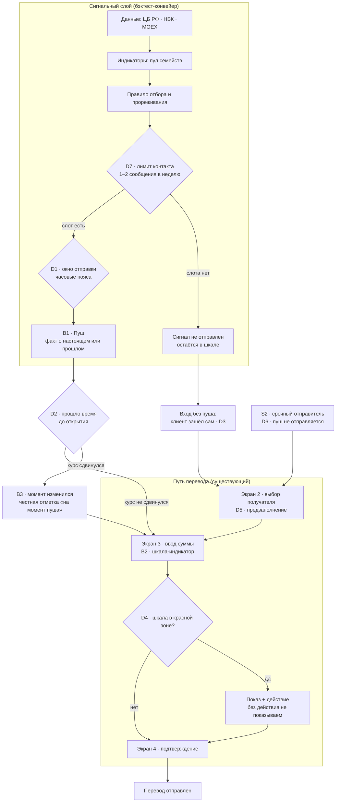

# Клиентский путь — рабочий документ и шаблон

Задача со звёздочкой кейса Альфа-Банка: «что клиент видит, когда момент изменился».

**Статус документа:** каркас с заготовками. Разделы 4 и 6 заполняются данными после прогона приложения; до этого их поля помечены `[TBD]`.
**Владелец:** AI Product
**Дата создания:** 2026-09-04.

---

## 0. Как читать этот документ

Три уровня, каждый обязателен для следующего:

| Слой | Что это | Раздел | Без него |
|---|---|---|---|
| A · AS IS | Реальный путь перевода в приложении, снятый руками | §4 | Слой B не защищается: непонятно, во что мы врезаемся |
| B · TO BE | Дельта к слою A: три врезки, остальное не трогаем | §5 | Нечего показывать |
| C · Развилки | Семь решений с вариантами, критерием и обоснованием | §6 | «Красивый экран без ответа "почему именно так" не засчитывается» |
| D · Прототип | Кликабельные экраны | §9 | Опция. Добавляет баллы, не заменяет C |

Статусы по всему документу — как в остальных продуктовых артефактах проекта:
**Принято** — решение зафиксировано, менять только с обоснованием.
**Кандидат** — вариант в пуле, критерий выбора назван, выбор не сделан.
**Открытый вопрос** — нет данных, вопрос адресован кейсодателю.

---

## 1. Рамка: что именно требует кейс

Дословные требования звёздочки — шесть шагов:

1. Разберите текущий путь перевода — приложение публично доступно
2. Тайминг отправки — часовые пояса: пуш в 01:00 по локальному времени не даст актуального сигнала
3. Механика «момент изменился» — несколько вариантов, не один первый
4. Обзор практик — ИИ-агентом — финансы, путешествия, e-commerce
5. Предзаполнение формы перевода — какие данные банка нужны
6. Прототип агентными инструментами — в стилистике приложения

Качественная оценка — четыре критерия:
реальный путь, а не выдуманный · несколько механик, выбор объяснён · обзор с источниками, конкретные продукты · реализуемо без переделки пути целиком.

Плюс дисквалифицирующее: красивый экран без ответа «почему именно так» не засчитывается.

### Карта соответствия «требование → раздел»

| Требование кейса | Раздел документа | Статус |
|---|---|---|
| 1. Реальный путь | §4 Слой A | `[TBD]` — прогон приложения |
| 2. Часовые пояса | §6 D1 | Заготовка, решение не принято |
| 3. Механика «момент изменился», несколько вариантов | §6 D2 | Пул из 4 механик собран, выбор не сделан |
| 4. Обзор практик с источниками | §7 | Каркас таблицы, заполняется |
| 5. Предзаполнение и какие данные нужны | §6 D5 + §8 | Реестр данных, часть — запрос к банку |
| 6. Прототип | §9 | Опция, после §5–§6 |
| Реализуемо без переделки пути | §5, дельта-принцип | Принято как принцип работы |

---

## 2. Ключевое решение по форме: КП — это diff, а не новый флоу

Мы **не рисуем путь перевода заново**. Мы снимаем реальный путь и показываем разницу.

Причина прямая: критерий «реализуемо без переделки пути целиком» проверяется по тому, сколько существующих экранов мы предлагаем изменить. Команда, которая приносит нарисованный с нуля флоу, этот критерий проваливает автоматически, даже если флоу лучше.

Практическое следствие: в слое B каждый экран имеет **тот же номер**, что в слое A. Новое помечено маркером `[NEW]`, изменённое — `[Δ]`, нетронутое — без маркера. На схеме то же самое цветом.

---

## 3. Стык с основной задачей

КП не отдельный проект. Три жёстких связки, которые должны быть видны на защите:

**Связка 1 — шкала.** Величина на экране перевода — та же, по которой считался индикатор в бэктесте. Не отдельная дизайнерская метафора. Если индикатор построен на перцентиле окна, шкала показывает перцентиль окна.

**Связка 2 — отбор.** Путь начинается не с пуша, а с цепочки: сигнал → правило отбора и прореживания → лимит контакта 1–2 сообщения на клиента в неделю (делится со всем маркетингом) → отправка. Пуш — выход конвейера из шести блоков, а не самостоятельный объект.

**Связка 3 — сегмент.** S2 (срочный отправитель) исключён как адресат пуша. Значит, в КП обязана быть ветка «клиент, которому пуш не отправлен, зашёл сам» — иначе исключение сегмента не доведено до продукта.

---

## 4. Слой A · AS IS: протокол снятия реального пути

**Как снимаем.** Приложение публично доступно. Прогон до экрана подтверждения, **без отправки денег**. Делают три человека независимо; расхождения в наблюдениях фиксируются отдельно — они сами по себе продуктовая находка.

**Время:** 30 минут на человека.

### 4.1 Карта экранов — заполнить

| № | Экран | Что на нём есть | Показан ли курс | Обновляется ли на экране | Что предзаполнено | Тапов от иконки |
|---|---|---|---|---|---|---|
| 1 | `[TBD]` | | | | | |
| 2 | | | | | | |
| 3 | | | | | | |
| 4 | | | | | | |

### 4.2 Контрольные наблюдения — заполнить

| Вопрос | Наблюдение | Кто снял |
|---|---|---|
| Где именно впервые показан курс | `[TBD]` | |
| Есть ли таймер или фиксация курса на экране | `[TBD]` | |
| Что происходит при возврате на экран через 10 минут | `[TBD]` | |
| Какие поля предзаполняются из истории переводов | `[TBD]` | |
| Есть ли сегодня хоть какой-то ориентир по курсу (график, «вчера было») | `[TBD]` | |
| Комиссия: где показана, до или после ввода суммы | `[TBD]` | |
| Что видно получателю по сумме до подтверждения | `[TBD]` | |

### 4.3 Расхождения между наблюдателями

| Что | Наблюдатель 1 | Наблюдатель 2 | Наблюдатель 3 | Вывод |
|---|---|---|---|---|
| `[TBD]` | | | | |

### 4.4 Базовая последовательность (по постановке кейса, до верификации)

Из материалов кейса путь описан так:

1. Решил перевести — зарплата или просьба семьи
2. Открыл приложение, выбрал получателя
3. Ввёл сумму, видит курс сегодняшнего дня
4. Отправил по текущему курсу

Это **источник кейсодателя, а не наше наблюдение**. После §4.1 сверяем и правим.

Точка боли, зафиксированная ранее: на шаге 3 курс показан как цифра без системы отсчёта — сравнить сегодняшний день не с чем.

---

## 5. Слой B · TO BE как дельта

Три врезки, ни одной больше.

| Врезка | Куда | Что добавляется | Тип |
|---|---|---|---|
| B1 | Перед шагом 1 | Пуш с фактом о курсе — новый вход в путь, которого не было | `[NEW]` |
| B2 | Шаг 3 (ввод суммы) | Шкала-индикатор рядом с курсом; та же величина, что в пуше | `[Δ]` |
| B3 | Новое состояние | Открытие устаревшего пуша: что видит клиент, если курс сдвинулся | `[NEW]` |

Шаги 2 и 4 не меняются. Это и есть ответ на «реализуемо без переделки пути целиком».

### 5.1 Схема



### 5.2 Правило маркировки на слайде

`[NEW]` — акцентный цвет, `[Δ]` — контур акцентным, остальное — серый. Один взгляд на слайд должен давать ответ «сколько экранов вы меняете».

---

## 6. Слой C · Развилки

**Центральная часть документа.** Схема без заполненных карточек — картинка, а не результат.

### 6.1 Шаблон карточки развилки

Копировать для каждой новой развилки. Поля не пропускаются: пустое поле — это тоже ответ, и он пишется словами.

```markdown
### D<N> · <Название развилки>

**Вопрос:** <что именно надо решить, одним предложением>
**Откуда взялась:** <требование кейса / наше наблюдение / ограничение банка>
**Влияет на:** <какие экраны и блоки конвейера>

| Вариант | Что это | Плюс | Минус | Стоимость реализации |
|---|---|---|---|---|
| V1 | | | | |
| V2 | | | | |
| V3 | | | | |

**Критерий выбора:** <по какому признаку выбираем — назван ДО выбора>
**Выбор:** <V_> — статус: Принято / Кандидат / Открытый вопрос
**Почему:** <обоснование через критерий, не через вкус>
**Чем подтверждено:** <данные корпуса / бэктест / ответ кейсодателя / допущение>
**Что делаем, если допущение не подтвердится:** <запасной вариант>
```

### 6.2 Реестр развилок

| # | Развилка | Откуда | Статус |
|---|---|---|---|
| D1 | Окно отправки пуша, часовые пояса | Требование кейса, дословно | Открытый вопрос |
| D2 | Что видит клиент, открывший устаревший пуш | Ядро звёздочки | Пул из 4 механик, выбор не сделан |
| D3 | Вход без пуша — клиент зашёл сам | Наше решение | Кандидат |
| D4 | Сигнала нет или курс в красной зоне | Наше правило UX | Принято как принцип |
| D5 | Предзаполнение формы: какие поля и откуда | Подвопрос кейса | Открытый вопрос к банку |
| D6 | Путь для S2, кому пуш не отправляется | Следствие сегментации | Кандидат |
| D7 | Конфликт с лимитом 1–2 сообщения в неделю | Ограничение кейсодателя | Открытый вопрос |

---

### D1 · Окно отправки пуша и часовые пояса

**Вопрос:** в какое время суток и по чьему локальному времени отправляется пуш.
**Откуда взялась:** прямая цитата кейса — «пуш в 01:00 по локальному времени не даст актуального сигнала».
**Влияет на:** блок отправки конвейера, не на экраны.

| Вариант | Что это | Плюс | Минус | Стоимость |
|---|---|---|---|---|
| V1 | Единое окно по московскому времени | Просто, данных не требует | Владивосток получает пуш ночью | Низкая |
| V2 | Окно по таймзоне отправителя | Корректно для клиента | Нужна таймзона клиента — данных у нас нет | Средняя, зависит от банка |
| V3 | Окно по таймзоне получателя (Казахстан) | Логично для «когда деньги придут» | Отправитель решает, а не получатель | Средняя |
| V4 | Окно по фактической активности клиента в приложении | Не требует таймзоны напрямую | Нужны поведенческие данные банка | Высокая |

**Критерий выбора:** минимум требуемых клиентских данных при отсутствии ночных отправок для основной массы отправителей.
**Выбор:** `[TBD]` — сначала ответ кейсодателя, есть ли у банка таймзона или геопризнак клиента.
**Чем подтверждено:** кейсодатель заявил, что клиентских данных не будет предоставлено команде. Это ограничение хакатона, но не ограничение банка в проде — различие надо проговорить на защите явно.
**Запасной вариант:** V1 с явным указанием в ограничениях, что в проде заменяется на V2.

Отдельная подразвилка, которую нельзя терять: **тайминг источников**. Публикация ЦБ/НБК/MOEX → момент, когда сигнал физически можно посчитать → момент отправки. Курс ЦБ на завтра публикуется сегодня (Т+1); в выходные значение переносится, серии нулевых изменений не являются движением рынка. Если между публикацией и окном отправки разрыв — это меняет архитектуру, а не косметику. Таблица тайминга — в §10, пункт «до отправки».

---

### D2 · Механика «момент изменился»

**Вопрос:** что видит клиент, открывший пуш через t после отправки, если курс сдвинулся.
**Откуда взялась:** ядро звёздочки. Цитата: «от отправки пуша до открытия — от минут до суток».
**Влияет на:** экран 3 и новое состояние B3.
**Кейс требует несколько вариантов с объяснённым выбором — отклонённые остаются в документе и на слайде.**

| Вариант | Что это | Плюс | Минус | Стоимость |
|---|---|---|---|---|
| V1 · Живой пересчёт | Актуальная сумма получателю + честная разница с моментом пуша | Ничего не обещаем, ничего не скрываем | Клиент видит, что стало хуже, и уходит | Низкая |
| V2 · Timestamp и TTL | «Расчёт на 14:32, будет перепроверен перед подтверждением», по истечении TTL пуш помечается устаревшим | Прозрачно, привычная механика из travel | Требует решения, чему равен TTL | Низкая |
| V3 · Три состояния | Условие живо → подтвердить · цена сдвинулась, условие живо → показать разницу · условие ушло → не давить | Разделяет «курс изменился» и «утверждение перестало быть верным» — это разные вещи | Сложнее объяснить и реализовать | Средняя |
| V4 · Фиксация курса | Курс закреплён за клиентом на h часов/дней | Снимает главный разрыв: последствие берёт на себя банк | Требует обсчёта издержек и поведения при высокой волатильности | Высокая, требует согласия банка |

**Критерий выбора:** (а) не нарушает запрет на утверждения о будущем; (б) реализуемо без переделки пути; (в) для V4 — обосновано числом из бэктеста.
**Выбор:** `[TBD]` — сделать до конца Дня 5.
**Связь с бэктестом:** V4 проверяется отдельным RAT — средняя стоимость удержания курса на h дней в дни, отобранные индикатором, ниже, чем в случайные дни. Если не ниже — фича возможна, но модель к ней не нужна, и это честно говорится.
**Комплаенс-заметка:** «Курс 5,42 закреплён за вами до пятницы, 18:00» — утверждение о настоящем и обязательство банка, проходит. «Гарантируем лучший курс» — запрещено.

---

### D3 · Вход без пуша

**Вопрос:** что видит клиент, который зашёл в приложение сам, без уведомления.
**Откуда взялась:** наше решение. Шкала не может существовать только после пуша — иначе это не индикатор, а рекламный баннер.
**Влияет на:** экран 3.

| Вариант | Что это | Плюс | Минус |
|---|---|---|---|
| V1 | Шкала показана всегда, в любом состоянии | Постоянный ориентир, чинит главную боль «сравнить не с чем» | В плохие дни шкала работает против перевода |
| V2 | Шкала показана только в дни сигнала | Не мешает конверсии | Клиент не понимает, что это и откуда, доверия нет |
| V3 | Шкала всегда, но с разной степенью акцента | Компромисс | Риск, что «тихий» вид прочитается как поломка |

**Критерий выбора:** снятая работа мониторинга — обещание продукта. Продукт, который показывает ориентир только когда выгодно банку, обещание не выполняет.
**Выбор:** V1 — статус Кандидат, сильный.
**Чем подтверждено:** аудитория уже мониторит курс вручную и сравнивает с публичным ориентиром — «курс лучше гугла» рабочий аргумент в корпусе. Мы не создаём привычку, а переносим её внутрь приложения.
**Открытый подвопрос:** какой референс на шкале. «Курс гугла» — установленный бенчмарк аудитории (упоминания зафиксированы в корпусном исследовании), но у банка есть комплаенс-ограничения на сравнение со сторонним источником. Вопрос кейсодателю.

---

### D4 · Красная зона: сигнала нет или курс плохой

**Вопрос:** что показывает шкала, когда момент неудачный.
**Откуда взялась:** наше правило, зафиксированное ранее.
**Влияет на:** экран 3.

**Принято как принцип:** негативный индикатор допустим **только в паре с ясным действием**. Иначе негатив приземляется на банк, а клиент уходит искать альтернативу.

| Вариант действия рядом с красной зоной | Комментарий |
|---|---|
| «Напомнить, когда станет лучше» — подписка на сигнал | Прямо укладывается в снятую работу. Кандидат |
| Показ диапазона за период без оценки | Информирование без совета. Кандидат |
| Совет «подождите» | **Не выбрано** — противоречит запрету на утверждения о будущем |
| Молчание, шкала скрыта | **Не выбрано** — ломает D3 V1 |

**Чем подтверждено:** запрет на прогноз — рамка кейса. Правило пары «негатив + действие» — наше продуктовое решение, не проверено интервью.

---

### D5 · Предзаполнение формы перевода

**Вопрос:** какие поля формы предзаполняются из пуша и из истории, и какие данные банка для этого нужны.
**Откуда взялась:** прямой подвопрос кейса — «какие данные банка нужны».
**Влияет на:** экраны 2 и 3.

| Поле | Источник | Нужны ли данные банка | Риск | Статус |
|---|---|---|---|---|
| Получатель | История переводов | Да — история по клиенту | Ошибка получателя при нескольких адресатах | Кандидат |
| Коридор / валюта | Из пуша | Нет | Нет | Принято |
| Сумма | История: типовая сумма клиента | Да | **Не предзаполнять** — навязывание суммы читается как давление | Не выбрано |
| Курс на момент пуша | Из пуша, как отметка | Нет | Устаревание — см. D2 | Принято |
| Способ зачисления | История | Да | Маршрут мог сломаться с прошлого раза | Кандидат |

**Критерий выбора:** предзаполняем то, что клиент не менял бы, и не предзаполняем то, что является его решением.
**Выбор:** предзаполнение получателя, коридора и способа; сумма — никогда.
**Чем подтверждено:** правило сформулировано нами. Проверяется на интервью.

**Запрос к банку (§8)** — этот блок является ответом на шаг 5 звёздочки.

---

### D6 · Путь для S2, кому пуш не отправляется

**Вопрос:** что происходит с клиентом, которого мы исключили из адресатов сигнала.
**Откуда взялась:** следствие сегментации. S2 — срочный отправитель, ему нельзя предлагать ждать ни в какой формулировке.
**Влияет на:** весь путь.

**Ключевое ограничение, которое надо назвать вслух:** наблюдаемого признака гибкости даты у нас нет. «Неэкстренность» нельзя превращать в скрытый таргетинг. То есть исключение S2 на уровне рассылки технически неисполнимо без данных банка.

| Вариант | Что это | Комментарий |
|---|---|---|
| V1 | Шкала видна всем, пуш — по правилу отбора; срочный просто игнорирует пуш | Честно, но пуш всё равно приходит человеку с дедлайном |
| V2 | Явный опт-аут в настройках | Перекладывает решение на клиента, но требует, чтобы он до настроек дошёл |
| V3 | Признак гибкости строится по поведению (регулярность, разброс дат) | Требует данных банка. Открытый вопрос |

**Выбор:** `[TBD]`. Обязательно должно быть на слайде — это редкий и сильный ход: показать продукт для того, кому мы решили не писать.

---

### D7 · Конфликт с лимитом контакта

**Вопрос:** что делать, когда индикатор сработал, а слот коммуникации занят другим маркетингом.
**Откуда взялась:** ограничение кейсодателя — 1–2 пуша в неделю на клиента суммарно, в конкуренции с остальным маркетингом.
**Влияет на:** блок отправки.

| Вариант | Что это | Комментарий |
|---|---|---|
| V1 | Сигнал не отправляется, но остаётся в шкале внутри приложения | Ничего не теряем: клиент увидит при заходе. Согласуется с D3 V1 |
| V2 | Курсовой сигнал имеет приоритет над общим маркетингом | Требует решения банка, не наше |
| V3 | Прореживание: отправляем только сильнейший сигнал недели | Уже частично заложено в правило отбора |

**Выбор:** V1 как база, V3 как режим работы отбора. Статус Кандидат.
**Открытый вопрос кейсодателю:** имеет ли курсовой сигнал приоритет в очереди коммуникаций или конкурирует на общих основаниях.

---

## 7. Обзор практик «момент изменился»

Требование кейса: обзор с источниками, конкретные продукты, три домена — финансы, travel, e-commerce. Механика не изобретена нами, и показать знание рынка дешевле, чем выглядеть наивно.

### 7.1 Таблица — заполнить со ссылками

| Домен | Продукт | Механика | Что берём | Что не берём и почему | Источник |
|---|---|---|---|---|---|
| Travel | Google Flights | Индикатор «цена ниже обычного» + price guarantee | Референс-шкала «относительно обычного» — прямой аналог перцентиля | Гарантия цены — обещание о будущем, у нас запрещено | `[ссылка]` |
| Travel | Fare hold у авиакомпаний | Цена держится N часов за плату или бесплатно | Прямой аналог D2 V4 — фиксации курса | Платная фиксация меняет ценностное предложение | `[ссылка]` |
| Travel | Booking | Пометка давности найденной цены, «цена изменилась с момента просмотра» | Ровно механика D2 V1/V2 — честная отметка времени | Элементы срочности («осталось 2 номера») — под запретом | `[ссылка]` |
| E-commerce | Ozon / WB | Изменение цены в корзине между добавлением и оплатой | Паттерн разрыва во времени и его отработки | `[TBD]` | `[ссылка]` |
| E-commerce | Amazon price drop / трекеры | Подписка на порог цены | Механика подписки для D4 «напомнить, когда станет лучше» | Порог задаёт пользователь — это pull, у нас push | `[ссылка]` |
| Финансы | Wise Rate Alerts | Уведомление при достижении заданного клиентом порога | Формат сообщения о факте курса | Порог от клиента — pull-модель, наше место именно в push без порога | `[ссылка]` |
| Финансы | Revolut | Уведомления по курсу | `[TBD]` | `[TBD]` | `[ссылка]` |
| Финансы | KoronaPay | Курс фиксируется в момент отправки, 0% комиссии при конвертации | Ориентир по ожиданию клиента: фиксация уже норма рынка | — | `[ссылка]` |

Отдельная заметка: Wise отключает гарантированный курс при поведении, похожем на охоту за курсом. Если выбираем D2 V4 — это ограничение надо учесть и назвать.

### 7.2 Как заполнять

Обзор делает один человек параллельно с прогоном приложения. Требование — **конкретные продукты со ссылками**, не «в индустрии принято». Формулировка «что не берём и почему» важнее, чем «что берём»: она показывает, что был выбор.

---

## 8. Запрос данных к банку

Ответ на шаг 5 звёздочки. Формулируется как реестр требований, а не как список того, что у нас есть.

| Данные | Зачем | Развилка | Критичность |
|---|---|---|---|
| История переводов клиента: получатели, коридор, способ | Предзаполнение формы | D5 | Высокая — без неё предзаполнение невозможно |
| Таймзона или геопризнак клиента | Окно отправки пуша | D1 | Высокая |
| Регулярность и разброс дат переводов | Признак гибкости даты, отделение S1 от S2 | D6 | Высокая |
| Очередь коммуникаций и приоритеты маркетинга | Разрешение конфликта за слот | D7 | Средняя |
| Живой курс приложения и его частота обновления | Стык сигнала (дневной ряд) и цены исполнения | B2, D2 | Высокая |
| Стоимость удержания курса | Обсчёт фиксации | D2 V4 | Средняя, только если выбираем V4 |

**Важное различие для защиты:** «данных нет у команды на хакатоне» и «данных нет у банка» — разные утверждения. Первое — наше ограничение, второе — неправда. Смешивать нельзя.

---

## 9. Как рисовать и как раскладывать по слайдам

**Первичный носитель — схема + таблица развилок.** Схема служит таблице, а не наоборот.

Форма схемы: три дорожки — сигнальный слой / приложение / клиент, время слева направо, развилки ромбами с номерами D1–D7. Обоснования на схеме не пишутся, только номера.

Раскладка на три слайда — один слайд семь развилок с обоснованиями физически не выдержит:

| Слайд | Что на нём | Обязателен |
|---|---|---|
| КП-1 | Путь целиком: AS IS серым, врезки акцентом, номера развилок без текста | Да |
| КП-2 | Таблица развилок: вопрос · варианты · критерий · выбор · почему | Да |
| КП-3 | Три экрана прототипа | Нет |
| Приложение | Полные карточки развилок, обзор практик, реестр данных | Да |

Инструменты: Figma для схемы, либо генерация схемой в коде в стилистике деки — второе быстрее правится. Прототип — агентными инструментами, как предлагает кейс.

**Порядок работ не переставляется:** прогон приложения → заполнение реестра развилок → заполнение карточек → и только потом рисование. Схема, нарисованная до заполнения таблицы, переделывается дважды.

---

## 10. Чем этот КП отличается от типового

Раздел не для слайда, а для внутренней сверки: если пункт не выполнен — отличия нет.

1. **Diff к реальному пути со скриншотами**, а не выдуманный флоу. Закрывает два критерия оценки сразу.
2. **Отклонённые варианты остались в документе и на слайде.** Четыре механики D2 с критерием выбора — буквальное требование кейса, и ровно то, что обычно вычищают ради красоты.
3. **Путь состыкован с бэктестом.** Шкала на экране — та же величина, что в индикаторе. Пуш — выход конвейера, не отдельная сущность.
4. **Есть путь для того, кому не отправили** (D6). Исключённый сегмент доведён до продукта.
5. **Есть отрицательный сценарий** (D4). Продукт показан в состоянии «сигнала нет».
6. **Референс на шкале обоснован данными корпуса,** а не вкусом дизайнера.
7. **Часовые пояса и устаревание решены явно** (D1, D2), с честным разделением «нет у команды» и «нет у банка».

---

## 11. План работ и DoD

| Когда | Что | Кто | Готово, когда |
|---|---|---|---|
| День 5, утро | Прогон приложения, §4.1–4.3 | Все трое, независимо | Таблица экранов заполнена, расхождения зафиксированы |
| День 5, утро | Обзор практик §7 | Один человек параллельно | 8 строк со ссылками, поле «что не берём» заполнено |
| День 5, день | Таблица тайминга источников | AI Engineer | Публикация → расчёт → отправка, с Т+1 и выходными |
| День 5, вечер | Заполнение карточек D1, D2 | AI Product | Критерий выбора назван до выбора |
| День 5, вечер | RAT стоимости удержания курса (если рассматриваем D2 V4) | AI Engineer | Дополнительный столбец в бэктесте: стоимость окна в бп |
| День 6, утро | Карточки D3–D7, слой B | AI Product | Все семь карточек без пустых полей |
| День 6, утро | Сверка всех текстов пушей на запрещённые слова | AI Product | Пул прогнан построчно, не по памяти |
| День 6, день | Схема и слайды КП-1, КП-2 | AI Product | Три слайда собраны |
| День 6, вечер | Прототип, если остаётся время | Агентными инструментами | Опция |

**DoD документа:** ни одного `[TBD]` в §4, §6, §7. Каждая карточка развилки имеет заполненное поле «Чем подтверждено» — включая честное «допущение, не проверено».

---

## 12. Открытые вопросы кейсодателю

1. Есть ли у банка таймзона или геопризнак клиента для окна отправки? (D1)
2. Допустимо ли на экране сравнение с внешним публичным ориентиром курса, или только с собственной историей? (D3)
3. Имеет ли курсовой сигнал приоритет в очереди коммуникаций или конкурирует с маркетингом на общих основаниях? (D7)
4. Какие поля формы перевода технически предзаполняемы сегодня? (D5)
5. Живой курс приложения — с какой частотой обновляется и есть ли механика фиксации? (D2)
6. Допустима ли фиксация курса как продуктовая механика при условии обсчитанных издержек? (D2 V4)

---

## 13. Комплаенс-рамка текстов

Говорим о настоящем и прошлом. Вывод о будущем клиент делает сам.

**Не используем ни в одном варианте:** «успейте» · «курс скоро вырастет» · «гарантируем лучший курс» · «заработайте на переводе».

**Отдельная ловушка:** в методичке организаторов пример маппинга индикатора «Разворот» на текст пуша содержит слово «успейте». Это накладка в примере, а не разрешение. Весь пул формулировок проверяется построчно.

---

## Связанные документы

- [Постановка кейса](../global_task.md)
- [Исследование чата Казахстана](../Researches/chat_research_kz/report.md) — сегменты, JTBD, продуктовые ограничения
- [План ML и MVP](../Researches/ml_hackathon/HACKATHON_ML_PLAN_V2.md)
- [Метрический контракт](../review_artifacts/METRIC_CONTRACT_V2.md)
- [Сторибоард защиты](../review_artifacts/DEFENSE_STORYBOARD_7MIN.md)
