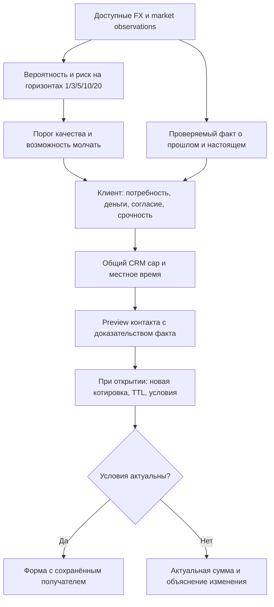

# V3: полезный контакт в момент реальной потребности

Исследование V3 показало, что уменьшение Brier и увеличение клиентской ценности — разные задачи. Поэтому один score больше не определяет одновременно выгодность, правдивость текста и уместность контакта.



## Решения, подтверждённые работой

- Не принуждать месячного пользователя к еженедельному FX-контакту. 1–2 сигнала в неделю на коридор — самопроверка market filter из Q&A; hard cap принадлежит клиенту и делится с остальным CRM.
- Разделять `P(NOW-hit)` и доказательство historical low. В V3 последнее вычисляется из реального префикса курса, имеет дату, окно и percentile. Альтернативный текст сообщает фактически наблюдённое изменение, не обещая следующий рост/падение.
- Внутренний прогноз есть; внешний текст остаётся о наблюдениях. Не писать одновременно «мы не прогнозируем» и обучать модель на будущем событии без объяснения этого различия.
- Рассматривать intent и доступные деньги как noisy observations. Future-known-at, неизвестная provenance и синтетика не становятся разрешением отправить сообщение.
- Срочному клиенту доступен обычный перевод; proactive timing-push не должен задерживать его обязательство.
- При открытии показывать текущие банковские условия. Исторический ЦБ — объяснение индикатора, не исполнимая котировка и не гарантия сохранения условий.

## Строгая граница метрик

| Слой | Что измеряем | Что не выводим из этих данных |
|---|---|---|
| Forecast | Brier/log loss, temporal calibration, stability | Реализованную экономию |
| Market policy | Candidate hit-rate lift, reference advantage, regret, signal counts и пропуски недель | Количество доставленных пушей |
| Client simulation | Использование бюджета, relevance, timing proxy всех planned transfers, sensitivity | Причинный revenue uplift или реалистичность банка |
| Future pilot | Incremental revenue/contribution и volume на eligible client; recipient units; guardrails | Эффект по историческому surrogate без quote/holdout |

Для h учитывать реальный срок потребности. Риск ошибки в bps, хвостовые потери, одинаковые all-in суммы и стоимость дополнительного контакта содержательнее одного признака «точный минимум». Однако новый payoff должен быть отдельной целью с собственным backtest, а не переименованием старой метки.

## Реализация

- `final_solution/alphatransfer_final/facts.py`: backward-prefix facts, ограниченные factual templates, evidence object.
- `final_solution/alphatransfer_final/behavior.py`: pure optional research gate с provenance и временными проверками.
- `final_solution/alphatransfer_final/product.py`: объединение этих проверок с существующими quote/TTL/timezone/CRM gates.
- `research_v3/preview.py`: исторический model/policy/horizon API, read-only probability prefix, SHA-256 receipt, abstention.

Запуск selective long preview:

```bash
python3 final_solution/main.py --research-v3 --model basis_train_120m \
  --as-of 2025-12-11 --policy selective --threshold 0.50 \
  --client-context research_v3/examples/behavior.synthetic.json
```

Оба контура остаются research-only. Для настоящего pilot нужны данные и интеграции банка; интерфейсный prototype не подменяет проверку сигналов. Существующий подробный путь и механики устаревания сохранены в `CLIENT_JOURNEY.md`.
