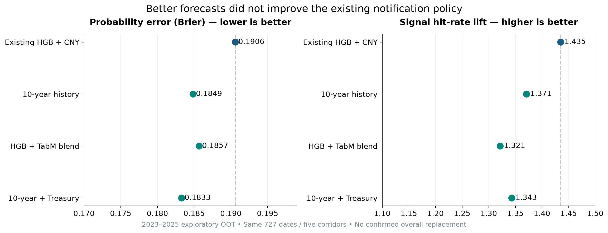
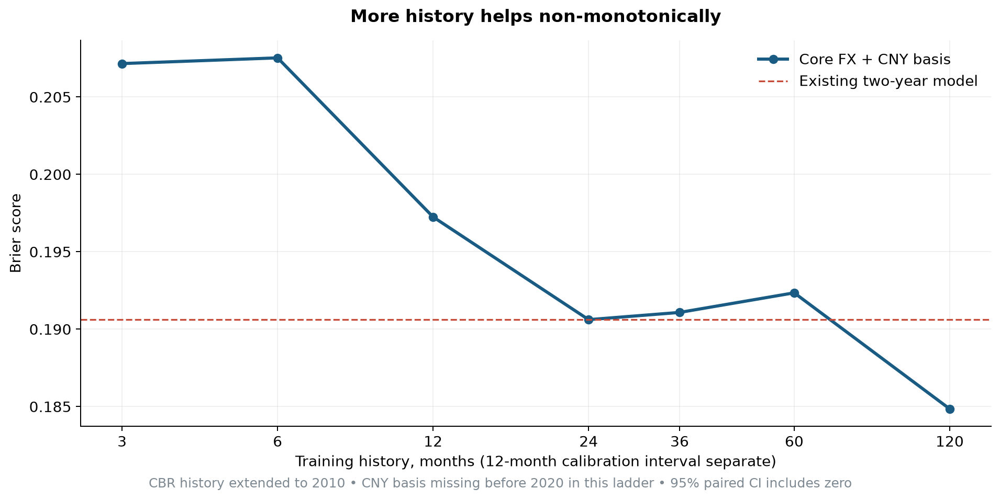
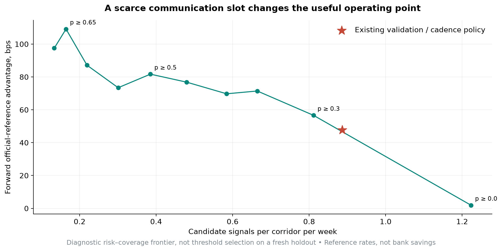
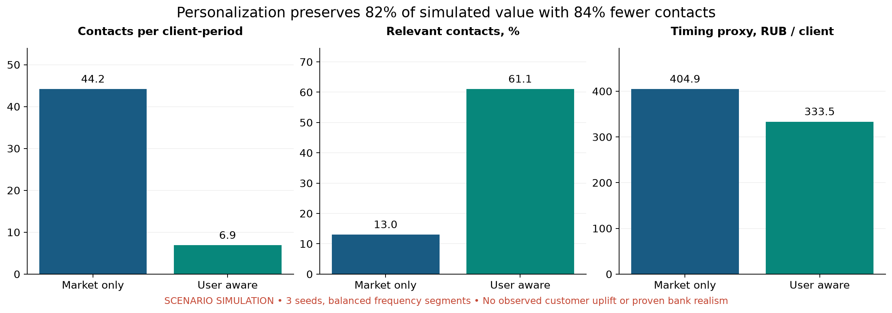

# AlphaTransfer V3: что улучшено и что показали эксперименты

**Дата: 5 сентября 2026.** Исторический исследовательский результат; исполнимых банковских котировок и реальных клиентских событий в данных нет.

Удалось существенно развить исследовательский и продуктовый контур. Самый полезный результат — управляемый обмен частоты на качество: **lift 1.435 → 1.786, forward reference advantage 47.69 → 95.35 bps**, при снижении частоты **0.887 → 0.469 сигнала на коридор в неделю**. Это длинная модель с более строгим отбором, а не улучшение прогнозирования при неизменной нагрузке. Для месячного пользователя такая частота осмысленнее попытки заполнить каждую неделю.

Отдельно, лучшее точечное качество вероятностей — **Brier 0.190617 → 0.183295, −3.84%** — получено длинным HGB с инфляционными ожиданиями Treasury. При прежней политике эта модель ухудшила lift и выгоду. Поэтому не подменяем улучшением Brier доказательство клиентской ценности.

В симуляции персонализация дала **−84.4% контактов**, сохранив **82.4% gross timing proxy**. Это обоснованный сценарий, но не доказанный uplift банка и не доказательство реалистичности распределения его клиентов.

## 1. Что сделано фактически

Прочитаны кейс, оба Q&A, финальное решение, старые ревью и продуктовые материалы. Исходная модель воспроизведена **на уровне всех 4 415 вероятностей и масок сигналов: максимальное расхождение 0**. Сохранён старый frozen bundle, изменена только продуктовая логика подтверждения фактов и добавлен новый режим.

- История ЦБ продлена с 2020 до **2010 года**: 20 576 строк по пяти валютам, до 2026-09-01. Дополнительно получены MOEX CNY/RUB 2013–2019 и fixing с августа 2019.
- Основной harness содержит **39 конфигураций**: длины train, месячные refits, capacity, feature engineering, decay, ensembles, survival factorization, common-factor smoothing и mean/quantile objectives.
- Четыре основных варианта дополнительно прогнаны по всем **h=1/3/5/10/20**.
- Внешние источники: **74 model×year fits**; реально обучены FRED/CBOE/ICE/GPR/Treasury варианты и комбинации.
- Выполнен TabM benchmark с temporal early stopping и refit, HGB comparator и convex blend; сохранены веса, preprocessing, train logs и версии.
- Поведение: 12 сценариев × 3 seeds, **388 800 клиентских сравнений**, общий market path и random numbers, temporal/conservation/null проверки.
- Для главных сравнений — **10 000 повторов** block bootstrap с пятью валютами внутри одной даты. Есть sensitivity к длинам блока, отдельные года и валюты, счётчики событий.

Полная машинная таблица всех подходов и изменений: [COMPARISON.csv](COMPARISON.csv). Детали численного baseline: [models/parity.json](models/parity.json).

## 2. Основные изменения метрик

Ниже одинаковые 727 OOT дат 2023–2025, пять валют, h=5. Brier меньше — лучше. Lift и bps относятся к коридорным кандидатам. Bps — official-reference proxy, а не деньги, реально полученные клиентом.

| Вариант | Brier | Lift | Reference advantage, bps | Что привнёс |
|---|---:|---:|---:|---|
| Старый HGB + CNY basis | 0.190617 | 1.435 | 47.69 | Точно воспроизведённый comparator |
| Train 3 месяца | 0.207159 | 1.266 | 29.45 | Короткая история недостаточна |
| Train 10 лет | 0.184850 | 1.371 | 40.08 | Brier −3.03%; прежняя policy хуже |
| Месячный refit, train 2 года / calibration 3 месяца | 0.188370 | 1.265 | 33.42 | Более свежая модель не даёт автоматического улучшения выбора дней |
| TabM | 0.187522 | 1.253 | 32.22 | Нейросеть улучшает proper score, но ослабляет старую policy |
| TabM + HGB, вес по предыдущему validation | 0.185688 | 1.321 | 38.41 | Brier −2.59%; отдельный probabilistic challenger |
| Treasury inflation, лаг 7 дней | 0.188583 | 1.456 | 43.72 | Brier −1.07%, lift чуть выше, bps ниже |
| Train 10 лет + Treasury lag7 | **0.183295** | 1.343 | 31.52 | **Brier −3.84%**, но без общего улучшения продукта |
| Старый HGB, порог 0.50 | 0.190617 | **1.782** | **81.70** | 288 сигналов вместо 663; изменена policy, не forecast |
| Train 10 лет, порог 0.50 | 0.184850 | **1.786** | **95.35** | 351 сигнал вместо 663; риск/частота лучше соответствуют редким переводам |

Для последней строки hit rate **45.25% → 59.26%**, regret относительно лучшего будущего reference-дня **80.33 → 40.35 bps**. Это условные результаты выбранных сигналов; сокращение количества меняет состав выборки.

Paired month-block readout, с пересчётом baseline в каждом draw: Δ lift длинной selective policy против старой **+0.351 [0.171; 0.566]**, Δ reference bps **+47.66 [29.18; 67.30]**. Интервалы не включают весь процесс выбора моделей/порогов. Это retrospective evidence для проверки, не confirmatory significance. Удаление первых 20 дат каждого test-года сохраняет качественный вывод.

При **одинаковом пороге 0.50** long против incumbent даёт Δ lift **+0.0038 [−0.2695; +0.2246]** и Δ bps **+13.65 [−2.36; +30.54]**. Превосходство длинной модели по utility здесь не установлено; основная подтверждённая на этой истории перемена — более строгий отбор и право молчать.

Порог 0.65 даёт ещё более высокий development lift, но слишком мало событий; у старой модели в diagnostic 2026 остаются **всего два сигнала**. Такой режим не выбран для основного сценария. Таблицы: [models/decision_policy_intervals.csv](models/decision_policy_intervals.csv), [парные изменения](models/decision_policy_paired_deltas.csv).

## 3. Длинная история и более сложное обучение

Изначальное предположение о «паре месяцев» оказалось неверным: старый final train — **два года**, за ним **целый validation год**. Мы проверили 3/6/12/24/36/60/120 месяцев и expanding history, затем частоту переобучения и длину calibration отдельно.

История помогает немонотонно. На h=5 три месяца дают Brier 0.207159, два года 0.190617, пять лет 0.192349, десять лет 0.184850. Простое «добавим всё старое» может ухудшить результат из-за смены режимов и missingness. Только official FX без CNY axis даже с длинной историей остаётся слабым.

| h, эффективных строк ЦБ | Старый Brier | Train 10 лет Brier | Старый lift | Train 10 лет lift |
|---:|---:|---:|---:|---:|
| 1 | 0.199166 | 0.195626 | 1.293 | 1.300 |
| 3 | 0.200686 | 0.194849 | 1.294 | 1.300 |
| 5 | 0.190617 | 0.184850 | 1.435 | 1.371 |
| 10 | 0.173271 | 0.170606 | 1.333 | 1.336 |
| 20 | 0.155887 | 0.148567 | 1.289 | 1.342 |

На h=20 также небольшой прирост reference advantage: 41.49 → 43.34 bps. Разные h означают разные задачи, поэтому их абсолютные Brier нельзя ранжировать между собой как модели одной цели.

Более глубокие HGB (depth 3/4/6), полные наборы features, logistic, ExtraTrees, decay, survival factorization `P(NOW5)=P(NOW1)×P(NOW5|NOW1)`, mean/median/lower-quantile objectives и common-factor smoothing не дали общего доминирующего решения. Все отрицательные строки сохранены. Mean/quantile return models проверены как отдельные способы ранжирования, затем калиброваны на NOW-hit; это не эксперимент с настоящим executable-P&L target.

**Данные старых лет неполные по внешним признакам.** В основном long-run ЦБ есть с 2010, CNY basis — с 2020. Отдельный вариант продлил basis до августа 2019; его Brier 0.187480. Нельзя называть это десятью годами полного market-data набора. Параметрические модели обучаются на 5 коррелированных строках за дату; оценка неопределённости учитывает общие даты.

Статистика: long-only Δ Brier CI **[−0.011811; +0.000167]**, TabM blend **[−0.010220; +0.000254]** — включает ноль. Для **long+Treasury против исходного** Δ **−0.007322**, CI **[−0.014351; −0.000610]**, но улучшились лишь 2/3 development года, выбор post-hoc, multiplicity всего поиска не учтена; diagnostic 2026 ухудшился. **Инкремент Treasury поверх long** имеет другой CI **[−0.004148; +0.000898]**. Эти два сравнения нельзя смешивать.

## 4. Данные с ограничениями и открытые аналоги

Минимальное требование выполнено реальными экспериментами: FRED inflation, ICE credit через FRED и CBOE volatility использованы в отдельном локальном сценарии **«что было бы, если бы это можно было свободно использовать»**. Условия источников и raw inputs не смешаны с правом публичного распространения финального решения.

Главный практический результат: **FRED T10YIE/T5YIFR восстановлены из nominal/real US Treasury**. Значения совпали на 1 920 общих датах; после одинакового warm-up совпали все **4 415 OOT прогнозов и решений**, для лагов 2 и 7. Для этой информации отдельный FRED-доступ качества не добавляет. FRED VIX совпадает с первичным CBOE на 2 212 датах. Условия использования проверялись по [FRED](https://fred.stlouisfed.org/legal/terms/), источники и формулы — по [Treasury](https://home.treasury.gov/policy-issues/financing-the-government/interest-rate-statistics).

Основные новые блоки ухудшили incumbent: FRED inflation lag2 Brier 0.192735, CBOE 0.194184, GPR 0.193105, все вместе 0.199785. ICE имеет только три доступных года истории, поэтому проверен отдельно: matched diagnostic Brier 0.223178 → 0.222582, CI включает ноль; reference benefit ухудшился.

**Bloomberg не обучался: авторизованного исторического экспорта нет. Его возможный эффект неизвестен.** Подготовлен конкретный запрос на timestamped bid/ask, intraday CNY/RUB, USD/CNH, local USD/LCY и fixing-vintages, с полями, comparator и критериями полезности. Покупку широкого macro feed имеющиеся результаты не обосновывают. Публичная [страница Data License](https://professional.bloomberg.com/products/data/data-license/) не заменяет сами данные.

Подробные provenance, условия и все эффекты: [external_data/REPORT.md](external_data/REPORT.md). Редкие Telegram P2P quotes из существующей соседней разработки также изучены: всего 27 accepted quotes, только четыре RUB→KZT card-transfer даты; это не ежедневный индекс и не подходящий обучающий target. В чужие незавершённые файлы P2P изменения не вносились.

## 5. Новая постановка: прогноз, факт, потребность

Старое решение смешивало три разных вопроса:

1. **Прогноз:** насколько вероятно, что в следующие h обновлений не появится лучший официальный курс? Метрики: Brier, log loss, calibration и regret.
2. **Факт для текста:** что уже произошло с опубликованным курсом? Это проверяемый predicate, а не вероятность модели.
3. **Потребность:** есть ли у конкретного человека деньги, план и возможность сдвинуть перевод? Метрики: полезные контакты, использование CRM-слота, клиентская net benefit на настоящих quotes.

У старых 663 сигналов только **30.3%** лежали в нижнем квинтиле 60 наблюдений; **59.0%** были выше медианы. Тем не менее всем автоматически писалось «благоприятная зона по исторической шкале». Высокая вероятность будущего роста совместима с дорогим текущим курсом.

Исправлено в `final_solution/alphatransfer_final/facts.py`: для каждого текста рассчитывается исторический факт строго из префикса. «Среди 20% низких» разрешено лишь при полном окне и соответствующем percentile; иначе указывается наблюдённое изменение/официальный уровень, дата и отличие от курса приложения. В JSON сохраняется доказательство. Прогноз остался внутренним вероятностным сигналом. Будущий курс в тексте не обещается.

**90% заполненных недель — собственный старый gate, а не требование кейсодателя.** Q&A разрешает обосновать молчание, а реальный cap относится к клиенту суммарно. Старый показатель сохранён для comparability, дополнительно показаны недели с границами периода. Для prospective stage exposure denominator должен включать все реальные eligible даты и пока не созревшие исходы; текущие OOT таблицы не объявлены такой операционной экспозицией.

Рабочий контракт: сначала прогноз риска/выгоды для срока потребности; затем допустимый факт; затем клиентская readiness и общий cap; при открытии — новая банковская котировка, TTL и текущие условия. Это уже реализованное разделение в decision API, а не только схема. Полная спецификация: [V3_DECISION_CONTRACT.md](../product_artifacts/V3_DECISION_CONTRACT.md).

## 6. Синтетика пользователей: измеренный эффект и границы

Сегменты: частые 7/14 дней, месячные, редкие 60/90/180 дней; вариации сумм, зарплатная фаза, срочность, готовность денег, несовершенный intent, response и fatigue. Исторические опросы и administrative remittance studies подтверждают механизмы, но не параметры клиентов Альфы. **Доказанно реалистичной для банка эта синтетика не является:** реальных данных нет. Источники, параметры и необходимая внешняя валидация вынесены в [behavior/EVIDENCE.md](behavior/EVIDENCE.md).

| Метрика, базовый сценарий 2023–2025 | Market only | User aware |
|---|---:|---:|
| Контактов на клиент-период | 44.20 | **6.90** |
| Релевантных контактов | 13.03% | **61.06%** |
| Gross timing proxy, RUB/клиент-период | 404.92 | **333.46** |
| Bps на весь planned volume | 7.25 | 5.97 |
| Улучшение FX Brier | — | **0** |
| Доказанный causal revenue uplift | неизвестен | **неизвестен** |

При **одинаковом realized contact budget** случайный market-контакт дал 85.69 RUB, календарный — −13.98 RUB, user-aware 333.46 RUB. Quota matched ex post: это описательное сравнение использования бюджета, не online policy и не настоящий RCT.

User-aware сохраняет 82.35% gross при 15.60% числа контактов, но абсолютный gross ниже. При заданных чеках и response break-even дополнительного контакта — 1.92 RUB; это сценарная joint value, не банковская прибыль. При response=0 gross строго нулевой у всех arms; 25/50 bps дополнительного execution drag съедают значительную долю выигрыша. При слабом intent персонализация заметно хуже. Эти отрицательные сценарии сохранены.

В `behavior.py` реализован optional gate с consent, history, planned-date window, достаточностью баланса, последним переводом, urgency и CRM cap. Future/malformed observations подавляются; synthetic provenance не становится production-разрешением. Банк сможет заменить сценарные параметры измеренными, сохранив API.

## 7. Что разумно добавлять дальше

Сильнейшая новая информация — **timestamped all-in quotes самого банка**, не ещё один ряд общего макроуровня. Следом: bid/ask и intraday RUB-anchor, local USD/LCY, подтверждённые времена публикации fixing, поток заявок/ликвидность. Это позволит отделить предсказуемую механику официального fixing от реально исполнимого улучшения условий перевода. Информационную ценность каждого feed нужно проверять на одинаковых decision cutoffs и customer payoff.

Для персонализации — 12–24 месяца обезличенных переводов, зачислений дохода, доступного баланса и app intent. Валидация на новых клиентах и следующем временном периоде, включая ошибку определения потребности. Для causal результата — клиентский randomized holdout и observation window, охватывающее несколько обычных циклов переводов; primary incremental contribution/volume, secondary realized recipient units, guardrails fatigue/жалобы/отписки/каннибализация. Sample size считается после измерения baseline variance, а не из выдуманной конверсии.

## 8. Что поставляется и что выбрано

Поставляются новые данные и receipts, полный ledger экспериментов, deep-learning checkpoints, пять горизонтов, block uncertainty, risk–coverage frontier, behavioral simulator, исправленный фактологический слой, optional readiness gate, единый CLI для исторического V3 preview и проверки.

Incumbent оставлен базой сравнения. Для prospective shadow зафиксированы две research policies: incumbent p≥0.50 и long120 p≥0.50. Long+Treasury и TabM blend — отдельные probabilistic challengers. Ни один результат 2026 не назван новым holdout. Реальная отправка не включена; нового календарного мониторинга или задач за пределами этой работы не создавалось.

**Главный защищаемый вывод:** качество модели, пригодность момента и ценность уведомления — три разных объекта. Мы измерили их отдельно, нашли более выгодный режим использования ограниченного числа контактов, получили небольшие улучшения вероятностей и показали, какие дорогие/ограниченные данные пока не оправдали ожиданий.
