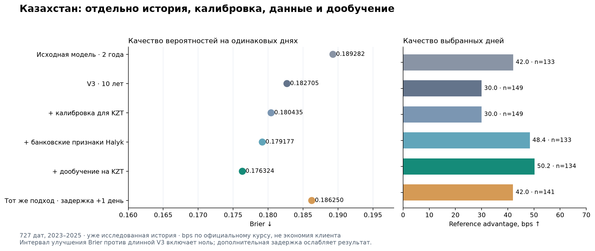
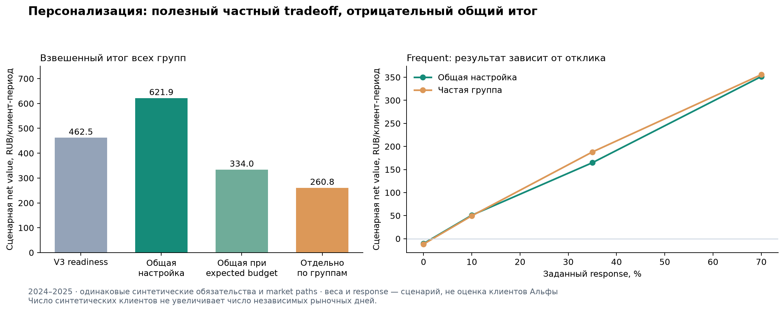

**Последний завершённый раунд:** [финальный TabM, метрики и доверительные интервалы](final_sprint/REPORT.md).

> Новое продолжение: [OXR2010–2026, длинные модели и банковский PoC](oxr2010_bank/REPORT.md). Предыдущие результаты сохранены.

> **Продолжение V4:** OXR 2018–2026, десять лет обучения NOW поверх Chronos, бюджет 300/900 шагов и стресс-тест задержки источников. [Новый отчёт](continuation/REPORT.md), [новая таблица сравнений](continuation/COMPARISON.csv). Ниже — исходный основной этап V4.

> **Уточнение задержки Halyk, KZT 2023–2025:** указанные ниже 0.186250 относятся к отдельному обучению с lag2. Для исходной неизменённой модели при задержке входа на день измерено 0.181404; детали и контролируемые сравнения — в продолжении.

# AlphaTransfer V4: новые данные, настоящее дообучение и проверка персонализации

**5 сентября 2026 года.** Главный новый кандидат — специализация Казахстана с банковской историей Halyk. Brier на KZT снизился **с 0.182705 до 0.176324: −3.49% относительно длинной V3** и **−6.85% относительно исходной модели, обученной на 24 месяцах**. При почти том же числе сигналов их преимущество по официальному курсу выросло с 42.04 до 50.23 базисного пункта (bps). Однако превосходство над длинной V3 по Brier и качеству отбора сигналов статистически не установлено, а дополнительный лаг ослабляет результат. Кандидат подготовлен для наблюдения на новых данных без влияния на клиентов; решение о внедрении не принято.

Предобученные модели и криптоданные прошли реальные эксперименты и не дали сильного общего прироста. Анализ микроданных денежных переводов уточнил основания персонализации: увеличение частоты контактов иногда полезно для частых отправителей, но отдельные групповые политики существенно ухудшили общую взвешенную метрику. Отрицательные результаты сохранены вместе с положительными.

## Что выполнено по пяти направлениям

| Направление | Фактическая работа | Изменение относительно уже существующего решения |
|---|---|---|
| Предобученные временные модели | Chronos-2 Small 28M и Synth 119M: прогноз без дообучения и 12 обучений всех весов; 2,800 шагов оптимизатора, 12 сохранённых моделей. Прогноз курса и вероятность NOW оцениваются отдельно | Small после дообучения + HGB: Brier 0.190617 → 0.187990, но преимущество сигналов 47.69 → 34.96 bps. Synth без дообучения практически повторяет V3 |
| Сегменты | Пять гипотез потребностей из чатов, микроданные Всемирного банка; выбор горизонта, порога и частоты только по прошлому; фиксированные веса групп и сравнение при равном ожидаемом бюджете | Общая модельная полезность 621.93 → 260.84 RUB на клиента за период, −58.1%. У частых отправителей в базовом сценарии 164.75 → 188.02 при +12% контактов и −2.62 п.п. точности h5; низкий отклик меняет знак эффекта |
| Казахстан | 24 конфигурации × 4 года: общая модель, локальная калибровка, обучение только на KZT, ограниченная коррекция; Halyk/KASE и чувствительность к задержке данных | Лучший Brier 0.176324 против 0.182705 у длинной V3. Вклад калибровки, данных и продолжения обучения измерен отдельно |
| Крипто | Реальные Binance/EXMO USDT_RUB/USDT_KZT и контрольные признаки; 120 годовых обучений; проверка почасовой агрегацией и архивными контрольными суммами | Длинная модель + кросс-курс EXMO: ΔBrier = −0.000323, интервал включает ноль. Контрольные модели только с официальными курсами часто сильнее |
| Ликвидность и котировки | KASE: 13,476 исходных строк сессий; банковские курсы продажи Halyk за 2020–2026 годы; активность и стоимость фондирования MOEX; 28 конфигураций × 4 года | Дополнения MOEX к длинной модели дают Brier около 0.184; комбинация Treasury/MOEX/премии RUB — около 0.1832, почти как V3 с Treasury. Общая модель с KASE/Halyk часто ухудшается; специализация KZT перспективнее |

Полная таблица экспериментов — [COMPARISON.csv](COMPARISON.csv). Клиентские метрики имеют другие единицы и знаменатели, поэтому вынесены в [отдельные результаты](segments/results/weighted_development.csv) и не смешиваются с Brier валютного прогноза.

## Казахстан: основной новый кандидат

| variant | brier | lift | forward_delta_bps | signals |
| --- | --- | --- | --- | --- |
| Исходный HGB, 24 месяца | 0.189282 | 1.588 | 42.037 | 133 |
| Длинный V3, 120 месяцев | 0.182705 | 1.478 | 29.971 | 149 |
| Длинный V3 + калибровка на KZT | 0.180435 | 1.478 | 29.971 | 149 |
| Длинный V3 + ограниченная коррекция для KZT | 0.179110 | 1.434 | 33.251 | 146 |
| Длинный V3 + Halyk + калибровка на KZT | 0.179177 | 1.670 | 48.418 | 133 |
| Длинный V3 + Halyk + ограниченная коррекция для KZT | 0.176324 | 1.680 | 50.229 | 134 |
| Только KZT + Halyk, 120 месяцев | 0.181638 | 1.759 | 60.383 | 131 |
| Halyk + коррекция для KZT, дополнительный лаг | 0.186250 | 1.490 | 42.012 | 141 |

Сравнение использует 727 одинаковых дней KZT за 2023–2025 годы, горизонт h5 — пять следующих наблюдений ЦБ. Исходная модель и новый кандидат дают 133 и 134 сигнала соответственно: прирост здесь не объясняется прежним двукратным сокращением частоты. Но 95%-ный парный интервал для прибавки +8.19 bps остаётся широким: [−11.50; +28.66].

Относительно исходной модели ΔBrier = −0.012958, 95%-ный интервал месячного блочного bootstrap — [−0.023265; −0.002489]; улучшены все 3 из 3 годов. Относительно длинной V3 разница составляет −0.006380, интервал [−0.014807; +0.001762]. Продолжение обучения поверх **той же модели Halyk с калибровкой на KZT** даёт −0.002853, интервал [−0.005218; −0.000887]. Все интервалы ретроспективны и не учитывают накопленный поиск вариантов.

Дополнительный день задержки увеличивает Brier до 0.186250: преимущество перед длинной V3 исчезает. В уже просмотренном 2026 году лаг 1 даёт 0.223331 против 0.234980 у длинной V3; лаг 2 ухудшает результат до 0.242399. Это делает точное время обновления банковских данных приоритетом следующей проверки. [Разложение эффекта и алгоритм](kazakhstan/REPORT.md).



## Что дают новые данные всей системе

| config_id | brier | lift | forward_delta_bps | signals |
| --- | --- | --- | --- | --- |
| baseline_reproduction | 0.190617 | 1.435 | 47.686 | 663 |
| basis_train_120m | 0.184850 | 1.371 | 40.078 | 723 |
| basis_train_120m__treasury_lag7 | 0.183295 | 1.343 | 31.515 | 767 |
| combo_treasury_halyk_120m | 0.186840 | 1.468 | 46.118 | 731 |
| combo_treasury_moex_erub_120m | 0.183222 | 1.396 | 41.288 | 746 |
| moex_liquidity_120m_lag1 | 0.183954 | 1.362 | 40.639 | 726 |

Здесь сравниваются 727 дней × 5 коридоров на одинаковом h5. Полный набор KASE с объёмами не превзошёл исходную модель; объединение всех доступных признаков часто ухудшает результат. Небольшой прирост отдельных комбинаций относительно V3 с Treasury не подтверждает существенного нового улучшения. Сохранены основной лаг, проверка задержки и сравнения с тем же длинным предшественником. [Рыночные эксперименты](liquidity/README.md), [интервалы вероятностных метрик](market_paired_uncertainty.csv), [интервалы политики сигналов](market_policy_paired_uncertainty.csv).

Halyk публикует банковский курс **продажи**: это независимые от официального FX данные, но направление противоположно покупке RUB банком у отправителя. Объём и число сделок KASE отражают состоявшиеся сделки, а не дисбаланс заявок. Дневные bid/offer пересекались и не трактовались как исполнимый спред. Проверены календарь, выбор сессий, конфликтующие даты Halyk и задержки. Независимое сопоставление с KASE XLS дало точное совпадение 1,538 цен; решения по 224 дублирующимся ячейкам записаны в [журнале сессий](liquidity/kase_session_resolution.csv). [Аудит источников](liquidity/source_audit.json), [Halyk](https://halykbank.kz/en/exchange-rates), [KASE](https://kase.kz/en/markets/foreign-currencies).

## Предобученные модели

Все веса обеих Chronos дообучались на прошлой 10-летней истории. Synth, по заявлению авторов, предобучен только на синтетике: это наиболее убедительный контроль возможного запоминания реальных данных, но его веса созданы в 2025 году и не были доступны в 2023-м. Корпус Small включает реальные и синтетические ряды; пересечение с нашими данными полностью не исключено. Маргинальные квантили не выдавались за вероятность отсутствия лучшего курса на всём горизонте: отдельная модель события NOW обучалась на прошлом.

Дообученный Small с HGB улучшает Brier исходной модели на 1.38%, но ухудшает сигналы; длинная V3 остаётся сильнее. Synth без дообучения с HGB даёт 50.31 против 47.69 bps, интервал прироста [−2.58; +7.91]. Дополнительное обновление всех весов Synth на KZT улучшает его общего предшественника: Brier 0.189971 → 0.184963, но уступает длинной V3. Случайное блуждание с гауссовскими приращениями лучше проверенных нейронных моделей по средней квантильной ошибке (pinball loss). [Результаты](foundation/REPORT.md), [модели, первичные статьи, лицензии и корпуса](foundation/SOURCES.md).

## Крипто: найдены реальные RUB/KZT рынки

Собраны дневные свечи реальных спотовых рынков: EXMO USDT_KZT — 2,254 с 2020 года, USDT_RUB — 3,241 с 2017-го; Binance USDTRUB — 1,498 за 2019–2024 годы. Это прямые рыночные данные, а не произведение FX×USDT или сконструированный P2P-индекс. История Binance USDTKZT начинается только 2026-05-04 и не используется в бенчмарке с оценкой за 2023–2025 годы. Совпали восемь проверок агрегации EXMO из часовых свечей в дневные, 151 день Binance API/архива и пять контрольных сумм. Потеря актуальности фиатных данных EXMO летом 2026 года явно учтена.

Длинная модель с кросс-курсом EXMO получает Brier 0.184528 против 0.184850: Δ = −0.000323, интервал [−0.002357; +0.001857]. Контрольные признаки официальных курсов, входящих в знаменатель, в короткой модели сильнее криптопризнаков; добавление крипто поверх них не улучшает результат. Такой контроль предотвращает ошибочное приписывание крипто эффекта официального FX или длинной истории. [Данные, все 120 обучений и недоступные API](crypto/REPORT.md).

## Персонализация с реальной эмпирической опорой

Группы S1–S5 из чатов описывают потребность, срочность и маршрут. Частые, ежемесячные и редкие отправители — отдельная ось сегментации; активность автора в чате не считается частотой переводов. Исследование Всемирного банка Listening to Kyrgyz Republic за 2021–2025 годы дало 8,257 наблюдений «мигрант–месяц» для 1,490 мигрантов. Для соседних месяцев P(sendnext|sent) = 70.76%, P(sendnext|notsent) = 31.91%. Это свойства наблюдаемой выборки, а не параметры клиентов Альфы. Они подтверждают устойчивость поведения и пропуски месяцев, но не измеряют частоту внутри месяца, баланс или намерение в приложении. Сохранены агрегаты, исходные микроданные не распространяются. [Продуктовая доказательная база](../product_artifacts/V4_SEGMENTATION_EVIDENCE.md).

Политики выбирались только по прошлым годам: 2023 → 2024, затем 2023–2024 → 2025. Фиксированные веса групп раскрыты и отражают сценарий близкого опроса переводов, а не состав клиентов Альфы. Качество событий оценивается по единой метке h5, даже если настройка использует h1 или h20. Ежемесячные и редкие группы пропускают много полезных моментов: общая расчётная полезность снижается с 621.93 до 260.84 RUB на клиента за период. При равном ожидаемом бюджете контактов результат групповой политики — 260.84 против 333.99 у универсальной.

У частых отправителей базовый сценарий даёт +12% контактов, +14.1% расчётной полезности и −2.62 п.п. точности. Однако при отклике 10% он проигрывает: 49.64 против 50.86 RUB. Точность самой FX-модели от этого не растёт. **Редкие переводы — основание реже отправлять уведомления, но не реже проверять рынок внутри окна потребности.** В демонстрации по умолчанию используется универсальная политика с проверкой готовности клиента; групповые частоты остаются экспериментальными. [Полный отчёт симуляции](segments/REPORT.md).



## Что можно защищать перед кейсодателем

1. Найдены реальные банковские данные и измерен эффект специализации KZT по Brier. Денежная экономия не подтверждена. До наблюдения на новых данных нужен архив времени обновления и котировки покупки нужного направления с полной стоимостью операции.
2. Нейросети, крипто и групповые политики проверены фактическими экспериментами. Там, где V3 сильнее, он сохранён.
3. Разделены качество прогноза, момент и частота контакта, наблюдаемый факт для текста, потребность клиента, исполнимая котировка и причинный бизнес-эффект. Новые источники не заменяют банковский рандомизированный эксперимент.
4. Главный неустранённый риск — многократно использованная история. Периоды разработки 2023–2025 и диагностики 2026 не стали новой независимой тестовой выборкой; блочные интервалы не учитывают выбор среди всех экспериментов. Изменений промышленного решения и отправок клиентам не было.

## Артефакты и запуск

- [Таблица экспериментов](COMPARISON.csv), [протокол](PROTOCOL.md), [проверка рыночных моделей](market_verification.json), [исправления по независимому аудиту](crypto/ROOT_CODE_AUDIT.md).
- Код, веса и файлы происхождения результатов находятся в пяти направлениях исследования. Автономная демонстрация рыночной модели проверяет контрольную сумму и читает только доступные дату, вероятность, сессию и маску выбора; будущие метки не используются:

```sh
python research_v4/market_preview.py --model kzt_residual_shrink_120m__halyk_lag1 --as-of 2025-12-11 --corridor KZT
python -m research_v4.segments.preview --context research_v4/segments/examples/context.json --scores research_v4/segments/examples/scores.json --as-of 2026-08-04
```

Это раздельные исследовательские демонстрации: групповые пороги обучались на оценках V3 и автоматически на новые модели не переносятся. Исходный зафиксированный комплект, контрольные суммы V3 и финальное решение сохранены без замены. Инструкции полного воспроизведения находятся в README каждого направления.
