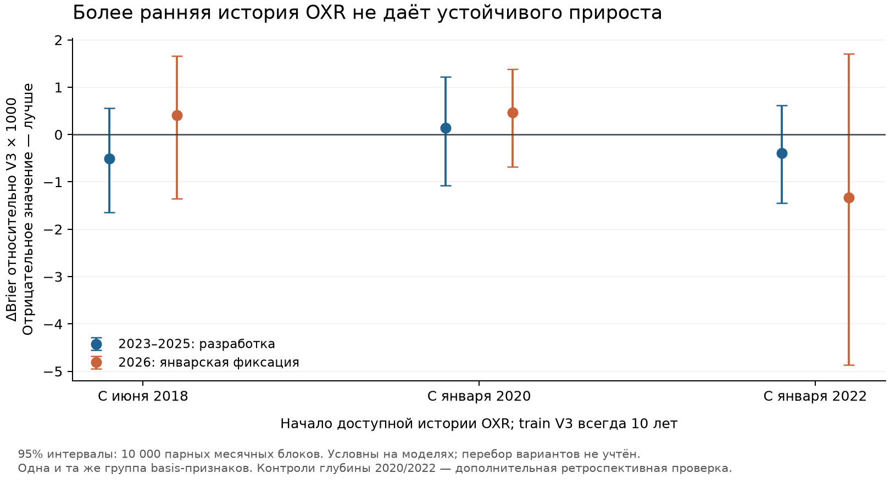

# OXR: проверка пользы имеющейся истории с 2018 года

**Сильного улучшения длинной V3 не найдено; расширение OXR до 2010 года пока не обосновано улучшением качества.** Признаки расхождения OXR–ЦБ дали на 2023–2025 годах Brier 0.184344 против 0.184850 у V3: −0.27%. Парная разница −0.000507 с 95%-ным месячным блочным интервалом [−0.001644; +0.000558]. В 2026 году модель с этим набором, выбранным по разработке, немного хуже по точечной оценке Brier: 0.208816 против 0.208406, а преимущество сигналов снизилось с 29.64 до 23.64 bps. Это показатели на справочных курсах; банковские комиссии в них не учтены.

## Данные и фактический объём

Взяты все 27,000 исходных строк OXR, 3,000 UTC-дней × 9 валют, **2018-06-17–2026-09-02**. Модели оценивают пять коридоров AMD/KGS/KZT/TJS/UZS. В новый каталог скопирован неизменяемый снимок; платные API не вызывались. Данных до 2018 года нет и они не синтезировались.

17 заранее заданных конфигураций и две явно обозначенные дополнительные проверки глубины источника × пять отсечек = **95 сохранённых обученных моделей**. Основной кандидат выбран по минимальному Brier среди трёх заранее заданных групп признаков, train120m и основного лага, на 2023–2025 годах до нового расчёта метрик 2026. Выбор сохранён в [selection.json](selection.json) и не менялся. Проверки глубины для basis добавлены после первого просмотра новых результатов 2026; это дополнительная чувствительность, а не независимое подтверждение.

## Признаки и время доступности

- Базовая модель V3: 14 признаков официального курса плюс MOEX CNY/RUB close–fixing. Одинаковая ёмкость HGB, без ранней остановки; 24 или 120 месяцев обучения, предыдущие 12 месяцев калибровки и настройки частоты.
- OXR returns: лог-доходности за 1/5/20 календарных дней и стандартное отклонение однодневных лог-доходностей в окне 20 дней, минимум 10 наблюдений. Двадцатидневная доходность требует все 20 предыдущих наблюдений.
- OXR basis: log(OXR RUB/единицу валюты / известный текущий курс ЦБ), изменения за 1/5 наблюдений ЦБ и нормировка по скользящему окну 20 наблюдений ЦБ, минимум 10. Окно включает текущий доступный basis.
- Контроль наличия источника: только признак доступности и возраст. Он отделяет часть эффекта календаря и наличия истории от собственно котировок.
- Полный набор объединяет returns+basis. Все дополнительные наборы содержат признаки наличия и возраста. Более ранние неизвестные значения остаются пропусками, которые обрабатывает обученный только на прошлом preprocessor.

Для источника known_at = max(published_at_utc, следующая UTC-полночь)+24 часа, stress +48 часов. Снимок завершённого дня D попадает в пакет 10:05 MSK не раньше D+2; стресс — D+3. Минимальный фактический запас после публикации — 31 ч 05 м. Join только назад, максимум 7 дней после known_at. Расхождение с текущим ЦБ использует тот же контракт известности официального курса, что V3. Дата публикации не доказывает неизменность исторических vintages: локальный CSV не содержит архивов их пересмотров. Подробности и первичная документация: [аудит источника](source_audit.md).

## Разработка 2023–2025: одинаковые 3,635 строк / 727 дней

| config_id | brier | signals | lift | forward_delta_bps |
| --- | --- | --- | --- | --- |
| v3_120m | 0.184850 | 723 | 1.370970 | 40.078412 |
| oxr_basis_120m_delay24h | 0.184344 | 758 | 1.336222 | 35.051412 |
| oxr_basis_120m_delay48h | 0.183880 | 732 | 1.370122 | 39.759310 |
| oxr_returns_120m_delay24h | 0.186475 | 726 | 1.366121 | 39.954972 |
| oxr_full_120m_delay24h | 0.185719 | 755 | 1.340876 | 38.152313 |
| oxr_coverage_120m | 0.185015 | 719 | 1.353397 | 38.540903 |

Более длинный лаг у basis показал немного меньший Brier, чем основной; это отдельный измеренный вариант, основной кандидат не заменялся по результатам 2026. Полный набор и returns по отдельности не улучшили длинную V3 на разработке. Некоторые варианты OXR улучшили 24-месячную модель, но ни один из них не превзошёл 10-летнюю V3 по Brier на тех же 2023–2025 годах. Все варианты сохранены в [summary.csv](summary.csv).

## Временной тест 2026 с двумя замороженными отсечками

January freeze: train 2015–2024, калибровка 2025 с purge по фактическому пятому будущему наблюдению; все оцениваемые 2026 labels исключены из fit. March freeze: train 2015-03–2025-02, калибровка 2025-03–2026-02 с тем же purge; в неё могут войти только созревшие к 1 марта labels. Веса, калибратор и пороги внутри каждой тестовой траектории не обновляются. Rolling-признаки используют прошлые наблюдаемые курсы по мере их поступления.

Все доступные тестовые даты: 156; общее мартовское окно обеих заморозок:122 даты. История ЦБ в зафиксированном наборе заканчивается раньше 2 сентября, поэтому свежие дни только OXR не создают новых размеченных тестовых примеров. Нельзя назвать период новым независимым holdout: 2026 уже просматривался в предыдущих этапах.

| track | config_id | brier | signals | lift | forward_delta_bps |
| --- | --- | --- | --- | --- | --- |
| test2026_january_freeze | oxr_basis_120m_delay24h | 0.208816 | 177 | 1.256198 | 23.635026 |
| test2026_january_freeze | v3_120m | 0.208406 | 173 | 1.336949 | 29.640444 |
| test2026_common_january_freeze | oxr_basis_120m_delay24h | 0.233199 | 142 | 1.070661 | 16.276833 |
| test2026_common_january_freeze | v3_120m | 0.232811 | 138 | 1.159551 | 23.871545 |
| test2026_common_march_freeze | oxr_basis_120m_delay24h | 0.233179 | 141 | 1.116364 | 16.489715 |
| test2026_common_march_freeze | v3_120m | 0.232359 | 141 | 1.114664 | 17.952508 |

| track | delta_brier | ci_low | ci_high | blocks |
| --- | --- | --- | --- | --- |
| development_2023_2025 | -0.000507 | -0.001644 | 0.000558 | 36 |
| test2026_january_freeze | 0.000410 | -0.001348 | 0.001659 | 8 |
| test2026_common_january_freeze | 0.000388 | -0.001881 | 0.001968 | 6 |
| test2026_common_march_freeze | 0.000819 | -0.000456 | 0.001942 | 6 |

Перенос отсечки с января на март не даёт убедительного улучшения выбранного OXR-кандидата: на общих датах разница Brier «март минус январь» равна −0.000020, месячный интервал [−0.001092; +0.001096]. [Прямое сравнение отсечек](march_vs_january.csv). В парном сравнении January freeze 2026 преимущество сигналов OXR относительно V3 ниже на 6.01 bps, месячный интервал [−11.18; −1.27]; число сигналов при этом отличается: 177 против 173. Это исследовательский интервал условно на выбранных моделях.

## Помогает ли более ранняя история источника?

Мы оставили один и тот же 10-летний train официальных курсов, но искусственно удалили OXR до 2020 или 2022 года. Поэтому здесь меняется глубина дополнительных признаков, а не количество строк обучения V3. Прогнозные даты и формулы одинаковы после прогрева.

| track | config_id | brier | signals | forward_delta_bps |
| --- | --- | --- | --- | --- |
| development_2023_2025 | oxr_basis_120m_delay24h | 0.184344 | 758 | 35.051412 |
| development_2023_2025 | oxr_basis_120m_since2020 | 0.184989 | 750 | 37.868967 |
| development_2023_2025 | oxr_basis_120m_since2022 | 0.184462 | 766 | 37.222769 |
| test2026_january_freeze | oxr_basis_120m_delay24h | 0.208816 | 177 | 23.635026 |
| test2026_january_freeze | oxr_basis_120m_since2020 | 0.208877 | 177 | 23.635026 |
| test2026_january_freeze | oxr_basis_120m_since2022 | 0.207081 | 173 | 31.951119 |



Добавление OXR 2018–2019 к истории с 2020 улучшает development Brier только на 0.000645, интервал [−0.001484; +0.000149]. Добавление 2018–2021 к истории с 2022 — на 0.000118, интервал [−0.001159; +0.000986]. В January 2026 более полная история 2018, наоборот, хуже начала 2022 на 0.001736. Нет монотонной зависимости «чем больше старых OXR, тем лучше» и нет основания экстраполировать определённый процент выигрыша на 2010–2018. [Прямые парные сравнения глубины](source_history_pairs.csv).

Для 10-летней модели с January 2026 freeze реально недостающие OXR для train — главным образом 2015–первая половина 2018; 2010–2014 в этот фиксированный train уже не попадают. Полная история 2010 может быть полезна для других отсечек или более длинных окон, но это другая гипотеза. Текущие измерения не обосновывают покупку истории ради обещанного boost.

## Проверки и воспроизведение

Оба baseline точно воспроизводят исходные прогнозы V3 на 3,635 строках разработки и 780 строках January freeze 2026 каждый. Сохранены checkpoints, калибраторы, пороги, source/feature hashes и фактические границы зрелости labels. Независимый аудит завершён: 124 проверки прошли, ошибок нет; проверены все 95 моделей и восстановлены вероятности, калибровка, пороги и сигналы для 11 выбранных checkpoints. Проверены неизменность прошлого при подмене будущих OXR и labels, а также bootstrap с повторной оценкой базовой частоты успеха и средней доходности случайного дня внутри каждого повтора. [Исходный код](experiment.py), [оценка](assess.py), [независимый аудит](audit/REPORT.md).

Из этого каталога, Python 3.11 с зависимостями V4:

```sh
python experiment.py --phase development
python experiment.py --phase test
python history_sensitivity.py
OPENBLAS_NUM_THREADS=1 python assess.py
python build_report.py
```

Перезапуск заново выполняет исследование; сохранённые результаты выше относятся к исходным контрольным суммам и неизменной selection. Доверительные интервалы используют 10,000 совместных блоковых повторов по валютам, основной блок — месяц, sensitivity 20/60 дат. Они не корректируются на весь исторический перебор моделей и не включают неопределённость повторного обучения.
