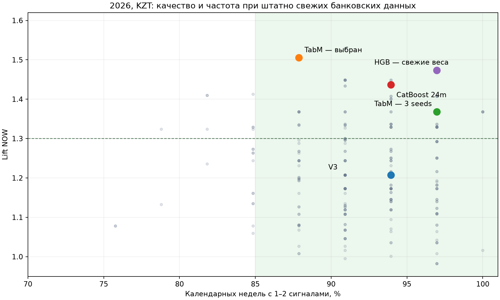

# Финальный рывок V4: выбран TabM на десятилетней истории

Для банковского proof of concept RUB→KZT выбран **tabm_periodic_kzt_120m_s2_kztcal**, политика **cadence85_cd2**. Исполняемый профиль с весами и проверенным воспроизведением добавлен в [final_solution/final_sprint](../../final_solution/final_sprint/README.md).

На 2026-м: **lift 1.505; 29/33 недель с 1–2 сигналами; 40 сигналов; +66.22 б.п. к среднему дню**. На 2025-м: lift **1.5125**, **45/51 недель**, **60 сигналов**, **+44.96 б.п.**

Выбор следует уточнению пользователя: в инфраструктуре банка доступны свежие курсы; аварийная дополнительная задержка банковских данных не участвует в отборе. Полный рейтинг — [ranking.csv](ranking.csv), все ячейки — [leaderboard.csv](leaderboard.csv). Штатная историческая доступность Halyk осталась прежней: effective date +1 календарный день; реальные timestamps Alpha этим экспериментом не моделируются.

## Сопоставимые результаты 2026

**Уточнение comparator:** «V3» в следующей таблице означает десятилетний HGB с legacy-политикой. Главный результат `research_v3` — lift **1.786** на2023–2025 по пяти коридорам — получен с более строгим порогом0.50. На тех же датах KZT2026 строгий V3 имеет lift **1.642**, но только **5 сигналов и4/33 недели (12.1%)**; он не отвечает новой цели85%недель. Таблица ниже не доказывает превосходство TabM над лучшим selective-liftV3. [Полная сверка и H3/H5](../../analysis_notes/v3_lift_reconciliation/README.md).

Общая выборка: 13 января — 25 августа 2026, **156 дат KZT, 33 календарные недели**. Учитываются недели без сигналов и частичные недели на границах. Среднее число сигналов делится именно на эти 33 недели. h=5 следующих наблюдений ЦБ.

| Модель и политика | Brier ↓ | Hit rate | Lift ↑ | Сигналов | В неделю | Недель с 1–2 | Преимущество, б.п. |
|---|---:|---:|---:|---:|---:|---:|---:|
| V3, 10 лет | 0.2350 | 44.1% | 1.207 | 34 | 1.03 | 93.9% | +31.60 |
| Прежний Treasury + Halyk + KZT | 0.2200 | 45.5% | 1.244 | 33 | 1.00 | 87.9% | +40.60 |
| HGB, 10 лет, веса: полураспад 3 месяца | 0.2528 | 53.8% | 1.474 | 39 | 1.18 | 97.0% | +47.89 |
| HGB, 5 лет + задержанные признаки | 0.2230 | 52.9% | 1.449 | 34 | 1.03 | 93.9% | +31.74 |
| CatBoost, 2 года, 14 признаков | 0.2346 | 52.5% | 1.437 | 40 | 1.21 | 93.9% | +42.46 |
| TabM, 10 лет, seed 0 | 0.1934 | 52.9% | 1.449 | 34 | 1.03 | 90.9% | +47.89 |
| TabM, ансамбль 3 запусков | 0.1966 | 50.0% | 1.368 | 44 | 1.33 | 97.0% | +37.23 |
| **Выбранный TabM, seed 2** | 0.1984 | 55.0% | 1.505 | 40 | 1.21 | 87.9% | +66.22 |

Относительно V3 выбранный вариант улучшил Brier на **15.58%**, hit rate на **10.88 п.п.**, lift на **0.298**, преимущество на **34.61 б.п.** Покрытие недель снизилось с 93.9% до 87.9%, оставаясь выше заданных 85%. При приоритете более ровного покрытия есть альтернативный ансамбль трёх запусков: 32/33 недели, lift 1.368, +37.23 б.п.

Таблица сравнивает готовые пары «модель + политика». Эффекты изменения модели и порога разделены одинаковыми четырьмя политиками для всех семейств; полные matched comparisons доступны в CSV. Максимальный lift среди прошедших только 2026 — 1.529 у TabM bank-augmentation/legacy, но его покрытие 2025 составляет 82.35%; выбранный seed2 проходит дополнительную проверку согласованности на обоих годах.

## Что именно попробовали

Выполнено **160 финальных обучений/контрольных checkpoint**: 64 годовых HGB, 54 дополнительных ежемесячных HGB, 18 CatBoost, 2 контроля дублирования обучающих строк, 18 TabM и 4 CLOSING. Для TabM дополнительно выполнены 18 внутренних обучений выбора числа эпох. Ансамбли и комбинации политик новых обучений не требуют. Финальный рейтинг содержит **292 пар модели и политики**. Все варианты и добавления после просмотра результатов отражены в отдельных протоколах.

**Близкие годы и свежие веса.** Для лучшего банковского HGB сравнили окна 1/2/3/5/10 лет, калибровку 12 и 3 месяца, полураспад весов 1/3/6/12 месяцев. Контроль ниже использует одинаковые признаки, год калибровки и legacy-политику:

| Окно HGB | Brier | Lift | Недель с 1–2 | Преимущество, б.п. |
|---|---:|---:|---:|---:|
| 12 месяцев | 0.2528 | 1.329 | 93.9% | 30.66 |
| 24 месяцев | 0.2138 | 1.244 | 90.9% | 53.65 |
| 36 месяцев | 0.2167 | 1.046 | 90.9% | 35.06 |
| 60 месяцев | 0.2106 | 1.207 | 90.9% | 46.99 |
| 120 месяцев | 0.2200 | 1.244 | 87.9% | 40.60 |

Усиление последних трёх месяцев обучения даёт хороший режим сигналов: lift 1.474, 32/33 недели, +47.89 б.п.; Brier ухудшается до 0.2528. Поэтому это полезная политика по некоторым продуктовым метрикам, но не общее улучшение прогноза. «Последние месяцы» здесь относятся к концу обучающего периода: при годовой калибровке модель января2026 обучается до конца2024. Трёхмесячная калибровка отдельно позволяет включить большую часть2025. Ежемесячное переобучение с актуальными зрелыми метками также выполнено: состояние реально выданных сигналов переносится между моделями. Лучший из рассмотренных ежемесячных режимов не обошёл выбранный TabM по целям.

**Отбор признаков и бустинг.** CatBoost обучался с сильной L2-регуляризацией, подвыборкой строк/признаков, компактной глубиной и повышенным весом KZT. Отбор использовал только четыре последовательных блока train: устойчивость ранга связи признаков с целью плюс фиксированные опорные признаки. 27 признаков сравнили с14; шесть дополнительных matched fits отделили отбор от изменения глубины/L2. Это не исчерпывающая оптимизация всех возможных признаков, но выполненный независимый подход. CatBoost24m с14 признаками особенно силён при требовании переживать дополнительную банковскую задержку; по уточнённой цели со свежими данными выигрывает TabM. Детали: [CatBoost REPORT](catboost/REPORT.md).

**Нейросетевая работа с числовыми признаками.** TabM с PeriodicEmbeddings, пропусками как отдельными индикаторами и компактной сетью обучен на окнах2/5/10 лет, в pooled и KZT-only режимах. Выбранная архитектура KZT120m определена по2025; финальный seed и политика отобраны ретроспективно с учётом2026. Используются33 признака: базовые курсовые, OXR2010, Halyk и Treasury lag7. Проведены три запуска, равновесный ансамбль, смеси с HGB с весом по предыдущей калибровке. Для выбранного seed prior-calibration смесь дала вес нейросети1; добавление HGB не улучшило эту пару. Обучения выполнены наCPU; MPS для данного размера задачи не потребовался. Детали: [TabM REPORT](tabm/REPORT.md).

OXR2010 входит в нейросетевую ветку на многолетней истории. Общий прирост TabM нельзя приписать исключительно расширению OXR: одновременно меняются архитектура и представление признаков. Ранее выполненная чистая абляция OXR2010/2018 сохранена в [предыдущем отчёте](../oxr2010_bank/REPORT.md).

**Задержки и устойчивость.** Обучение HGB на нормальных и задержанных банковских признаках улучшило lift в stress-режиме. Контроль normal+normal показал, что эффект не объясняется одним удвоением числа строк; прирост не одинаков для всех метрик. Для TabM выполнены bank/all-source augmentation и отдельное исключение возраста OXR. Найдена реальная хрупкость quantile-transform почти постоянного возраста котировки при дополнительном дне задержки: исключение возраста исправляет этот численный эффект, но ухудшает итоговую комбинацию метрик. Эти результаты остаются диагностикой; аварийная задержка не исключает выбранную модель согласно уточнению пользователя. [Матрица чувствительности](tabm/source_delay_diagnostic.csv).

## Два продуктовых сценария

**NOW / «выгодно сейчас»:** текущая стоимость валюты в рублях не выше минимума следующих5 наблюдений. **CLOSING / «окно закрывается»:** стоимость через5 наблюдений выше текущей. Для CLOSING обучена отдельная голова; вероятность NOW не переименовывается в вероятность роста.

Основной поток — NOW. Подмножество сильных NOW-сигналов получает дополнительную CLOSING-аннотацию, если отдельная голова прошла порог, установленный по прошлой калибровке, и уже наблюдается положительный ret1. Сценарии допускают совместное присутствие в одном уведомлении. NOW оценивается на всём основном потоке, CLOSING — на своём подмножестве; число уведомлений не увеличивается, единого «смешанного lift» нет.

Для финального TabM:2026 — **40 NOW, lift1.505; 21 дополнительная CLOSING-аннотация, 16 верных, lift1.398**.2025 — **60 NOW, lift1.5125; 16 CLOSING-аннотаций, 10 верных, lift1.468**. Это точечные результаты небольшой выборки и исследовательской политики, предложенной после просмотра первых результатов. Режим добавления самостоятельных CLOSING-контактов оказался слабее; он сохранён как отрицательный контроль. [Продуктовый отчёт и проверки](product/REPORT.md).

В исполняемом профиле сохранены модельные вердикты «выгодно сейчас» и «есть признаки закрытия окна». Текст уведомления опирается на наблюдаемые факты, предполагает проверку актуального банковского курса и не обещает гарантированную экономию. Ограничение1–2 сигнала в неделю относится к рыночным кандидатам KZT; готовность клиента и общий CRM-бюджет оцениваются отдельно.

## Что подтверждают интервалы

Для фиксированных прогнозов выбранной модели, парный bootstrap по месяцам2026, 10000 повторов, относительноV3:

- ΔBrier **-0.0366**, 95%CI **[-0.0670; -0.0167]**.
- Δlift **0.298**, 95%CI **[-0.077; 0.749]**.
- Δпреимущества **+34.61 б.п.**, 95%CI **[-8.93; 70.82]**.

Улучшение Brier поддерживается этим условным интервалом. Превосходство lift и расчётной выгоды надV3 на95% уровне не подтверждено. Абсолютный lift имеет четырёхнедельный блочный95%CI **[1.190; 2.015]**; преимущество — **[39.20; 94.29] б.п.** Это интервалы для фиксированных предсказаний после ретроспективного выбора, без полной поправки на весь поиск. Они не доказывают будущий lift≥1.3 или гарантированные85% недель. [Все интервалы](selected_intervals.json).

По кварталам метрики не одинаковы: Q1lift1.20, Q2lift1.94, Q3lift1.34. Внутри Q2 покрытие ниже85%; общая годовая цель выполнена. При делении на кварталы граничные недели учитываются в каждом квартале отдельно, поэтому их нельзя суммировать в годовой знаменатель. [Квартальные срезы](quarter_sensitivity.csv).

## Границы и воспроизведение

Все обучающие и калибровочные исходы зрелые до следующей временной границы; промежутки2026 оцениваются после прогноза. Сам2026 уже многократно использован исследованием и выбран пользователем для ретроспективного отбора. Обучение до2026 обеспечивает временную корректность прогнозов, но не превращает этот год в ранее не просмотренный тест.

Расчётное преимущество — разность между средним будущим изменением официального курса на сигналах и на всех доступных днях. Это не клиентская прибыль с учётом банковского спреда/комиссий. Halyk SELL использован как банковский предиктор; модель не воспроизводит исполнимый курс перевода Alpha. Treasury/OXR остаются источниками исследовательского сценария с отдельными условиями использования.

Проверены горизонты1/3/5/10/20 и задержка исполнения по цене следующих наблюдений: [sensitivity](horizon_execution_sensitivity.csv). Lift выбранной политики на горизонтах1/3/5/10/20: **1.328 / 1.418 / 1.505 / 1.343 / 1.307**; преимущество положительно на всех пяти. Это переоценка фиксированной политики h5, без нового обучения под каждый горизонт. При исполнении на следующем наблюдении преимущество сокращается с66.22 до9.18 б.п., а lift — до1.087. Задержка поставки данных и совершение перевода позже — разные эксперименты; сигнал нужно пересчитывать после обновления котировки.

Профиль: `python final_solution/final_sprint/predict.py`. Пример содержит только признаки; состояние сохраняется для последовательной обработки, пропуски сессий и повторная обработка отклоняются. CSV читается с точным восстановлением float: обычный быстрый парсер менял значения квантильных преобразований и до0.004 вероятности. Проверены точность воспроизведения, точное совпадение контактов и аннотаций batch/incremental, отсутствие влияния исходов на прогноз, зрелость меток и сохранность предыдущих артефактов. Сводный результат проверок — [verification.json](verification.json).
