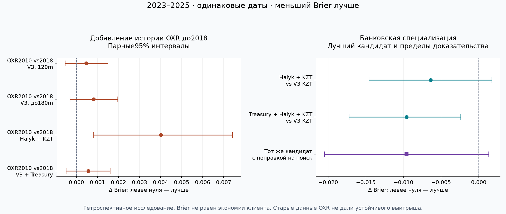

# OXR 2010–2026 и банковская специализация: результаты V4

**Расширение OXR не принесло устойчивого улучшения. Новый перспективный результат найден в сочетании Treasury + Halyk + ограниченной KZT-корректировки длинной модели, без OXR.** Улучшение Brier ещё не является доказанным ростом клиентской экономии; после поправки на поиск моделей и стрессов статистическое превосходство остаётся неполным.

Это продолжение [предыдущего исследования](../continuation/REPORT.md). Старые модели, данные benchmark и `final_solution` сохранены. Новые результаты находятся только в этой исследовательской ветке.

## 1. Что проверено

- **170 HGB fits:** 27 конфигураций × пять cutoff плюс 35 контрольных переобучений после численного аудита. История train120m и до 180m, OXR basis/full/coverage, локальная калибровка KZT, 40 слабых residual-деревьев с ограничением веса, Halyk, явная премия банка к OXR, Treasury и контрольные комбинации.
- **100 NOW-head fits поверх сохранённых Chronos-прогнозов:** 85 основных и 15 численных контролей; Synth zero-shot как основная семья, Small FT300 как контроль, обучающая история головы 10 лет, OXR2018/2010 и банковские комбинации. Backbone и его прогнозы повторно не обучались. Подробности: [foundation/REPORT.md](foundation/REPORT.md).
- **Отдельные реальные банковские targets:** будущая средняя котировка и NOW по следующим пяти банковским обновлениям; классификация и регрессия с простыми контрольными прогнозами. [bank_target/REPORT.md](bank_target/REPORT.md).
- Модельные checkpoints, прогноз каждой строки, cutoff/feature receipts, парные интервалы и независимые проверки сохранены. [Общий ledger по раздельным targets](COMPARISON.csv), [все метрики длинных моделей](long_models/summary.csv), [все парные интервалы](long_models/paired_intervals.csv), [поправка на семейство 27 моделей](long_models/simultaneous_intervals.csv).

Разработка: 2023–2025, 727 дат × пять валют =3635 строк. KZT —727 наблюдений. Январская фиксация 2026: train заканчивается до 2025, calibration до 2026, test13 января–25 августа 2026, 156 дат. Мартовская фиксация: cutoff1 марта; сравнение с январской на одних 122 датах 3 марта–25 августа. По каждому split исключены метки, пятая будущая котировка которых ещё не известна к границе.

Выбор основных вариантов использовал development до нового расчёта 2026. Три дополнительных Treasury-контроля введены после первого результата исключительно для разделения вкладов. История 2026 ранее уже просматривалась: это временно корректные ретроспективные тесты, **не новый независимый holdout**.

## 2. Что изменило расширение OXR

Снимок содержит 54 454 строки, 6091 день, 01.01.2010–04.09.2026. По AMD/KGS/KZT/TJS/UZS —30 455 строк без пропусков дат и дубликатов. Все 27 000 строк перекрытия с прошлым snapshot совпадают по котировкам и timestamp. Поэтому добавление истории отделено от пересмотра данных. Новый `source_quote` не меняет пять целевых валют; особенности BYR/BYN и неполный TMT2010 описаны отдельно. [Аудит источника](data_audit/REPORT.md).

Нормальный OXR-признак доступен после конца дня/публикации плюс 24 часа, то есть обычно D+2. В benchmark остаётся прежняя история официальных курсов: новые два дня OXR не создают дополнительных зрелых меток 2026.

В модели с cutoff2023 покрытие train признаками OXR выросло с 35,4% до 100%; в cutoff2026 —с 65,5% до 100%. Число обучающих CBR-примеров при одинаковых 120m **не изменилось**. Для 120m первый новый train начинается в 2012/2015 соответственно; вариант 180m отдельно включает всю доступную историю с 2010.

| Модель | Brier 2023–2025 | Brier Jan2026 | Сигналы dev | Reference advantage dev, bps |
|---|---:|---:|---:|---:|
| V3, train120m | 0.184850 | 0.208406 | 723 | 40.08 |
| V3 + OXR с 2018, basis | 0.184344 | 0.208816 | 758 | 35.05 |
| V3 + OXR с 2010, basis | 0.184811 | 0.208881 | 754 | 35.21 |
| V3 + полный OXR с 2010 | 0.186623 | 0.208470 | 743 | 40.05 |
| История с 2010, лимит 180m | 0.185691 | 0.208344 | 728 | 36.82 |
| История с 2010 + OXR с 2010 | 0.186068 | 0.208501 | 746 | 37.49 |
| V3 + Treasury | 0.183295 | 0.208938 | 767 | 31.52 |
| V3 + Treasury + OXR с 2010 | 0.183992 | 0.208906 | 757 | 35.13 |

Численный аудит отдельно исключил эффект pandas rolling-roundoff: на общем периоде после 01.09.2018 признаки были сделаны побитово одинаковыми, ранние значения сохранены. Все 35 повторных fits дали **те же 50 250 построчных прогнозов и сигналы**, включая stress. Поэтому вывод ниже сохраняется при строгом контроле общих признаков. [Протокол](long_models/canonical/protocol.json), [точное совпадение](long_models/canonical/retraining_parity.json).

Чистый эффект добавления OXR2010–2018 при одинаковом 120m: **ΔBrier +0.000467, 95% CI [-0.000536; +0.001503]**. Положительный знак —ухудшение. В Jan2026: +0.000064, 95% CI [-0.000595; +0.000780]. Таким образом, основной controlled experiment не подтверждает пользу расширения. Увеличение самой train-истории до 180m тоже не улучшило результат.

У мартовской модели на общем периоде встречается небольшой выигрыш OXR2010 против 2018; он не согласуется с основным development/Jan2026 и не служит основанием выбирать модель по уже просмотренному тесту. Это не доказательство бесполезности архива для любой другой задачи —это отрицательный результат для проверенных NOW-моделей и признаков.

## 3. Halyk и новый кандидат

| Модель | Brier 2023–2025 | Brier Jan2026 | Сигналы dev | Reference advantage dev, bps |
|---|---:|---:|---:|---:|
| V3, KZT | 0.182705 | 0.234980 | 149 | 29.97 |
| V3 + KZT residual shrink | 0.179110 | 0.241192 | 146 | 33.25 |
| Прежний Halyk + KZT shrink | 0.176324 | 0.223331 | 134 | 50.23 |
| Halyk + OXR с 2018 + shrink | 0.176624 | 0.222383 | 145 | 42.55 |
| Halyk + OXR с 2010 + shrink | 0.180639 | 0.223530 | 138 | 48.84 |
| То же + явная премия банка к OXR | 0.181341 | 0.220315 | 134 | 45.96 |
| Treasury + KZT shrink | 0.177125 | 0.244180 | 155 | 27.09 |
| Treasury + Halyk + локальная калибровка | 0.175951 | 0.226255 | 141 | 54.73 |
| Treasury + Halyk + KZT shrink | 0.173119 | 0.220019 | 145 | 47.56 |
| Treasury + Halyk + OXR с 2010 + shrink | 0.178780 | 0.217831 | 144 | 53.18 |

OXR2010 в комбинации Halyk ухудшил development относительно того же Halyk+OXR2018: **+0.004015, 95% CI [+0.000825; +0.007419]**. Относительно прежнего Halyk без OXR: **+0.004314, 95% CI [+0.001061; +0.007891]**. Более явная премия банка к OXR проблему не устранила.

Зато **Treasury + Halyk + KZT shrink** улучшил Brier относительно V3 KZT:

- Development: **-0.009586, 95% CI [-0.017228; -0.002397]**, снижение Brier примерно 5,25%.
- Jan2026: **-0.014961, 95% CI [-0.023407; -0.007373]**, снижение примерно 6,37%.
- Против уже сильной Halyk-модели эффект добавления Treasury: development **-0.003206, 95% CI [-0.006082; -0.000530]**; Jan2026 **-0.003312, 95% CI [-0.008159; +0.001672]**.

Для отделения вклада банковских данных добавлены контролируемые модели с теми же Treasury, train, калибровкой и residual-адаптацией. Инкремент Halyk к Treasury+KZT shrink: development **-0.004006, 95% CI [-0.010719; +0.002523]**, Jan2026 **-0.024161, 95% CI [-0.039523; -0.009643]**. Development CI включает ноль. Мы получили свидетельство дополнительной информации банка, но не универсальное доказательство её устойчивого преимущества.

**Brier и клиентская ценность расходятся.** Новый кандидат даёт 47,56 reference-bps против 50,23 у прежнего Halyk на development; Jan2026 —40,60 против 46,99. Это средняя разница с baseline внутри год×коридор на выбранных сигналах. Она рассчитана по официальному reference-курсу, не по исполненным переводам.

## 4. Что выдерживают интервалы и задержки

Основные интервалы:10 000 парных bootstrap-повторов, валюты сохраняются вместе внутри дат, блоки пересэмплируются внутри года. Для policy baseline пересчитывается в каждом повторе. Дополнительно проверены блоки 20/60 дат.

Обычный парный интервал условен на уже выбранную модель. После одновременной поправки на 27 HGB-вариантов текущей ветки CI нового кандидата против V3 на development становится **[−0,020491; +0,001319]**: ноль внутри. На Jan2026 месячный интервал остаётся отрицательным, но при 20-дневных блоках включает ноль. Поправка не охватывает весь прошлый V3/V4-поиск и не превращает просмотренный 2026 в независимый тест. При 60-дневных блоках в коротком 2026 очень мало независимых блоков.

При дополнительном дне задержки Halyk, с теми же весами, калибровкой и порогами, Brier нового кандидата меняется:

| Период | Обычный Halyk | Halyk +1 день | V3 KZT |
|---|---:|---:|---:|
| Development | 0.173119 | 0.178598 | 0.182705 |
| Jan2026 | 0.220019 | 0.234408 | 0.234980 |

На Jan2026 преимущество почти исчезает; на общем мартовском периоде январская модель с задержкой даже проигрывает V3. **Устойчивости без потери качества пока нет.** Нормальное допущение Halyk effective-date+1calendar day не подтверждено историческим журналом фактической публикации.

Аудит исправил onset-сценарий задержки: rolling-история до cutoff теперь сохраняет нормальные данные, задержка начинается после cutoff. Пересчитан только inference, без повторного обучения; все normal predictions и сделанный ранее выбор сохранены. [Проверка 135 моделей/285 представлений](long_models/verification.json).

## 5. Нейросетевая ветка и собственно банковский target

Chronos Synth ZS +10-летняя NOW-head: Brier 0,184862 без OXR →0,184726 с OXR2010. CI прироста включает ноль. При прямом сравнении OXR2010 vs2018 результат 0,184726 vs0,184707 —история до 2018 не дала выигрыша. На Jan2026 OXR2010 слегка ухудшает исходную Synth-head. Полные OXR-признаки и SmallFT300 также не дали устойчивого улучшения. Отдельно переобученные D+2/D+3 варианты —это sensitivity к предположению о лаге, а не тест внезапного сбоя фиксированной модели.

Банковский target строится непосредственно по Halyk SELL RUB: **KZT за покупку 1RUB клиентом**, меньше лучше. Это обратное направление исходному RUB→KZT переводу. Прогноз средней следующих 5 котировок и событиеNOW оценены отдельно от CBR-target, с реальными датами обновлений и exact decimal ties. В новом банковском наборе OXR2010 и 2018 дают одинаковые доступные признаки: банковская история начинается в 2020, более старый OXR не создаёт банковских меток. Сводные результаты и интервалы находятся в [bank_target/REPORT.md](bank_target/REPORT.md).

На 708 development-датах банковской задачи прогноз прошлой частоты события даёт Brier 0,258758; bank+CBR —0,263619; добавление OXR —0,274211. Инкремент OXR ухудшает Brier на+0,010592, CI[+0,004321; +0,017888]. Persistence-прогноз текущей котировки даёт MAE 113,55bps, модель сOXR —155,92bps. Для NOW bank+CBR немного лучше baseline:0,198203 vs0,199860, но CI[−0,006207; +0,002444] включает ноль. На 118 общих банковских датах 2026 этот выигрыш не подтвердился. В банковском archive-task исключены три слишком длинных будущих окна: это явно условие плотности исторического архива, не доступный заранее online-фильтр.

Именно эта проверка ограничивает силу proof of concept: улучшение CBR-target за счёт Halyk **нельзя выдавать за улучшенный прогноз исполнимой банковской сделки**. Для сильного банковского PoC нужен ряд правильной стороны обмена, фактический known-at и условия исполнения; новый archive-fetch сам по себе не подтверждает historical availability.

Дополнительно проверен официальный public endpoint Halyk: правильная сторона BANK BUY RUB доступна, но полученный ответ содержит только 3–4 сентября 2026. Передача исторической даты не меняет ответ. Две даты недостаточны для обучения и не добавлены в backtest. [Сохранённые ответы и проверка возможности получения BUY-архива](data_audit/halyk_buy_feasibility/).

## 6. Решение по результатам

1. Сохранить полный OXR как исследовательский источник, но не включать старую историю в основную модель ради формального удлинения. На проверенных сильных моделях это не улучшило качество.
2. Сохранить Treasury+Halyk+KZT shrink как **новый экспериментальный кандидат по Brier**. Его нельзя пока продвигать как одновременно лучшую модель по utility, задержке и статистической устойчивости.
3. Для основного продукта оставить раздельные прогноз официального события и оценку банковской сделки. Нужны реальные котировки нужной стороны и журналы их доступности; банковские изменения модели проверять сначала на этом target.
4. В `final_solution` автоматической замены не делалось. Все положительные и отрицательные результаты, исходные 27/17 спецификации, контрольные модели и checkpoints доступны для воспроизведения.

Техническая навигация: [long_models/README.md](long_models/README.md), [source snapshot](input_oxr_snapshot.csv), [общая проверка](verification.json).
